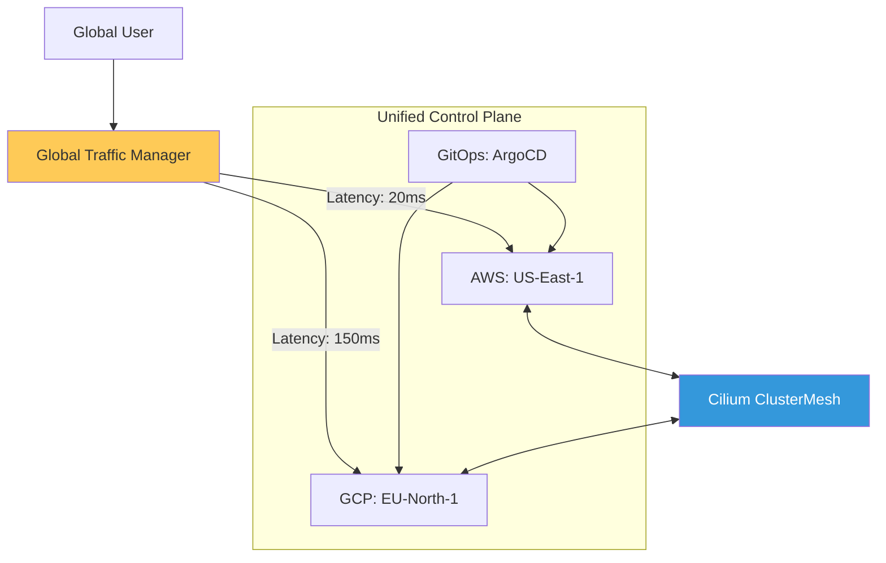

# Enterprise Multi-Cloud Architecture Reference

**Doc Version:** 1.0.0
**Role:** Cloud Architect / CTO Office
**Scope:** Multi-Region, Multi-Cloud, and Hybrid Architectures

---

## 1. The Multi-Cloud Maturity Model

Strategic cloud usage moves from "Single Cloud" to "Architecture-Agnostic" fleets.

- **Level 1 (Single Cloud)**: All resources in one region/vendor. Highest risk of vendor lock-in.
- **Level 2 (Multi-Region)**: Disaster recovery across regional boundaries within one vendor.
- **Level 3 (Hybrid Cloud)**: Connecting on-prem data centers with cloud resources (AWS DirectConnect / GCP Interconnect).
- **Level 4 (Cloud Agnostic)**: Workloads move seamlessly between AWS, GCP, and Azure using Kubernetes as the abstraction layer.

---

## 2. Global Traffic Steering

Managing users across a global footprint requires advanced DNS and Load Balancing.

### A. GSLB (Global Server Load Balancing)
Directing users to the closest healthy region based on latency or regulatory requirements (Data Sovereignty).

### B. Anycast IP
Using a single IP address that routes to the nearest edge location (e.g., AWS Global Accelerator / Google Cloud Load Balancing).

### C. Service Discovery (Cross-Cloud)
Using tools like Consul or Cilium ClusterMesh to allow a pod in AWS to talk to a service in GCP.

---

## 3. Data Sovereignty & Gravity

The most difficult part of multi-cloud is the "Data Gravity."

1.  **Replication Latency**: Syncing terabytes of data across oceans takes time and costs money (Egress).
2.  **Compliance (GDPR/CCPA)**: Ensuring user data doesn't leave the country of origin.
3.  **Local Read / Global Write**: Patterns for high-performance global applications.

---

## 4. Visualizing the Multi-Cloud Fabric

---

## 5. Abstraction Layers (The Kubernetes Promise)

Kubernetes is the "POSIX of the Cloud."
- **Standardized API**: Developers write the same YAML regardless of the cloud vendor.
- **Infrastructure Abstraction (Crossplane)**: Provisioning RDS (AWS) and CloudSQL (GCP) using the same declarative interface.
- **Network Abstraction (Istio/Cilium)**: Consistent security and encryption across different cloud VPC models.

---

## 6. Enterprise Governance Standards

- **Vendor Diversification Policy**: Critical business units must not have more than 70% of their workloads on a single cloud vendor.
- **Egress Cost Monitoring**: Real-time alerting on cross-cloud data transfer to prevent "Surprise Billing."
- **Unified Identity**: Using OIDC and Workload Identity Federation to ensure a developer's identity is consistent across AWS, GCP, and Azure.

> **Enterprise Pattern**: Implement **The "Cloud Exit" Strategy**. Maintain a documented and tested process for migrating a core business service from one cloud vendor to another within 30 days. This provides leverage during contract negotiations and ensures resilience against vendor-specific outages or policy changes.
