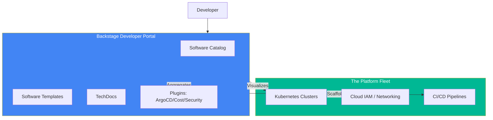

# 🏗️ Platform Engineering with Backstage (Advanced)

> **"Infrastructure for the developers, not just the operations. Reduce the cognitive load."**

## 📚 Overview

Platform Engineering is the discipline of designing and building self-service capabilities for software engineering organizations. An **Internal Developer Portal (IDP)** like **Backstage** (created by Spotify) serves as the "Front door" for developers to manage their services, documentation, and infrastructure without needing to master the underlying cloud complexity.

## 🎯 Learning Objectives
- ✅ Understand the difference between **DevOps** and **Platform Engineering**.
- ✅ Master the **Backstage Software Catalog** (entities, relations).
- ✅ Build **Software Templates** (Scaffolder) to automate "Golden Paths".
- ✅ Centralize documentation using **TechDocs** (Docs-as-Code).

## 🗺️ Module Structure

1. **[🔴 01-Internal-Developer-Portals](readme.md)**
   - The "Self-Service" philosophy.
   - Core components: Catalog, Scaffolder, Search.
2. **[🔴 02-Software-Templates](readme.md)**
   - Creating a "New Service" template with automated CI/CD and K8s manifests.

---

## 🏗️ Visual: The IDP Architecture



---

## 🛠️ Boilerplate: software-template.yaml
The "Golden Path" to creating a new microservice accurately and securely.

```yaml
apiVersion: scaffolder.backstage.io/v1beta3
kind: Template
metadata:
  name: standard-python-service
  title: Standard Python Microservice
  description: Creates a new Python service with Flask, Docker, and GitHub Actions
spec:
  owner: platform-team
  type: service
  parameters:
    - title: Provide basic info
      required: [name, owner]
      properties:
        name:
          title: Service Name
          type: string
        owner:
          title: Owner
          type: string
          ui:field: OwnerPicker
  steps:
    - id: template
      name: Fetch Skeleton
      action: fetch:template
      input:
        url: ./skeleton
    - id: publish
      name: Publish to GitHub
      action: publish:github
      input:
        allowedHosts: ['github.com']
        description: This is {{ parameters.name }}
        repoUrl: 'github.com?repo={{ parameters.name }}&owner={{ parameters.owner }}'
```

## 📋 Professional Pattern: The "Golden Path"
The platform team shouldn't say "No" to a developer's chosen tool, but they should make the "Right way" the "Easiest way". By providing a pre-configured, secure template, developers naturally follow best practices.

---
**Next Step**: Start with [Internal Developer Portals](readme.md) 🚀
