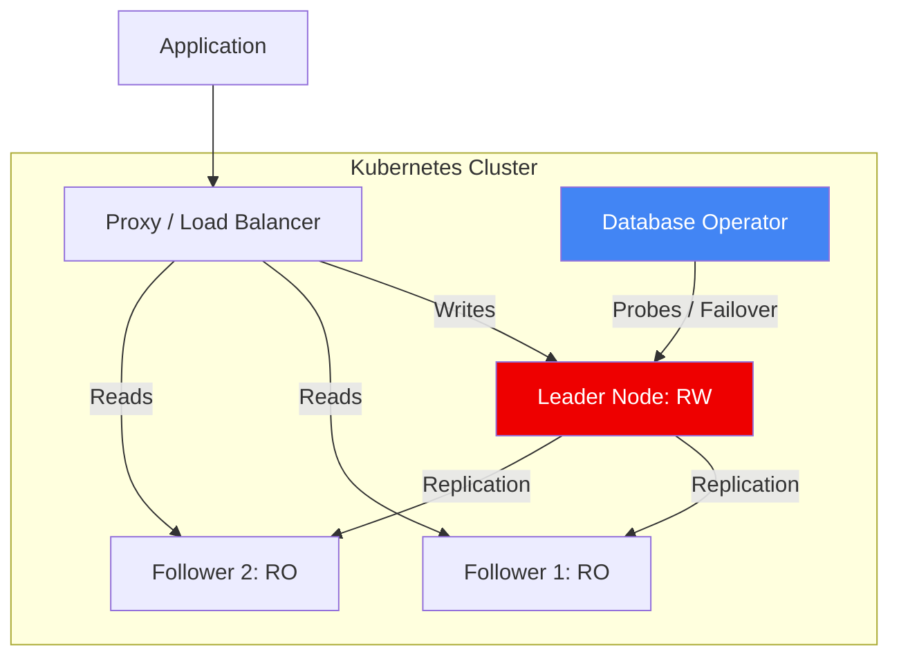

# 🗄️ Database Reliability Engineering (DBRE) (Advanced)

> **"Data is the most valuable asset. If it's not reliable, everything else is irrelevant."**

## 📚 Overview

Database Reliability Engineering (DBRE) is the application of SRE principles to the data layer. While standard SRE focuses on the application, DBRE focuses on operationalizing the database: ensuring durability, consistency, and low latency while automating scaling and recovery.

## 🎯 Learning Objectives

- ✅ Master the **Database Operator Pattern** in Kubernetes.
- ✅ Implement **High-Availability (HA)** with Leader/Follower and Failover automation.
- ✅ Conduct **Zero-Downtime Schema Migrations**.
- ✅ Orchestrate **Database Scalability** (Sharding vs. Replication).

## 🗺️ Module Structure

1. **[🔴 01-Database-Operators](readme.md)**
   - CloudNativePG and Vitess.
   - Using Operators to manage PVCs, Backups, and Failover.
2. **[🔴 02-Scalability-Patterns](readme.md)**
   - Read Replicas vs. Proxy-based sharding (ProxySQL).
   - Multi-Region data synchronization.

---

## 🏗️ Visual: High-Availability Database Topology



---

## 🛠️ Boilerplate: CloudNativePG Cluster (v1.29+)
The modern way to run PostgreSQL in Production on Kubernetes.

```yaml
apiVersion: postgresql.cnpg.io/v1
kind: Cluster
metadata:
  name: prod-db-cluster
spec:
  instances: 3
  imageName: ghcr.io/cloudnative-pg/postgresql:16
  primaryUpdateStrategy: unsupervised
  storage:
    size: 50Gi
  monitoring:
    enablePodMonitor: true
  backup:
    barmanObjectStore:
      destinationPath: s3://my-backups-bucket/pg-backups
      s3Credentials:
        accessKeyId:
          name: aws-creds
          key: ACCESS_KEY_ID
        secretAccessKey:
          name: aws-creds
          key: SECRET_ACCESS_KEY
```

## 📋 Professional Pattern: "Schema as Code"
Never perform manual `ALTER TABLE` commands on a production database. Use a migration tool (Flyway, Liquibase, or Golang Migrate) integrated into your CI/CD pipeline, and always test migrations against a production-sized staging database before applying them to PROD.

---
**Next Step**: Start with [Database Operators](readme.md) 🚀
