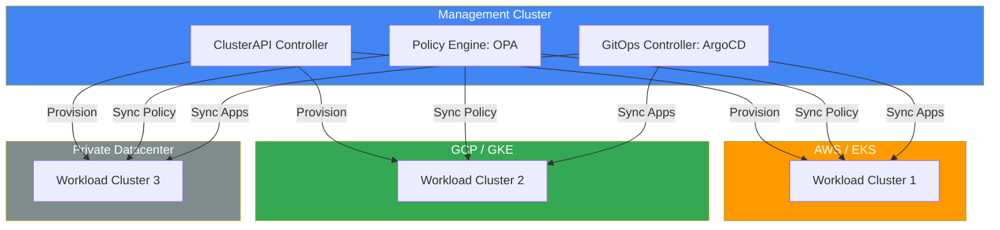

# 🌐 Multi-Cluster Kubernetes Management (MCM)

> **"One cluster is a pet. Ten clusters is a herd. A hundred clusters is a fleet."**

## 📚 Overview

Modern enterprises don't run on a single Kubernetes cluster. They run on dozens or hundreds across multiple clouds (AWS, GCP, Azure) and on-premises data centers. Multi-Cluster Management (MCM) is the discipline of treating these as a unified fleet.

## Core Concept: Declarative Fleet Management
**[REFERENCE: Multi-Cluster \u0026 CAPI Architecture](../reference/multi-cluster-capi-architecture-ref.md)**

Treating infrastructure as code extends beyond the application to the cluster lifecycle itself:
- **ClusterAPI (CAPI)**: Managing clusters as native Kubernetes objects, allowing for automated provisioning across AWS, GCP, and vSphere.
- **The Management Hub**: Utilizing a central, high-availability cluster to orchestrate the creation and health of the entire global fleet.
- **Bootstrapping Providers**: Automating the transformation of raw virtual machines into secured, ready-to-use Kubernetes nodes.

## Enterprise Governance: Global Consistency
**[REFERENCE: Multi-Cluster \u0026 CAPI Architecture](../reference/multi-cluster-capi-architecture-ref.md)**

Scaling the fleet without compromising security or architectural standards:
- **Infrastructure Providability**: Mandating version-controlled CAPI manifests for all cluster creation to eliminate "snowflake" environments.
- **Global Identity (OIDC)**: Centralizing RBAC and identity management across every cluster in the organization's portfolio.
- **Baseline Enforcement**: Ensuring that every cluster—regardless of cloud provider—is initialized with a standardized set of security and observability tools.
- **Fault Tolerance**: Designing for regional isolation while maintaining centralized management visibility.

## 🎯 Learning Objectives

- ✅ Master **ClusterAPI (CAPI)** for declarative cluster provisioning.
- ✅ Implement unified management with **Rancher**, **Anthos**, or **Azure Arc**.
- ✅ Enforce global policies across the fleet using **OPA Gatekeeper**.
- ✅ Understand multi-cluster networking and service discovery (Submariner).

---

## 🏗️ Visual: Multi-Cluster Control Plane



---

## 🛠️ Infrastructure as Code: ClusterAPI (CAPI)
ClusterAPI allows you to manage Kubernetes clusters the same way you manage Pods—using YAML.

**Example: CAPI AWSCluster Manifest**
```yaml
apiVersion: infrastructure.cluster.x-k8s.io/v1beta1
kind: AWSCluster
metadata:
  name: production-fleet-01
spec:
  region: us-west-2
  sshKeyName: default
  network:
    vpc:
      cidrBlock: 10.0.0.0/16
```

---

## 🛡️ Enterprise Strategy: Unified Policy Management
Never configure clusters individually. Use a "Fleet-wide" policy engine.

1.  **OPA Gatekeeper**: Defines constraints (e.g., "All clusters must have network policies enabled").
2.  **ConstraintTemplates**: Reusable Rego logic deployed once but enforced everywhere.

---

## 📋 Professional Pattern: The "Global Load Balancer"
Use a Global Server Load Balancer (GSLB) or ExternalDNS with multi-cluster ingress to route traffic to the healthiest or nearest cluster in your fleet.

---
**Next Step**: [Cluster Provisioning with CAPI](readme.md) 🚀
