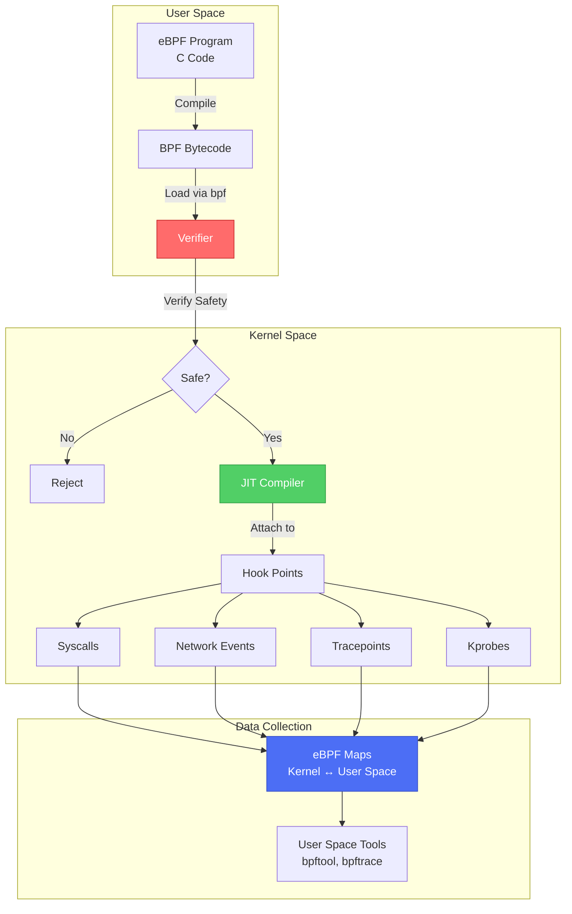

# 🔬 eBPF: The Kernel-Level Observability Revolution

> **"eBPF is doing to Linux what JavaScript did to HTML - it's turning a static system into a programmable platform."**  
> — Brendan Gregg, Performance Engineer

> **⚠️ Missing Image**: *eBPF Architecture* ('./assets/ebpf_architecture.png')

---

## 🎯 Core Concept & Technical Definition

**eBPF (Extended Berkeley Packet Filter)** is a revolutionary Linux kernel technology that allows you to run sandboxed programs in the kernel space without changing kernel source code or loading kernel modules. Think of it as "JavaScript for the Linux kernel" - it enables dynamic instrumentation, networking, security, and observability at unprecedented levels of performance and safety.

### The Paradigm Shift

Traditional kernel instrumentation required:
- ❌ Kernel module development (risky, requires reboot)
- ❌ Recompiling the kernel
- ❌ Root access with unlimited privileges
- ❌ High overhead from context switching

eBPF provides:
- ✅ **Safe**: Programs are verified before execution
- ✅ **Fast**: Runs in kernel space (no context switches)
- ✅ **Dynamic**: Load/unload programs without reboots
- ✅ **Portable**: Write once, run on any kernel 4.4+

---

## 🔧 DevOps Utility: Why eBPF is Essential in CI/CD

### 1. **Zero-Overhead Observability**

Traditional monitoring tools (like `strace`) can slow down applications by **100x**. eBPF provides:
- **Sub-microsecond latency** for tracing
- **Per-packet network inspection** without performance degradation
- **Real-time metrics** from kernel events

### 2. **Security at the Kernel Level**

eBPF powers modern security tools:
- **Falco**: Runtime threat detection
- **Cilium**: Network security policies
- **Tetragon**: Process-level security enforcement

### 3. **Network Performance**

eBPF enables:
- **XDP (eXpress Data Path)**: Process packets before they hit the network stack (40M packets/sec)
- **Service Mesh acceleration**: Bypass iptables for 10x faster networking
- **Load balancing**: Kernel-level load balancing without proxies

### 4. **Production Debugging**

Debug production systems without:
- Deploying debug builds
- Adding logging statements
- Restarting services
- Performance impact

---

## 🏗️ Visual Architecture

### eBPF Program Lifecycle



### eBPF in the Observability Stack

```mermaid
graph LR
    subgraph "Traditional Stack"
        T1[Application] --> T2[System Calls]
        T2 --> T3[Kernel]
        T3 --> T4[/proc, /sys]
        T4 --> T5[Monitoring Agent]
        T5 --> T6[Metrics Backend]
    end
    
    subgraph "eBPF Stack"
        E1[Application] --> E2[System Calls]
        E2 --> E3[Kernel + eBPF]
        E3 -->|Direct Access| E4[eBPF Maps]
        E4 --> E5[Monitoring Agent]
        E5 --> E6[Metrics Backend]
    end
    
    style E3 fill:#ffd43b,stroke:#fab005,color:#000
    style E4 fill:#51cf66,stroke:#2f9e44,color:#fff
```

---

## 💡 The "Fail-Safe" Pattern: Production-Grade eBPF

### Professional Error Handling

```python
#!/usr/bin/env python3
"""
Production-grade eBPF program with comprehensive error handling
Tracks TCP connection latency without impacting performance
"""

from bcc import BPF
import sys
import signal
import logging
from datetime import datetime

# Configure logging
logging.basicConfig(
    level=logging.INFO,
    format='%(asctime)s - %(levelname)s - %(message)s'
)
logger = logging.getLogger(__name__)

# eBPF program (C code)
bpf_program = """
#include <uapi/linux/ptrace.h>
#include <net/sock.h>
#include <bcc/proto.h>

// Data structure for connection events
struct conn_event_t {
    u32 pid;
    u32 saddr;
    u32 daddr;
    u16 sport;
    u16 dport;
    u64 latency_ns;
};

// eBPF map for passing data to user space
BPF_PERF_OUTPUT(events);

// Hash map to track connection start times
BPF_HASH(start_times, u64, u64);

// Hook: TCP connection initiated
int trace_connect_entry(struct pt_regs *ctx, struct sock *sk) {
    u64 pid_tgid = bpf_get_current_pid_tgid();
    u64 ts = bpf_ktime_get_ns();
    
    // Store start time
    start_times.update(&pid_tgid, &ts);
    
    return 0;
}

// Hook: TCP connection completed
int trace_connect_return(struct pt_regs *ctx) {
    u64 pid_tgid = bpf_get_current_pid_tgid();
    u64 *start_ts = start_times.lookup(&pid_tgid);
    
    if (start_ts == 0) {
        return 0;  // No start time found
    }
    
    // Calculate latency
    u64 latency_ns = bpf_ktime_get_ns() - *start_ts;
    
    // Prepare event data
    struct conn_event_t event = {};
    event.pid = pid_tgid >> 32;
    event.latency_ns = latency_ns;
    
    // Send to user space
    events.perf_submit(ctx, &event, sizeof(event));
    
    // Cleanup
    start_times.delete(&pid_tgid);
    
    return 0;
}
"""

class TCPLatencyTracer:
    """Production-grade TCP latency tracer using eBPF"""
    
    def __init__(self):
        self.bpf = None
        self.running = False
        
    def load_program(self):
        """Load and attach eBPF program with error handling"""
        try:
            logger.info("Loading eBPF program...")
            self.bpf = BPF(text=bpf_program)
            
            # Attach to kernel functions
            self.bpf.attach_kprobe(
                event="tcp_v4_connect",
                fn_name="trace_connect_entry"
            )
            self.bpf.attach_kretprobe(
                event="tcp_v4_connect",
                fn_name="trace_connect_return"
            )
            
            logger.info("✅ eBPF program loaded successfully")
            return True
            
        except Exception as e:
            logger.error(f"❌ Failed to load eBPF program: {e}")
            logger.error("Ensure you have:")
            logger.error("  1. Root privileges (sudo)")
            logger.error("  2. Kernel 4.4+ with eBPF support")
            logger.error("  3. BCC tools installed")
            return False
    
    def handle_event(self, cpu, data, size):
        """Process events from eBPF with error handling"""
        try:
            event = self.bpf["events"].event(data)
            latency_ms = event.latency_ns / 1_000_000
            
            # Log connection latency
            logger.info(
                f"TCP Connection | PID: {event.pid} | "
                f"Latency: {latency_ms:.2f}ms"
            )
            
            # Alert on high latency (production pattern)
            if latency_ms > 100:
                logger.warning(
                    f"⚠️  HIGH LATENCY DETECTED: {latency_ms:.2f}ms "
                    f"(PID: {event.pid})"
                )
                
        except Exception as e:
            logger.error(f"Error processing event: {e}")
    
    def run(self):
        """Main event loop with graceful shutdown"""
        if not self.load_program():
            sys.exit(1)
        
        # Setup signal handlers for graceful shutdown
        signal.signal(signal.SIGINT, self.shutdown)
        signal.signal(signal.SIGTERM, self.shutdown)
        
        logger.info("🔍 Tracing TCP connections... (Ctrl+C to stop)")
        self.running = True
        
        # Open perf buffer
        self.bpf["events"].open_perf_buffer(self.handle_event)
        
        # Event loop
        try:
            while self.running:
                self.bpf.perf_buffer_poll(timeout=1000)
        except KeyboardInterrupt:
            pass
        finally:
            self.cleanup()
    
    def shutdown(self, signum, frame):
        """Graceful shutdown handler"""
        logger.info("\n🛑 Shutting down gracefully...")
        self.running = False
    
    def cleanup(self):
        """Cleanup resources"""
        if self.bpf:
            logger.info("🧹 Detaching eBPF program...")
            # BCC automatically detaches on object destruction
            self.bpf = None
        logger.info("✅ Cleanup complete")


def main():
    """Entry point with production-grade error handling"""
    # Verify root privileges
    if os.geteuid() != 0:
        logger.error("❌ This program requires root privileges")
        logger.error("Run with: sudo python3 tcp_latency_tracer.py")
        sys.exit(1)
    
    # Check kernel version
    import platform
    kernel_version = platform.release()
    logger.info(f"Kernel version: {kernel_version}")
    
    # Run tracer
    tracer = TCPLatencyTracer()
    tracer.run()


if __name__ == "__main__":
    main()
```

### Key Production Patterns:

1. **Comprehensive Error Handling**: Try-except blocks at every eBPF interaction
2. **Graceful Shutdown**: Signal handlers for clean exit
3. **Resource Cleanup**: Proper detachment of eBPF programs
4. **Logging**: Structured logging for debugging
5. **Privilege Checking**: Verify root access before loading
6. **Performance Monitoring**: Alert on anomalies (high latency)

---

## 📝 Hands-On Labs

### Lab 1: Network Packet Inspection

**Objective**: Use eBPF to inspect all TCP packets without `tcpdump` overhead

**Challenge**: Write an eBPF program that:
1. Captures all outgoing TCP packets
2. Filters by destination port (443 for HTTPS)
3. Logs packet size and destination IP
4. Calculates bandwidth usage in real-time

**Solution**: See [challenges/01-packet-inspection/](readme.md)

### Lab 2: Process Monitoring

**Objective**: Track all process executions system-wide

**Challenge**: Create an eBPF program that:
1. Hooks into `execve()` syscall
2. Logs process name, PID, and arguments
3. Detects suspicious commands (e.g., `/bin/sh -c curl`)
4. Sends alerts to Slack/PagerDuty

**Solution**: See [challenges/02-process-monitoring/](readme.md)

### Lab 3: Service Mesh Acceleration

**Objective**: Bypass iptables for faster service mesh networking

**Challenge**: Implement:
1. XDP program for packet filtering
2. eBPF-based load balancing
3. Performance comparison: iptables vs eBPF
4. Measure latency improvement

**Solution**: See [challenges/03-service-mesh-acceleration/](readme.md)

---

## 🎤 Interview Preparation

### High-Probability Questions

#### 1. **Q**: What is the difference between eBPF and traditional kernel modules?

**A**: Traditional kernel modules run with full kernel privileges and can crash the entire system if they have bugs. eBPF programs are:
- **Verified** before execution (the verifier ensures they can't crash the kernel)
- **Sandboxed** (limited to safe operations)
- **Dynamically loaded/unloaded** without reboots
- **JIT-compiled** for native performance

However, eBPF is more limited in what it can do - it can't make arbitrary kernel function calls or access arbitrary memory.

---

#### 2. **Q**: How does eBPF achieve zero-overhead observability?

**A**: eBPF runs directly in kernel space, eliminating context switches between user and kernel space. Traditional tools like `strace` use `ptrace()` which:
1. Traps every syscall
2. Switches to user space
3. Processes the event
4. Switches back to kernel space

This can slow down applications by 100x. eBPF:
1. Runs in kernel space (no context switch)
2. Uses efficient data structures (eBPF maps)
3. Only copies relevant data to user space
4. Uses JIT compilation for native performance

---

#### 3. **Q**: What are eBPF maps and why are they important?

**A**: eBPF maps are key-value data structures that enable communication between eBPF programs in kernel space and user space applications. They are crucial because:

- **Data Sharing**: Allow eBPF programs to share state
- **Persistence**: Data survives across program invocations
- **User-Kernel Communication**: Efficient data transfer without syscalls
- **Types**: Hash maps, arrays, LRU caches, ring buffers, etc.

Example use case: A network monitoring eBPF program stores packet counts in a map, and a user-space dashboard reads from it in real-time.

---

#### 4. **Q**: Explain XDP (eXpress Data Path) and its use in DevOps.

**A**: XDP is an eBPF hook that runs at the earliest point in the network stack - right after the NIC driver receives a packet, before it reaches the kernel's network stack. This enables:

**Performance**:
- Process 40M+ packets/second per core
- Drop malicious packets before they consume CPU
- Implement load balancing without proxies

**Use Cases in DevOps**:
1. **DDoS Protection**: Drop attack traffic at line rate
2. **Load Balancing**: Distribute traffic without NGINX/HAProxy overhead
3. **Packet Filtering**: Firewall rules without iptables performance penalty
4. **Service Mesh**: Accelerate Istio/Linkerd by bypassing iptables

Example: Cloudflare uses XDP to handle 26M requests/second during DDoS attacks.

---

#### 5. **Q**: What are the security implications of eBPF in production?

**A**: eBPF has both security benefits and risks:

**Benefits**:
- **Runtime Security**: Tools like Falco detect malicious behavior in real-time
- **Network Policies**: Cilium enforces L3/L4/L7 policies without iptables
- **Process Monitoring**: Track all syscalls without performance impact

**Risks**:
- **Privilege Escalation**: Loading eBPF programs requires CAP_BPF or root
- **Information Disclosure**: eBPF can read kernel memory (if verified)
- **Resource Exhaustion**: Poorly written programs can consume kernel memory

**Mitigation**:
1. Use **unprivileged eBPF** when possible (limited functionality)
2. Implement **RBAC** for who can load programs
3. Monitor eBPF program loading (audit logs)
4. Use **signed eBPF programs** in production

---

## 🔗 Related Resources

### Internal Modules

- [Service Mesh Deep-Dive](readme.md) - eBPF-powered networking
- [Advanced Networking with Cilium](readme.md) - CNI with eBPF
- [Runtime Security](readme.md) - Falco and eBPF

### External Documentation

- [eBPF.io](https://ebpf.io/) - Official eBPF documentation
- [BCC Tools](https://github.com/iovisor/bcc) - eBPF toolkit
- [Cilium Documentation](https://docs.cilium.io/) - eBPF-based networking
- [Brendan Gregg's eBPF Tools](https://www.brendangregg.com/ebpf.html) - Performance analysis

### Books

- "BPF Performance Tools" by Brendan Gregg
- "Linux Observability with BPF" by David Calavera & Lorenzo Fontana

---

## 🚀 Next Steps

1. **Install BCC Tools**:
   ```bash
   # Ubuntu/Debian
   sudo apt-get install bpfcc-tools linux-headers-$(uname -r)
   
   # RHEL/CentOS
   sudo yum install bcc-tools kernel-devel-$(uname -r)
   ```

2. **Try Pre-built Tools**:
   ```bash
   # Monitor TCP connections
   sudo tcpconnect
   
   # Track file opens
   sudo opensnoop
   
   # Monitor process execution
   sudo execsnoop
   ```

3. **Complete the Labs**: Start with [Lab 1: Packet Inspection](readme.md)

4. **Explore Advanced Topics**:
   - [Cilium Service Mesh](readme.md)
   - [Falco Runtime Security](readme.md)

---

**Module Completion**: After mastering eBPF, you'll have kernel-level observability superpowers that set you apart in DevOps interviews and production troubleshooting.

**Estimated Time**: 8-12 hours  
**Difficulty**: Advanced  
**Prerequisites**: Linux systems programming, C basics, networking fundamentals

---

*"eBPF is not just a technology - it's a paradigm shift in how we interact with the Linux kernel."*
