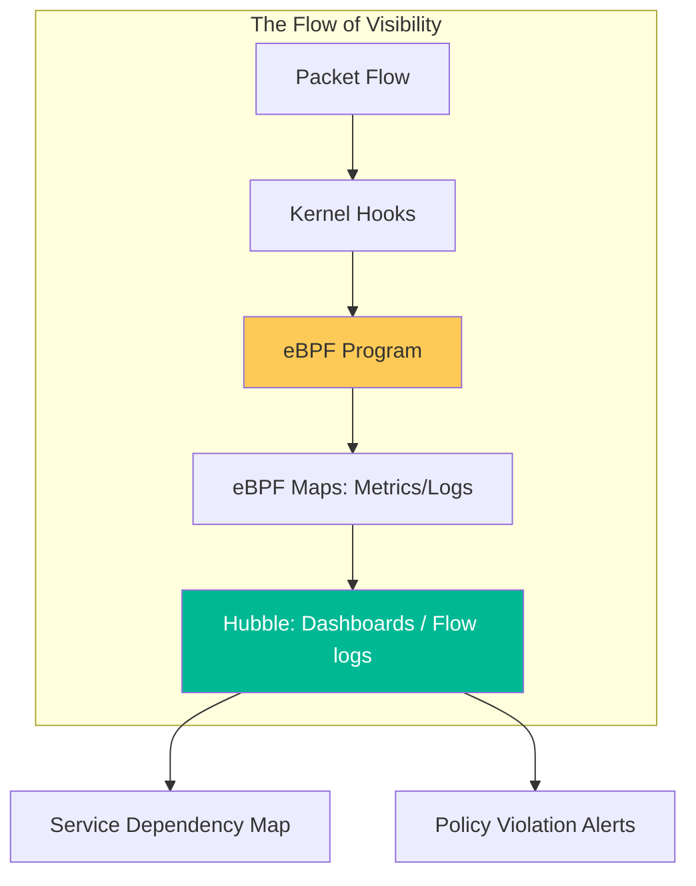

# eBPF \u0026 Cilium Architecture Reference

**Doc Version:** 1.0.0
**Role:** Network Security Architect / SRE Lead
**Scope:** eBPF Hooks, Cilium CNI, and Hubble Observability

---

## 1. The eBPF Paradigm Shift

Traditional Linux networking relies on **iptables** and **IPVS**, which were designed for static servers, not thousands of ephemeral containers. As the number of services grows, iptables performance degrades linearly.

- **The Hook Model**: eBPF (Extended Berkeley Packet Filter) allows you to attach sandboxed programs to hooks in the Linux kernel (TC, XDP, Socket).
- **Just-In-Time (JIT) Compilation**: eBPF code is compiled to native machine instructions at runtime, making it nearly as fast as the kernel itself.
- **Complexity O(1)**: Unlike iptables (which is O(N)), eBPF lookups are O(1) using hash maps, meaning networking performance stays constant regardless of how many services are in the cluster.

---

## 2. Cilium Architecture: The Agent \u0026 Operator

Cilium is the leading cloud-native networking platform built on top of eBPF.

### Components:
- **Cilium Agent**: Runs on every node. It compiles eBPF programs, manages maps, and intercepts all Pod traffic.
- **Cilium Operator**: Managed cluster-wide tasks like IP address management (IPAM), node discovery, and garbage collection.
- **Cilium CNI Plugin**: The bridge between Kubernetes and the Cilium Agent for Pod creation events.

---

## 3. High-Performance Connectivity Patterns

### A. Direct Server Return (DSR)
Bypassing the standard LoadBalancer NAT to allow pods to respond directly to clients. This reduces latency and CPU overhead on the nodes.

### B. Transparent Encryption (WireGuard)
Encrypting all inter-node traffic at the kernel level.
- **Benefit**: No sidecar complexity; extremely high throughput (multi-gigabit) with low latency.

### C. ClusterMesh (Multi-Cluster)
Connecting multiple Kubernetes clusters together into a single "Network Mesh."
- **Common Service Discovery**: Service identities are consistent across clusters.
- **Global Load Balancing**: Traffic can be automatically routed to the nearest healthy instance of a service, regardless of cluster.

---

## 4. Visualizing Hubble Observability

Hubble is the observability layer for Cilium, providing L3/L4/L7 visibility.

---

## 5. Layer 7 Policy Enforcement

Cilium identifies traffic not just by IP/Port, but by the application layer (HTTP/gRPC/Kafka).
- **Example**: "Allow Service A to call POST /v1/orders, but block DELETE."
- **Mechanism**: Cilium uses eBPF to redirect only the L7 packets to a local, high-performance Envoy proxy for inspection, keeping the majority of traffic in the optimized kernel path.

---

## 6. Enterprise Governance Standards

- **Default Deny (L3/L4)**: Start with a zero-trust network policy. No pod can talk to any other pod unless explicitly whitelisted.
- **Compliance Audit**: Use **Hubble** to stream every network flow log to a central SIEM for audit and forensics.
- **CNI Resilience**: Install Cilium in "Strict" Kube-Proxy-Replacement mode to eliminate iptables dependencies entirely, improving both security and performance.

> **Enterprise Pattern**: Implement **The Global Security Mesh**. Use Cilium ClusterMesh to synchronize network policies across all regional clusters. This ensures that the policy "Frontend-Stage can never talk to Prod-DB" is enforced whether the pods are in the same cluster in US-West or different clusters across oceans.
