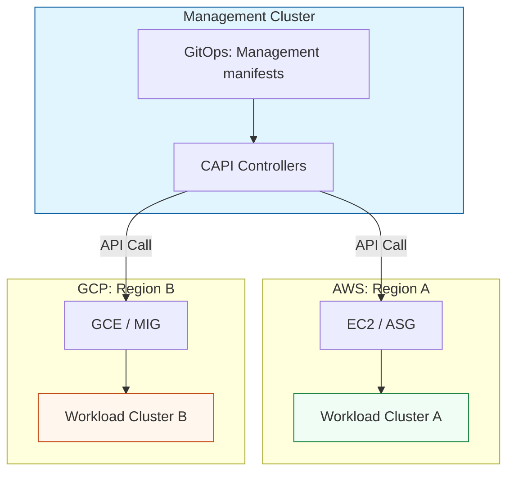

# Multi-Cluster Management & ClusterAPI Reference

**Doc Version:** 1.0.0
**Role:** Fleet Architect / Principal Platform Engineer
**Scope:** MCM, ClusterAPI (CAPI), and Cloud-Native Provisioning

---

## 1. The Multi-Cluster Maturity Model

Managing a fleet of Kubernetes clusters is a progression from manual clicks to declarative fleet operations.

- **Crawl (Peered Clusters)**: Individual clusters with manual VPC peering. No shared identity or policy.
- **Walk (Centralized Management)**: Using a "Pane of Glass" like Rancher or Anthos to view clusters. Manual provisioning still exists.
- **Run (Declarative Fleet)**: Clusters are treated as resources. Provisioned via **ClusterAPI (CAPI)** and configured via GitOps.
- **Fly (Global Fabric)**: Seamless service discovery and traffic shifting across a unified global network (using Submariner or Cilium Mesh).

---

## 2. ClusterAPI (CAPI) Architecture

ClusterAPI is the Kubernetes sub-project that brings declarative, "Kubernetes-style" APIs to cluster creation, configuration, and management.

### Key Components:
1.  **Management Cluster**: The existing K8s cluster that runs the CAPI controllers and stores the manifests.
2.  **Workload Cluster**: The cluster being created/managed by CAPI.
3.  **Infrastructure Provider**: The cloud-specific plugin (CAPA for AWS, CAPG for GCP) that handles the real VM/Networking creation.
4.  **Bootstrap Provider**: The component (CABPK) that generates the cloud-init to turn a VM into a K8s node.

---

## 3. The Lifecycle of a Declarative Cluster

1.  **Manifest Creation**: Define a `Cluster`, `AWSCluster`, `MachineDeployment`, and `KubeadmControlPlane` in YAML.
2.  **Reconciliation**: The CAPI controllers in the Management Cluster see the new goal and call the Cloud Provider APIs (e.g., AWS EC2).
3.  **Bootstrap**: The cloud creates instances; Kubeadm joins them together to form the control plane.
4.  **Success**: The Management Cluster receives the `kubeconfig` and marks the cluster as "Ready."

---

## 4. Visualizing CAPI Federation

---

## 5. Multi-Cluster Networking (East-West)

When Pods in Cluster A need to talk to Pods in Cluster B, standard K8s networking fails because CIDRs are internal.

- **Submariner**: Creates an encrypted "Tunnel" between clusters to allow flat Pod-to-Pod connectivity.
- **Cilium ClusterMesh**: Uses eBPF to route traffic across clusters without the overhead of standard tunnels, supporting global LoadBalancers and shared Service discovery.

---

## 6. Enterprise Governance Standards

- **Infrastructure as Code (CAPI)**: No cluster should be created via the AWS Console or `eksctl`. Every cluster must have a versioned CAPI manifest.
- **Uniform Security Baseline**: Every CAPI-provisioned cluster MUST automatically receive a set of "Foundation Apps" (Logging, Monitoring, OPA) before any user workloads are deployed.
- **Global Identity**: All clusters must use a unified OIDC provider (Okta, AzureAD) for RBAC to ensure a single identity source across the entire fleet.

> **Enterprise Pattern**: Implement **The Management Hub**. Reserve one highly-available cluster specifically for CAPI and GitOps. This cluster should have NO production workloads. If a workload cluster is destroyed, the Management Hub simply reconciles it back into existence from Git, providing true "Disaster Recovery" for the infrastructure itself.
