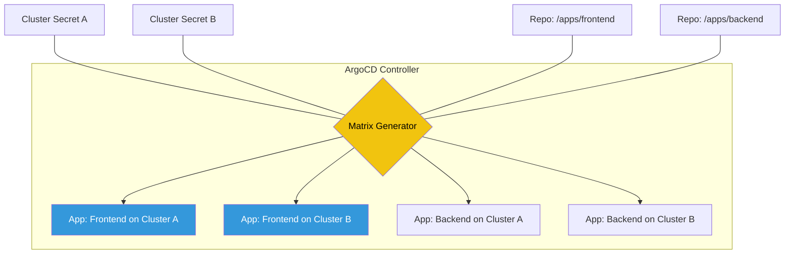

# 🚢 Fleet Management (ArgoCD ApplicationSets)

> **"Don't manage environments. Manage the factory that builds environments."**

## 📚 Overview

Managing 5 Kubernetes applications is easy; managing 500 across 50 clusters is impossible without automation. **ApplicationSets** is an ArgoCD controller that provides a way to automatically generate and manage ArgoCD Applications based on Git repositories, cluster lists, or custom matrices.

## 🎯 Learning Objectives

- ✅ Master the **ApplicationSet Controller** architecture.
- ✅ Use the **List Generator** to deploy apps across a fixed cluster list.
- ✅ Use the **Git Generator** to automatically discover new apps in a repo.
- ✅ Implement the **Matrix Generator** for complex combinations (e.g., every app on every cluster).
- ✅ Manage **Progressive Rollouts** using ApplicationSet strategies.

## 🗺️ Module Structure

1. **[🔴 01-Matrix-Generators](readme.md)**
   - Combining Cluster secrets with Git path configurations.
   - Using Templating and Go text/template syntax.
2. **[🔴 02-Git-Generators](readme.md)**
   - Automatic application creation via folder discovery.
   - Filtering with glob patterns.

---

## 🏗️ Visual: The ApplicationSet Factory



---

## 🛠️ YAML: Matrix Generator Example

Deploying all apps found in a repo to all clusters with a specific label.

```yaml
apiVersion: argoproj.io/v1alpha1
kind: ApplicationSet
metadata:
  name: fleet-matrix
spec:
  generators:
    - matrix:
        generators:
          - clusters: # Generator 1: Get all clusters
              selector:
                matchLabels:
                  environment: production
          - git: # Generator 2: Find all folders in /apps
              repoURL: https://github.com/my-org/infra.git
              revision: HEAD
              directories:
                - path: apps/*
  template:
    metadata:
      name: '{{path.basename}}-{{name}}'
    spec:
      project: default
      source:
        repoURL: https://github.com/my-org/infra.git
        targetRevision: HEAD
        path: '{{path}}'
      destination:
        server: '{{server}}'
        namespace: '{{path.basename}}'
```

## 📋 Professional Pattern: "Discovery over Definition"
Stop writing individual YAML files for every new application. Standardize your repository structure (e.g., `/apps/<app-name>/base/`) and use the **Git Generator**. When a developer opens a PR to add a new folder to `/apps`, ArgoCD detects it and automatically creates the Application, Deployment, and Service—realizing a true **Developer Self-Service** model.

---
**Next Step**: Start with [Matrix Generators](readme.md) 🚀
