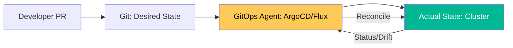

# Advanced GitOps Patterns & Architecture Reference

**Doc Version:** 1.0.0
**Role:** GitOps Architect / Platform Engineer
**Scope:** Pull-based reconcile, OCI-based GitOps, and Sync Strategies

---

## 1. The GitOps Pull-Based Model

Unlike traditional CI/CD "Push" models (where a runner pushes changes to the cluster), GitOps uses a "Pull" model.

- **The GitOps Agent**: A controller (ArgoCD / Flux) running *inside* the cluster.
- **Continuous Reconciliation**: The agent constantly compares the state in Git (Desired) with the state in the Cluster (Actual).
- **Security Benefit**: No long-lived cluster credentials need to be stored in your external CI system (GitHub Actions/Jenkins). The cluster pulls from Git via a secure one-way link.

---

## 2. Advanced Deployment Patterns

### A. The "App of Apps" Pattern
A structural pattern that allows managing a single "Bootstrap" application which in turn manages many other applications.
- **Benefit**: Allows you to bootstrap an entire cluster (Monitoring, Logging, Ingress, Apps) by pointing ArgoCD to a single repository.

### B. OCI Artifacts for GitOps
Instead of just pulling raw YAML/Kustomize from a Git repo, modern GitOps can pull **OCI Artifacts** (containers that hold YAML).
- **Benefit**: Atomic versioning, faster pulls, and the ability to use existing container registry security (vulnerability scanning, signing).

### C. Progressive Delivery (Argo Rollouts)
Integrating GitOps with advanced deployment strategies:
- **Canary**: Deploying to 5% of users, monitoring metrics, and auto-promoting if healthy.
- **Blue/Green**: Instant switch-over with automatic rollback on failure.

---

## 3. Sync & Drift Strategies

- **Auto-Sync**: Automatically apply changes when Git updates.
- **Self-Heal**: Automatically overwrite manual changes in the cluster to prevent configuration drift.
- **Manual Sync (Guardrail)**: Requiring a human to click "Synchronize" for production environments to ensure a "Four-Eyes" review process.

---

## 4. Visualizing the GitOps Loop

---

## 5. Security & Multi-Tenancy

- **Repository Access**: Using fine-grained SSH keys or OIDC identities to allow specific clusters to read only specific repositories.
- **Namespaced Isolation**: Ensuring a team managing `App-A` cannot accidentally deploy resources into `App-B`'s namespace via ArgoCD.

---

## 6. Enterprise Governance Standards

- **State Atomicity**: All infrastructure and application state must be captured in Git. No manual `kubectl` commands are permitted in Production.
- **Standardized Environments**: Using **Kustomize** or **Helm** to manage environment-specific overrides (Dev/Stage/Prod) within the same Git repository to ensure consistent logic across tiers.
- **Automated Rollbacks**: Ensuring that the GitOps controller is configured to automatically revert to the previous "Healthy" Git commit if a new deployment fails health checks.

> **Enterprise Pattern**: Implement **OCI-Driven GitOps**. Package your Helm charts or Kustomize manifests into OCI images and sign them with **Cosign**. Configure your GitOps controller to only pull and sync artifacts that have a valid company signature, effectively extending the secure supply chain to the deployment phase.
