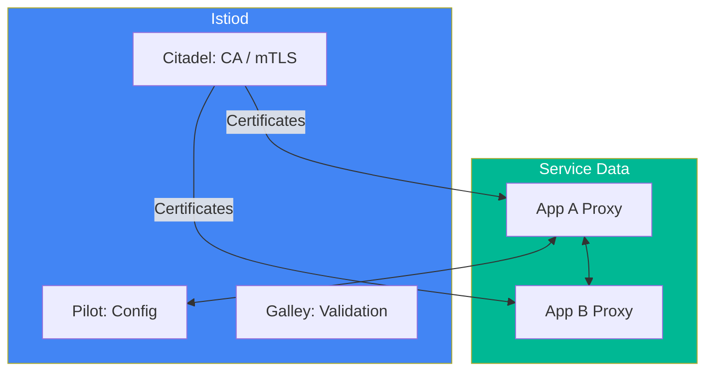

# 🕸️ Service Mesh with Istio (Advanced)

> **"Traditional networking stops at the cluster edge. Service Mesh manages the complexity within."**

## 📚 Overview

As applications transition to microservices, the network between those services becomes the bottleneck for security, observability, and control. Istio provides a transparent layer to manage this complexity.

## 🎯 Learning Objectives

- ✅ Master the **Sidecar Pattern** vs. **Ambient Mesh** (Sidecarless).
- ✅ Implement **mTLS** (Mutual TLS) for Zero-Trust networking.
- ✅ Configure **VirtualServices** for Canary Deployments.
- ✅ Perform **Fault Injection** (Chaos Engineering) via the mesh.

## 🏗️ Theory: Sidecar vs. Ambient

| Feature | Sidecar Mesh (Classic) | Ambient Mesh (New) |
| :--- | :--- | :--- |
| **Logic** | Proxy (Envoy) in every Pod. | Layer 4 (Ztunnel) + Layer 7 Proxy. |
| **Overhead** | High CPU/RAM per pod. | Significantly lower overhead. |
| **Security** | Full mTLS and L7 policy. | Multi-tier security (L4 + L7). |

---

## 🏗️ Visual: Control Plane vs. Data Plane



---

## 🛠️ Traffic Management: Canary Deployment (v1.29+)

**Boilerplate:** `virtual-service.yaml`
```yaml
apiVersion: networking.istio.io/v1beta1
kind: VirtualService
metadata:
  name: my-app-routing
spec:
  hosts:
  - my-app.prod.svc.cluster.local
  http:
  - route:
    - destination:
        host: my-app
        subset: v1
      weight: 90
    - destination:
        host: my-app
        subset: v2
      weight: 10
```

---

## 🏗️ Chaos Engineering: Fault Injection

**Boilerplate:** `fault-injection.yaml`
```yaml
apiVersion: networking.istio.io/v1beta1
kind: VirtualService
metadata:
  name: my-app-chaos
spec:
  hosts:
  - my-app
  http:
  - fault:
      delay:
        percentage:
          value: 10.0
        fixedDelay: 5s
    route:
    - destination:
        host: my-app
```

---
**Next Step**: [Traffic Management](readme.md) 🚀
