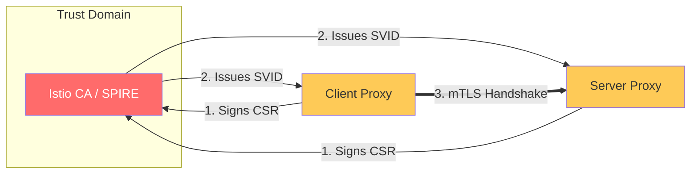

# Zero-Trust Identity & Workload Security Reference

**Doc Version:** 1.0.0
**Role:** DevSecOps Lead / Security Architect
**Scope:** SPIFFE/SPIRE, mTLS, and Istio Authorization

---

## 1. The Death of the IP-Based Security

In dynamic Kubernetes environments, IP addresses are ephemeral and untrusted. Zero-Trust networking assumes the network is already compromised and identifies workloads by **Identity**, not Location.

### SPIFFE (Secure Production Identity Framework for Everyone)
A set of open-source standards that provides a cryptographically provable identity to software services in a platform-agnostic way.
- **SVID (SPIFFE Verifiable Identity Document)**: A document (usually an X.509 certificate) that carries the service's identity.
- **SPIFFE ID**: A URI-formatted string (e.g., `spiffe://cluster.local/ns/default/sa/my-app`).

---

## 2. Mutual TLS (mTLS) at Scale

Service Mesh automates the lifecycle of certificates for $N$ number of services.

### Key Benefits:
- **Encryption in Transit**: Protecting sensitive data from packet sniffing.
- **Mutual Authentication**: Ensuring both the Client and Server are who they say they are.
- **Automated Rotation**: Istiod acts as a Certificate Authority (CA), rotating certificates every 24 hours (or less) without application downtime.

---

## 3. Istio Authorization Policies (RBAC)

Once identity is established via mTLS, we use **AuthorizationPolicies** to define "Who can do What."

### Logic:
- **Match (Selector)**: Which workload(s) does this rule apply to?
- **From (Source)**: Which client(s) or namespaces are allowed to call?
- **To (Operation)**: What methods (`GET`, `POST`) and paths (`/api/v1/*`) are allowed?
- **Action**: `ALLOW`, `DENY`, or `CUSTOM`.

**Rule of Thumb**: Implement a **Default Deny** policy at the root of the mesh and explicitly allow only required communication paths.

---

## 4. Visualizing the Zero-Trust Handshake

---

## 5. Peer Authentication vs. Request Authentication

- **Peer Authentication**: Controls the protocol used for the connection (e.g., "Force mTLS for all traffic in this namespace").
- **Request Authentication**: Validates an end-user credential (JWT token) attached to the request, typically used at the Ingress Gateway to verify user identity before it reaches the backend.

---

## 6. Enterprise Governance Standards

- **Strict mTLS**: Production clusters must be set to `STRICT` mode, rejecting any unencrypted (plaintext) traffic.
- **Identity Sprawl Control**: Use unique **ServiceAccounts** for every microservice. Never share a single ServiceAccount across multiple apps, as this breaks the Zero-Trust identity model.
- **Audit Logs**: Enable Envoy Access Logging with mTLS metadata to prove for audit purposes that all internal traffic was encrypted.

> **Enterprise Pattern**: Implement **Namespace Isolation Gates**. Use a combination of `Sidecar` resources and `AuthorizationPolicies` to ensure that a compromised service in the `Marketing` namespace cannot even *reach* the API for the `Payment` namespace, effectively creating a virtual air-gap between business units.
