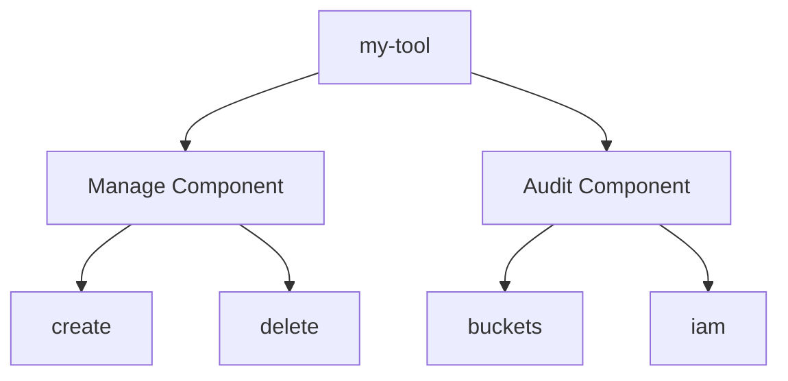

# Professional CLI Frameworks (Click & Typer)
*Building Tools Humans (and Bots) Love to Use*

While `argparse` is great for simple scripts, enterprise-grade tools need nested commands, automatic shell completion, beautiful progress bars, and high-quality "Help" menus. In the Advanced track, we use **Click** (the engine behind the AWS CLI) or **Typer** (the modern, type-hinted successor).

---

## 🏗️ Click vs Typer

### Click (The Classic)
Explicit decorators, extremely robust, and used by millions of production tools.

```python
import click

@click.group()
def cli():
    pass

@cli.command()
@click.option("--name", prompt="Your name", help="Name of the bucket")
def create(name):
    click.echo(f"Creating bucket: {name}")

if __name__ == "__main__":
    cli()
```

### Typer (The Modern)
Built on top of Click, uses standard Python type hints for zero-config validation.

```python
import typer

app = typer.Typer()

@app.command()
def create(name: str = typer.Option(..., prompt=True)):
    print(f"Creating bucket: {name}")

if __name__ == "__main__":
    app()
```

---

## 📊 Logic Flow: Command Nesting



---

## 🛠️ Hands-On Challenges

Master CLI construction by building these professional interfaces.

| Challenge | Topic | Description | Starter Code | Solution |
| :--- | :--- | :--- | :--- | :--- |
| **01. Cluster Manager** | Command Nesting | Build a nested CLI `cluster [create|delete|list]` with Click or Typer. | [Link](./challenges/challenge-01-cli-nesting.py) | [Link](./challenges/solutions/solution-01-cli-nesting.py) |
| **02. Multi-Select Prompt** | Interactivity | Create a Typer CLI that presents a list of instances and allows the user to select one for a restart. | [Link](./challenges/challenge-02-cli-interact.py) | [Link](./challenges/solutions/solution-02-cli-interact.py) |
| **03. Progress Dashboard** | Visuals | Integrate `rich` with `click` to show a beautiful progress bar during a simulated 10-server deployment. | [Link](./challenges/challenge-03-cli-rich.py) | [Link](./challenges/solutions/solution-03-cli-rich.py) |

---

## ❓ Interview Questions

1. **Why use Click instead of standard `argparse`?**
   * *Answer*: Click simplifies complex CLI features like nested commands (sub-commands), automatic argument validation based on types, and built-in support for prompts, password hidden input, and file-handling.
2. **What is 'Shell Completion' and why is it important?**
   * *Answer*: It allows users to hit `TAB` to see available commands or even dynamic values (like a list of bucket names). This significantly improves the Developer Experience (DX) and reduces typos.
3. **How do you handle 'Context' in a nested Click app?**
   * *Answer*: Use `@click.pass_context`. This allows you to store shared data (like a Boto3 session or a Database URL) in the parent command and access it in any child subcommand.

---

**Next Step**: [Generic Automation Framework Design →](../06-generic-automation-framework/readme.md)
