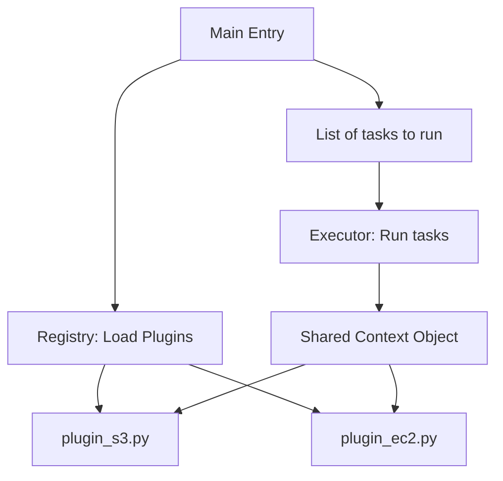

# Generic Automation Framework (GAF)
*Architecture of a Reusable Orchestrator*

The pinnacle of Advanced Python is not writing single scripts, but building a **Generic Automation Framework (GAF)**. This is a modular engine that can execute pluggable tasks, handle complex dependency graphs, and provide unified logging and state management.

---

## 🏗️ The Framework Components

A GAF typically consists of:
1.  **The Registry**: A central dictionary or class that tracks all available "Tasks" or "Plugins".
2.  **The Executor**: The engine that runs tasks (sequentially, in parallel, or via a dependency graph like DAG).
3.  **The Context**: An object passed between tasks containing shared state (Config, DB connections, API clients).
4.  **The Loader**: Logic to dynamically import plugins from a specified directory.

---

## 📊 Logic Flow: Plugin Architecture

---

## 🛠️ Hands-On Challenges

Master architectural scaling by building your own micro-framework.

| Challenge | Topic | Description | Starter Code | Solution |
| :--- | :--- | :--- | :--- | :--- |
| **01. Dynamic Plugin Loader** | Metaprogramming | Write a script that automatically finds and loads all classes inheriting from `BaseTask` in a `/plugins` folder. | [Link](./challenges/challenge-01-plugin-loader.py) | [Link](./challenges/solutions/solution-01-plugin-loader.py) |
| **02. Dependency Runner** | DAG Logic | Implement a simple task runner where Task B only runs if Task A succeeds. | [Link](./challenges/challenge-02-task-deps.py) | [Link](./challenges/solutions/solution-02-task-deps.py) |
| **03. Global State Manager** | Context Pattern | Build a framework where every task adds metadata to a shared `Context` object that is exported at the end. | [Link](./challenges/challenge-03-gaf-context.py) | [Link](./challenges/solutions/solution-03-gaf-context.py) |

---

## ❓ Interview Questions

1. **Why use a plugin architecture instead of a single main script?**
   * *Answer*: Scalability and isolation. Plugins allow multiple teams to add features independently without touching the "Core" code. It also makes testing easier, as each plugin is a self-contained unit.
2. **How does Python's `importlib` help in framework design?**
   * *Answer*: It allows you to import modules by their string name or file path at runtime. This is the foundation of dynamic discovery, where you can "discover" code that didn't even exist when the main framework was written.
3. **What is a 'Hook' or 'Entry Point'?**
   * *Answer*: It's a specific place in the framework lifecycle (e.g., `pre_deploy`, `post_deploy`) where a plugin can "hook" in its custom logic to extend the behavior of the system.

---

**Next Step**: [Python for Infrastructure as Code →](../07-infrastructure-as-code-python/readme.md)
