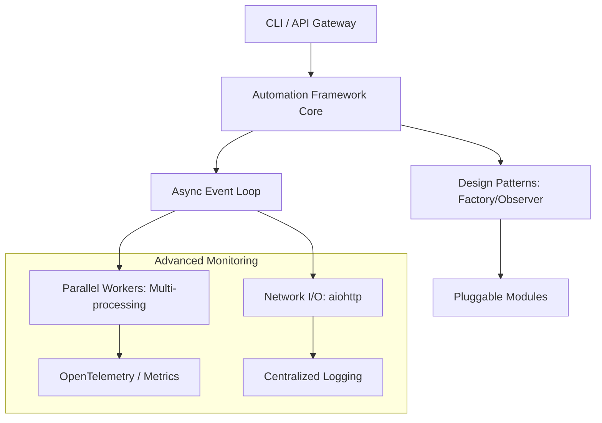

# Advanced Python for DevOps: Enterprise Automation
*Scaling from Scripts to Mission-Critical Frameworks*

Welcome to the Advanced track. Here, we transition from writing automation "that works" to building automation that is **performant**, **modular**, and **resilient** at enterprise scale. We will explore asynchronous execution, high-concurrency patterns, and design principles used in major platforms.

## 📚 Learning Path

| # | Topic | Key Concepts | Tools |
| :--- | :--- | :--- | :--- |
| **01** | [**Async Programming**](./01-async-programming-asyncio/readme.md) | Event Loops, Coroutines, Non-blocking I/O | asyncio, aiohttp |
| **02** | [**Concurrent Futures**](./02-concurrent-futures/readme.md) | Parallelism vs Concurrency | ThreadPool, ProcessPool |
| **03** | [**Advanced OOP & Patterns**](./003-advanced-oop-and-design-patterns/readme.md) | Mixins, Abstract Base Classes, Factories | ABC, Design Patterns |
| **04** | [**Decorators & Meta**](./04-metaprogramming-and-decorators/readme.md) | Wrapping logic, Profiling, Code Generation | Wraps, Type Checking |
| **05** | [**Professional CLIs**](./05-cli-frameworks-click-typer/readme.md) | Arguments, Nesting, Shell Completion | Click, Typer |

---

## 🏛️ Architecture: The Advanced Automation Stack

---

## 🏗️ Real-Life Scenarios

### Scenario 1: The "Sequential Slowness" Bottleneck
**Problem**: A script scanning 5,000 S3 buckets for public policies took 45 minutes to run sequentially.
**Crisis**: During a security audit, the team needed a scan of all 20 AWS accounts immediately. The sequential script would have taken all day.
**Advanced Solution**: Refactored using **Asyncio** and `aiohttp`. By performing non-blocking I/O calls to the AWS API, the same scan was completed in 3 minutes.

### Scenario 2: The "Spaghetti Framework"
**Problem**: A custom deployment tool grew from 2 files to 50. Adding support for a new cloud provider required changes in 15 different places.
**Advanced Solution**: Implemented the **Factory Pattern** and **Dependency Injection**. Now, adding a new provider only requires creating a single class that implements the `CloudProvider` Interface (ABC).

---

## ❓ Interview Questions (Advanced)

1. **What is the Global Interpreter Lock (GIL) and how does it affect DevOps automation?**
   * *Answer*: The GIL is a mutex that protects access to Python objects, preventing multiple native threads from executing Python bytecodes at once. This means multithreading is great for I/O-bound tasks (network calls) but doesn't provide true parallelism for CPU-bound tasks (encryption/compression). For CPU heavy tasks, we use Multiprocessing.
2. **When would you choose `asyncio` over `threading`?**
   * *Answer*: `asyncio` is better for high-concurrency I/O (thousands of connections), as it uses a single thread and manages task switching itself, avoiding the overhead of operating system threads. `threading` is better for legacy code or specific blocking libraries.
3. **What are 'Abstract Base Classes' (ABC) used for?**
   * *Answer*: They define a blueprint for other classes. In automation, we use them to enforce that every "Storage" or "Compute" module implement specific methods like `.provision()` or `.delete()`, ensuring consistency across a large codebase.

---

**Next Step**: [Mastering Async Programming →](./01-async-programming-asyncio/readme.md)

---
## 🧭 Additional Modules
- [06 Generic Automation Framework](06-generic-automation-framework/readme.md)
- [07 Infrastructure as Code Python](07-infrastructure-as-code-python/readme.md)
