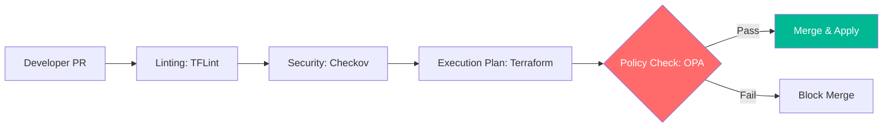

# IaC Governance & Enterprise Scale Reference

**Doc Version:** 1.0.0
**Role:** Cloud Governance Architect / SecOps Lead
**Scope:** Terraform Enterprise, Crossplane, and Policy-as-Code for Infrastructure

---

## 1. Scaling Infrastructure-as-Code

Managed IaC moves from local `.tfstate` files to centralized, governed platforms.

- **Private Module Registry**: Curating a library of "Approved" infrastructure components (VPCs, DBs, Clusters).
- **Remote State Management**: Ensuring state locking and encryption at rest to prevent data corruption and leakage.
- **Provider Governance**: Restricting which cloud providers and versions can be used across the organization.

---

## 2. Crossplane vs. Terraform

Choosing the right tool for the job.

### A. Terraform (Static/Procedural)
- **Best for**: Initial bootstrap, complex legacy migrations, and one-off environment setup.
- **Model**: "Plan and Apply."

### B. Crossplane (Dynamic/Declarative)
- **Best for**: Self-service infrastructure, platform-as-a-service (PaaS), and multi-cloud abstractions.
- **Model**: "Continuous Reconciliation" (Kubernetes Native).

---

## 3. Infrastructure Policy Guardrails

Implementing automated checks into the IaC lifecycle.

1.  **Static Analysis (TFLint/Checkov)**: Scanning code for security misconfigurations (e.g., "Public S3 bucket detected").
2.  **Policy-as-Code (Sentinel/OPA)**: Defining business rules (e.g., "No `m5.large` instances in the `dev` environment").
3.  **Cost Estimates (Infracost)**: Predicting cloud spend before the code is merged.

---

## 4. Visualizing the Governed IaC Pipeline

---

## 5. Drift Detection & Remediation

Infrastructure state must always match the source code in Git.
- **Drift Detection**: Automated jobs that run `terraform plan` on a schedule to check for manual changes.
- **Auto-Correction**: If drift is detected, the pipeline automatically re-applies the code to revert manual changes.

---

## 6. Enterprise Governance Standards

- **Team Isolation**: Using Workspaces or Clusters to ensure Team A cannot modify Team B's infrastructure.
- **Tagging Enforcement**: Every resource MUST be tagged with `ProjectID`, `Environment`, and `BillingCode`. Infrastructure without tags must be automatically destroyed.
- **Role-Based Access Control (RBAC)**: Fine-grained permissions on who can trigger "Plans" vs. who can "Apply" changes to Production.

> **Enterprise Pattern**: Implement **The "Internal Cloud" Provider**. Use Crossplane to create a high-level "Composition" that abstracts a complex cloud setup (e.g., an EKS cluster with RDS and S3). Developers only interact with a simple `Database` object in Kubernetes; the Platform team manages the complex underlying Terraform/Crossplane logic.
