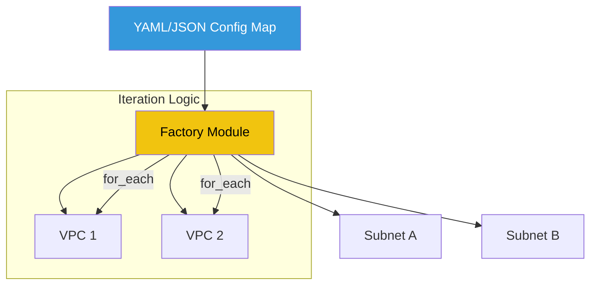

# 🏗️ Advanced Terraform Workflows

> **"If you're copy-pasting code in Terraform, you're building technical debt."**

## 📚 Overview

Intermediate Terraformers use modules; masters build factories. This module dives into **Iterative Patterns** using `for_each` and `dynamic blocks`, and explores how to build **Custom Logic** within your HCL (HashiCorp Configuration Language). We focus on building highly reusable, data-driven modules that can scale to hundreds of resources without code duplication.

## 🎯 Learning Objectives

- ✅ Master **Collections and Loops** (`for`, `for_each`, `flatten`).
- ✅ Implement **Dynamic Blocks** for resource sub-components.
- ✅ Build **Factory Modules** that instantiate multiple resources from a single map.
- ✅ Understand **Advanced Lifecycle Management** (`ignore_changes`, `precondition`).
- ✅ Use **External Data Sources** to bridge Terraform with Python/Go scripts.

## 🗺️ Module Structure

1. **[🔴 01-Iterative-Patterns](readme.md)**
   - Handling complex nested data structures.
   - Using the `flatten` function to simplify `for_each` loops.
2. **[🔴 02-Custom-Data-Sources](readme.md)**
   - Writing Python scripts to fetch dynamic metadata.
   - Managing `depends_on` in complex graph scenarios.

---

## 🏗️ Visual: The Terraform Module Factory



---

## 🛠️ Code: Dynamic Blocks & For Each

```hcl
# Example of a security group with dynamic ingress rules
resource "aws_security_group" "allow_web" {
  name = "dynamic-sg"

  dynamic "ingress" {
    for_each = var.service_ports
    content {
      from_port   = ingress.value
      to_port     = ingress.value
      protocol    = "tcp"
      cidr_blocks = ["0.0.0.0/0"]
    }
  }
}

variable "service_ports" {
  type    = list(number)
  default = [80, 443, 8080]
}
```

## 📋 Professional Pattern: "Configuration separation"

Don't bake your environment values into your HCL logic. Keep your Terraform code strictly for **Architectural Logic** and use **YAML/JSON files** for your **Environment Configuration**. Your module should read the YAML file, parse it into a map, and use `for_each` to create the infrastructure. This allows you to add new environments or services just by editing a simple data file—zero HCL changes required.

---
**Next Step**: Start with [Iterative Patterns](readme.md) 🚀
