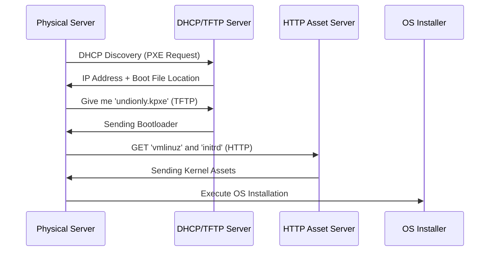

# 🔌 Bare Metal Automation (PXE & MaaS)

> **"Hardware shouldn't be special. Treat your physical servers like disposable cloud instances."**

## 📚 Overview

Bare Metal Automation is the process of provisioning physical hardware without manual human intervention. Instead of manually installing OSs via USB drives, we use network-based boot protocols (**PXE**) and management platforms (**MaaS**, **Tinkerbell**) to transform raw servers into ready-to-use compute nodes.

## 🎯 Learning Objectives

- ✅ Master **PXE (Preboot Execution Environment)** and **iPXE** fundamentals.
- ✅ Understand **DHCP**, **TFTP**, and **HTTP** roles in network booting.
- ✅ Implement **MaaS (Metal as a Service)** for server fleet management.
- ✅ Automate hardware state management with **IPMI** and **Redfish**.

## 🗺️ Module Structure

1. **[🔴 01-PXE-Fundamentals](readme.md)**
   - Setting up a PXE boot environment.
   - Configuring `dnsmasq` for DHCP and TFTP.
2. **[🔴 02-Metal-as-a-Service-MaaS](readme.md)**
   - Fleet discovery and labeling.
   - Commissioning and deploying physical OS images.

---

## 🏗️ Visual: The PXE Boot Lifecycle



---

## 🛠️ Configuration: grub.cfg for Network Boot

```text
set timeout=5

menuentry 'Install Ubuntu 22.04 LTS (Network)' {
    linux /vmlinuz ip=dhcp url=http://10.0.0.10/ubuntu-22.04.iso autoinstall ds=nocloud-net;s=http://10.0.0.10/
    initrd /initrd
}
```

## 📋 Professional Pattern: "Lights-Out Management"
Always leverage out-of-band management interfaces (**IPMI**, **iDRAC**, **iLO**). By using tools like **Redfish API**, you can programmatically reboot a server, change its boot order, or monitor fan speeds without ever entering the data center.

---
**Next Step**: Start with [PXE Fundamentals](readme.md) 🚀
