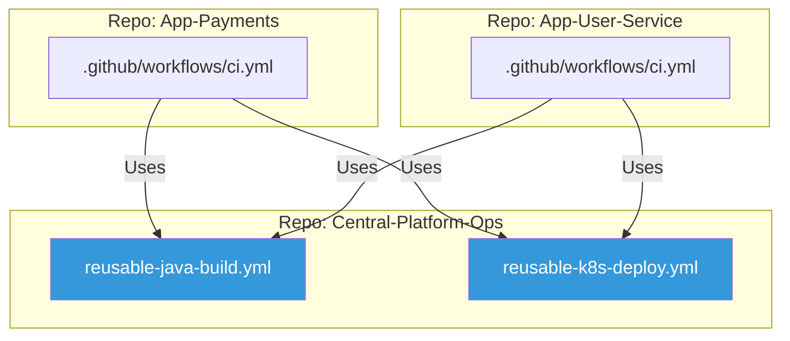

# 🚀 Advanced CI/CD Patterns (GitHub Actions)

> **"Stop repeating yourself. Build a component library for your pipelines."**

## 📚 Overview

Modern CI/CD is about scalability and security. **Advanced GitHub Actions** patterns move away from monolith `.github/workflows/main.yml` files toward a modular, centralized architecture. This module covers **Reusable Workflows**, **Composite Actions**, and organizational security hardening to create a "Pipeline Factory."

## 🎯 Learning Objectives

- ✅ Master **Reusable Workflows** (`workflow_call`) for template-based CI.
- ✅ Build and version **Composite Actions** for complex logic.
- ✅ Implement **OpenID Connect (OIDC)** for keyless cloud auth (AWS/GCP).
- ✅ Manage **Environment Secrets** and Deployment Gates.
- ✅ Orchestrate **Matrix Strategies** for cross-platform testing.

## 🗺️ Module Structure

1. **[🔴 01-Reusable-Workflows](readme.md)**
   - Centralizing logic in a `.github` repository.
   - Passing secrets and inputs safely.
2. **[🔴 02-Custom-Actions-and-Security](readme.md)**
   - JavaScript Actions vs. Docker Actions.
   - Hardening Runners and using OIDC.

---

## 🏗️ Visual: The Centralized Pipeline Architecture



---

## 🛠️ Code: Reusable Workflow Example

**Central File: `.github/workflows/deploy.yml`**

```yaml
name: Reusable Deploy
on:
  workflow_call:
    inputs:
      env:
        required: true
        type: string
    secrets:
      API_KEY:
        required: true

jobs:
  deploy:
    runs-on: ubuntu-latest
    steps:
      - run: echo "Deploying to ${{ inputs.env }}"
```

## 📋 Professional Pattern: "Keyless Auth with OIDC"

Stop storing AWS Access Keys or GCP JSON Keys in GitHub Secrets. Use **GitHub Actions OIDC**. By configuring a trust relationship between GitHub and your Cloud Provider, your runner can fetch short-lived tokens on the fly. This eliminates the risk of static credential theft and simplifies security audits.

---
**Next Step**: Start with [Reusable Workflows](readme.md) 🚀
