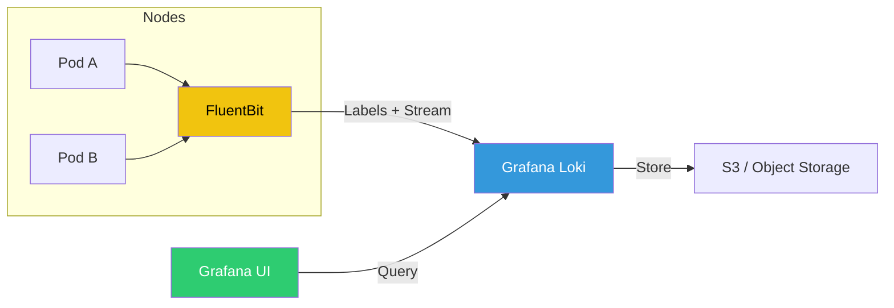

# 🪵 Cloud-Native Logging (Loki & FluentBit)

> **"Logs are the memories of your infrastructure. Don't let them fade into the noise."**

## 📚 Overview

Traditional logging stacks (ELK) are often heavy and costly to maintain. **Cloud-Native Logging** with **Grafana Loki** offers a "Prometheus-like" approach—indexing metadata (labels) rather than the full log content. Paired with **FluentBit** for ultra-lightweight log collection and routing, this module covers building a high-performance, cost-effective observability pipeline for Kubernetes.

## 🎯 Learning Objectives

- ✅ Implement **FluentBit** as a DaemonSet to collect K8s logs.
- ✅ Master **Loki Architecture** (Distributor, Ingester, Querier).
- ✅ Write complex log queries using **LogQL**.
- ✅ Perform **Log Contextualization** (linking Logs to Metrics & Traces).
- ✅ Configure **Retention Policies** and S3/Object Storage backends.

## 🗺️ Module Structure

1. **[🔴 01-Log-Aggregation-Architecture](readme.md)**
   - FluentBit Parsers and Filters.
   - Routing logs to multiple destinations.
2. **[🔴 02-LogQL-and-Dashboards](readme.md)**
   - Creating Grafana dashboards from log data.
   - Alerting based on log patterns (e.g., HTTP 500 spikes).

---

## 🏗️ Visual: The Loki Logging Pipeline



---

## 🛠️ Code: LogQL Example

Extracting error rates from Nginx logs in real-time.

```logql
# Calculate the percentage of 5xx errors over the last 5 minutes
sum by (app) (rate({app="nginx"} |= " 500 " [5m])) 
/ 
sum by (app) (rate({app="nginx"} [5m])) * 100
```

## 📋 Professional Pattern: "Label Parsimony"

In Loki, labels are everything. **Do not over-index.** Avoid using high-cardinality values (like User IDs or Request IDs) as labels. Instead, use labels for static metadata (cluster, namespace, app) and use **LogQL line filters** or **Parser expressions** to search through the dynamic content. This keeps your Loki index small and your queries lightning fast.

---
**Next Step**: Start with [Log Aggregation Architecture](readme.md) 🚀
