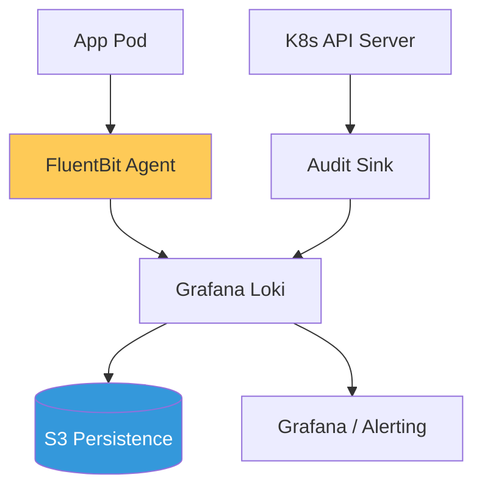

# Enterprise Log Aggregation & Compliance Reference

**Doc Version:** 1.0.0
**Role:** DevSecOps Lead / Compliance Architect
**Scope:** Loki, FluentBit, Audit Logging, and Log Retention Policies

---

## 1. The Role of Logging in Governance

Logging is the primary source of truth for post-incident forensics and regulatory compliance (SOC2, HIPAA, PCI-DSS).

- **System Logs**: Kernel and OS events.
- **Application Logs**: Business logic and application errors.
- **Audit Logs**: Recording "Who did what, where, and when" (Kubernetes API Audit logs).

---

## 2. High-Efficiency Logging with PLG Stack

The **PLG Stack** (Promtail/FluentBit, Loki, Grafana) is designed for cloud-native scale.

### A. The Collection Layer (FluentBit)
- **Why**: C-based, extremely low memory footprint (< 20MB).
- **Function**: Parsing, filtering, and enriching logs with Kubernetes metadata before forwarding.

### B. The Storage Layer (Loki)
- **Philosophy**: "Like Prometheus, but for logs." It only indexes labels, not the full log text.
- **Benefit**: 10x-100x cheaper storage than Elasticsearch/Splunk.

---

## 3. Log Security & Integrity

In a regulated environment, logs must be immutable and secure.

1.  **Tamper-Proofing**: Streaming logs to a write-once bucket (AWS S3 with Object Lock).
2.  **Encryption**: Encrypting logs at rest and in transit (TLS 1.3).
3.  **Redaction**: Automatically stripping PII (Personally Identifiable Information) or secrets like API keys at the scraper level (FluentBit).

---

## 4. Visualizing the Log Journey

---

## 5. Retention & Tiering Strategy

Not all logs are created equal. Storage costs are optimized through tiering.

- **Hot Storage (Loki)**: Last 7-14 days for active troubleshooting. High performance.
- **Cold Storage (S3/Glacier)**: 1-7 years for compliance. Low cost, slower access.
- **Purge Policies**: Automated deletion of non-compliant logs after their retention period expires.

---

## 6. Enterprise Governance Standards

- **Centralized Audit Path**: Kubernetes API Audit logs MUST be streamed to a separate security cluster or SIEM that is inaccessible to the standard administrative team.
- **Strict Format**: Standardizing on JSON logging across all microservices to ensure consistent parsing and searchability.
- **Alerting on Silence**: Implementing "Watchdog" alerts that trigger if log volume drops to zero (indicating a failure in the logging pipeline itself).

> **Enterprise Pattern**: Implement **The "Sidecar-less" Logger**. Avoid using sidecars for logging (which doubles the number of containers). Use a node-level DaemonSet (FluentBit) that reads from the `/var/log/pods` path. This reduces overhead and simplifies orchestration while maintaining full metadata enrichment (Pod name, Namespace, Container ID).
