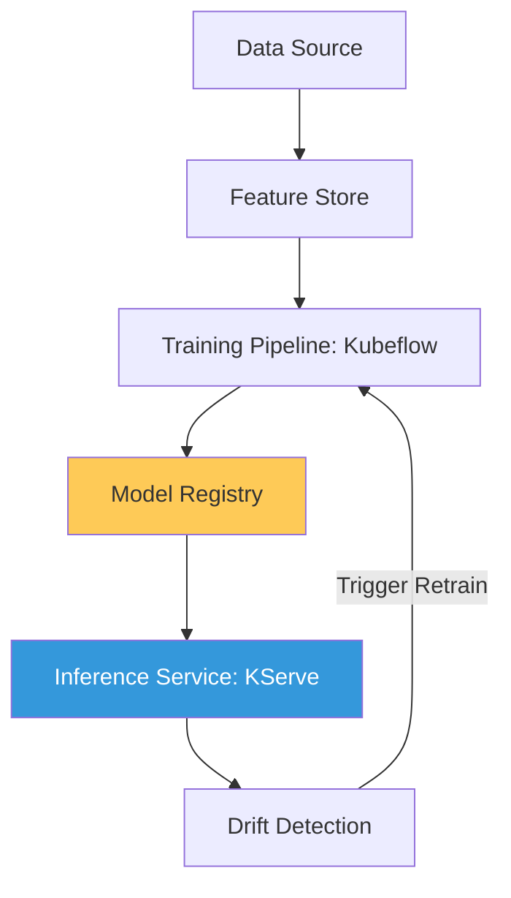

# MLOps Platform & Governance Reference

**Doc Version:** 1.0.0
**Role:** MLOps Engineer / Platform Architect
**Scope:** Model Lifecycle, Feature Stores, and Production ML Infrastructure

---

## 1. MLOps: DevOps for Machine Learning

MLOps (Machine Learning Operations) focuses on the intersection of data engineering, machine learning, and DevOps to provide a reproducible and scalable environment for ML models.

- **Continuous Integration**: Validating data and code.
- **Continuous Delivery**: Deploying model training pipelines and inference services.
- **Continuous Monitoring**: Watching model performance and data drift in production.

---

## 2. The Production ML Architecture

Deploying ML at scale requires standard infrastructure components.

### A. Feature Store
A centralized repository to store and serve features for both training and real-time inference.

### B. Model Registry
Version control for models. Tracking which model version is currently in "Champion" vs. "Challenger" status.

### C. Inference Servers
High-performance serving engines (KServe, Seldon Core) that handle auto-scaling, canary rollouts, and protocol conversion (gRPC/REST).

---

## 3. The Lifecycle of a Production Model

1.  **Exploration**: Data scientists work in Jupyter Notebooks.
2.  **Packaging**: Model and dependencies are containerized.
3.  **Validation**: Model is tested against a "Hold-out" dataset for accuracy and bias.
4.  **Deployment**: Model is deployed as a microservice on Kubernetes.
5.  **Monitoring**: Real-world performance is tracked; retraining is triggered if accuracy drops.

---

## 4. Visualizing the MLOps Pipeline

---

## 5. GPU Resource Management

ML workloads are resource-heavy and expensive.
- **GPU Partitioning (MIG)**: Dividing a single physical A100 GPU into multiple virtual instances for shared team use.
- **Fractional GPUs**: Using specialized schedulers to allow multiple pods to share a single GPU device.
- **Cold-Start Optimization**: Reducing the time it takes for heavy ML containers to pull and start.

---

## 6. Enterprise Governance Standards

- **Model Bias Auditing**: Every model must be scanned for demographic bias before being promoted to production.
- **Lineage Tracking**: Every prediction made in production must be traceable back to the exact dataset version and code commit used to train the model.
- **Reproducibility Guarantee**: The platform must be able to recreate any historical model version within 1 hour in a disaster recovery scenario.

> **Enterprise Pattern**: Implement **The "Challenger" Inference Model**. For every production model (The Champion), run a newer version (The Challenger) in parallel. The Challenger receives 100% of the traffic but its results are discarded—only used to compare performance against the Champion. Once the Challenger proves its superiority over 24 hours, it is automatically promoted.
