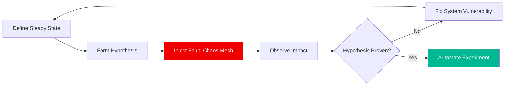

# 🌀 Chaos Engineering with Chaos Mesh (Advanced)

> **"Assume everything fails. Prove that your system survives anyway."**

## 📚 Overview

Chaos Engineering is the discipline of experimenting on a system in order to build confidence in the system's capability to withstand turbulent conditions in production. **Chaos Mesh** is a cloud-native Chaos Engineering platform that orchestrates chaos experiments on Kubernetes environments.

## 🎯 Learning Objectives

- ✅ Understand the **Principles of Chaos Engineering**.
- ✅ Install and configure **Chaos Mesh** in a K8s cluster.
- ✅ Inject **Pod Chaos** (kills, evictions) and **Network Chaos** (latency, partition).
- ✅ Define a **Steady State** and monitor impact during experiments.
- ✅ Build **Chaos Workflows** for automated experiment orchestration.

## 🗺️ Module Structure

1. **[🔴 01-Foundations-of-Chaos](readme.md)**
   - Game Days vs. Automated Chaos.
   - Defining Blast Radius and Steady State.
2. **[🔴 02-Injecting-Faults-with-Chaos-Mesh](readme.md)**
   - YAML-based experiment definitions.
   - Fault types: CPU Stress, Clock Skew, IO Faults.

---

## 🏗️ Visual: The Chaos Lifecycle



---

### YAML: Network Latency Experiment

Injecting 200ms of latency to simulate a slow region-to-region connection.

```yaml
apiVersion: chaos-mesh.org/v1alpha1
kind: NetworkChaos
metadata:
  name: network-latency
spec:
  action: delay
  mode: one
  selector:
    namespaces:
      - default
    labelSelectors:
      'app': 'payment-service'
  delay:
    latency: '200ms'
    correlation: '100'
  duration: '60s'
```

## 📋 Professional Pattern: "Chaos in the Pipe"
Don't wait for production to run chaos tests. Integrate Chaos Mesh into your **Staging/QA Pipelines**. Use it to verify that your Canary deployments automatically rollback when latency is injected or pods are killed during the rollout.

---
**Next Step**: Start with [Foundations of Chaos](readme.md) 🚀
