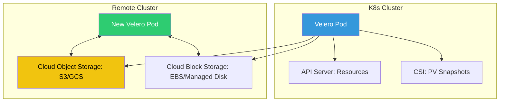

# 💾 Cloud-Native Backup & Restore (Velero)

> **"A backup is only as good as the last time you verified the restore."**

## 📚 Overview

Kubernetes is ephemeral, but your data isn't. **Velero** is the industry standard for backing up Kubernetes cluster resources and persistent volumes. This module covers setting up automated backup schedules, performing cross-region disaster recovery (DR), and migrating stateful workloads between clusters.

## 🎯 Learning Objectives

- ✅ Install **Velero** with S3/Azure/GCS backends.
- ✅ Back up **Persistent Volumes (PVs)** using snapshots and Restic.
- ✅ Implement **Scheduled Backups** with flexible retention policies.
- ✅ Perform **Disaster Recovery** onto a fresh cluster.
- ✅ Use **Namespace Mapping** during restore to rename or migrate environments.

## 🗺️ Module Structure

1. **[🔴 01-Stateful-Backup-Logic](readme.md)**
   - Volume Snapshot Locations (VSL) vs. Backup Storage Locations (BSL).
   - Hooking into databases (Pre-backup fs-freeze).
2. **[🔴 02-Disaster-Recovery-Testing](readme.md)**
   - Simulated cluster failure and recovery steps.
   - Resource filtering (excluding temp pods/logs).

---

## 🏗️ Visual: The Velero Backup Architecture



---

## 🛠️ CLI: Creating a Backup with PVs

```bash
# Create a backup of everything in the 'prod' namespace
velero backup create prod-backup-$(date +%F) \
    --include-namespaces prod \
    --snapshot-volumes \
    --wait

# Verify backup status
velero backup describe prod-backup-latest
```

## 📋 Professional Pattern: "The Restore Drill"

Never assume your backups work. Implement an **Automated Restore Drill**: Once a week, a CI/CD job should trigger a Velero restore into a "Shadow Namespace" or a separate staging cluster. The job then runs a smoke test against the internal database to ensure data integrity. If the test fails, an incident is triggered.

---
**Next Step**: Start with [Stateful Backup Logic](readme.md) 🚀
