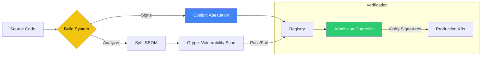

# 🛡️ Supply Chain Security (SLSA & SBOM)

> **"Don't just secure your code; secure everything that touches it."**

## 📚 Overview

Supply Chain Security is the practice of ensuring the integrity and security of the softare building blocks (dependencies, build processes, and delivery mechanisms). With the rise of software supply chain attacks (e.g., SolarWinds), tools like **SBOM (Software Bill of Materials)** and frameworks like **SLSA (Supply-chain Levels for Software Artifacts)** have become critical for enterprise security.

## 🎯 Learning Objectives

- ✅ Generate and manage **SBOMs** using **Syft**.
- ✅ Scan dependencies for vulnerabilities using **Grype**.
- ✅ Implement **Attestations and Signing** with **Cosign**.
- ✅ Understand the **SLSA Framework** and its four levels of security.

## 🗺️ Module Structure

1. **[🔴 01-SBOM-Generation](readme.md)**
   - Generating Syft SBOMs in JSON/SPDX format.
   - Analyzing image layers for hidden vulnerabilities.
2. **[🔴 02-Attestations-and-Signing](readme.md)**
   - Image signing with Keyless signing.
   - Verifying build provenance in CI/CD.

---

## 🏗️ Visual: The Secure Supply Chain Pipeline



---

## 🛠️ Code: Generating and Signing an Artifact

### Step 1: Generate SBOM

```bash
syft my-app:latest -o json > sbom.json
```

### Step 2: Sign the Image

```bash
cosign sign --key cosign.key my-registry.com/my-app:latest
```

### Step 3: Attest the SBOM

```bash
cosign attest --key cosign.key --type spdx --predicate sbom.json my-registry.com/my-app:latest
```

## 📋 Professional Pattern: "Verify Before You Run"
Integrate image verification into your Kubernetes admission controller (using **Policy Controller** or **Kyverno**). Ensure that any image missing a valid signature or an accompanying SBOM attestation is blocked from deployment to production.

---
**Next Step**: Start with [SBOM Generation](readme.md) 🚀
