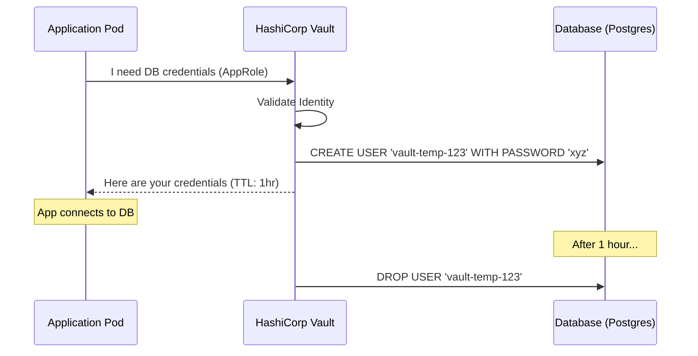

# 🔑 Advanced Secret Management (HashiCorp Vault)

> **"Static secrets are a liability. Dynamic secrets are an asset."**

## 📚 Overview

Modern security demands that we move away from static, long-lived credentials. **Advanced Secret Management** leverages **HashiCorp Vault** to generate "Dynamic Secrets"—credentials created on-demand with a built-in Time-to-Live (TTL). If a dynamic secret is leaked, it expires automatically, drastically reducing the blast radius of a credential compromise.

## 🎯 Learning Objectives

- ✅ Master the lifecycle of **Dynamic Secrets** (Database, AWS, SSH).
- ✅ Implement **Vault Agent Auto-Auth** for transparent application login.
- ✅ Configure **AppRole Auth Method** for CI/CD pipeline integration.
- ✅ Automate **Secret Rotation** for legacy static secrets.
- ✅ Understand **Vault Response Wrapping** for secure secret transport.

## 🗺️ Module Structure

1. **[🔴 01-Dynamic-Secrets-Generation](readme.md)**
   - Configuring the Database Secret Engine.
   - On-the-fly creation of temporary SQL users.
2. **[🔴 02-Vault-Agent-Auto-Auth](readme.md)**
   - Using Sidecar containers to provide secrets to applications.
   - Managing Token renewal and caching.

---

## 🏗️ Visual: The Dynamic Secret Workflow



---

## 🛠️ Configuration: Vault Database Engine Role

```hcl
path "database/config/my-postgresql" {
  capabilities = ["read"]
}

# Define the role that generates temporary users
resource "vault_database_secret_backend_role" "role" {
  name    = "my-app-role"
  backend = "database"
  db_name = "my-postgresql"
  creation_statements = [
    "CREATE USER \"{{name}}\" WITH ENCRYPTED PASSWORD '{{password}}' VALID UNTIL '{{expiration}}';",
    "GRANT SELECT ON ALL TABLES IN SCHEMA public TO \"{{name}}\";"
  ]
  default_ttl = "1h"
  max_ttl     = "24h"
}
```

## 📋 Professional Pattern: "Zero-Knowledge Delivery"
Use **Vault Agent with Template Files**. Instead of your application code knowing how to talk to the Vault API, the Vault Agent sidecar fetches the secret and writes it to a shared volume (memory-backed `emptyDir`) in a standard format (like `.env`). The application just reads a local file, completely unaware of the complex auth and rotation happening in the background.

---
**Next Step**: Start with [Dynamic Secrets Generation](readme.md) 🚀
