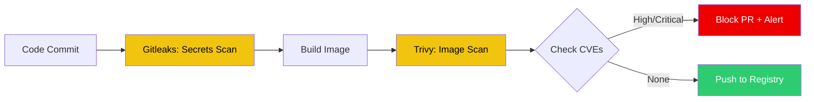

# 🔍 Automated Security Scanning (Trivy & Gitleaks)

> **"Identity is a perimeter, but code is the payload. Scan it early, scan it often."**

## 📚 Overview

Security must be an automated gate, not a manual checkbox. This module focuses on integrating **Vulnerability Scanning** and **Secret Detection** into your CI/CD pipelines. We use **Trivy** for container images and infrastructure as code, **Grype** for deep dependency analysis, and **Gitleaks** to prevent credentials from ever reaching your repository history.

## 🎯 Learning Objectives

- ✅ Implement **Container Image Scanning** (CVE detection) in CI/CD.
- ✅ Orchestrate **Secret Leakage Prevention** with Gitleaks pre-commit hooks.
- ✅ Perform **Software Bill of Materials (SBOM)** analysis with Grype.
- ✅ Configure **Vulnerability Exceptions** (.trivyignore) for false positives.
- ✅ Build **Security Dashboards** to track MTTR (Mean Time To Remediate).

## 🗺️ Module Structure

1. **[🔴 01-Image-Vulnerability-Scanning](readme.md)**
   - High vs. Critical CVE filtering strategies.
   - Base image selection and optimization.
2. **[🔴 02-Secret-Leakage-Prevention](readme.md)**
   - Scanning full Git history for historical leaks.
   - Integrating with GitHub/GitLab protected branches.

---

## 🏗️ Visual: The Secure CI/CD Scanning Pipeline



---

## 🛠️ YAML: GitHub Action for Trivy Scanning

```yaml
name: Security Scan
on: [push, pull_request]

jobs:
  scan:
    runs-on: ubuntu-latest
    steps:
      - uses: actions/checkout@v3
      - name: Run Trivy vulnerability scanner
        uses: aquasecurity/trivy-action@master
        with:
          image-ref: 'myapp:${{ github.sha }}'
          format: 'table'
          exit-code: '1' # Fail the build on vulnerabilities
          ignore-unfixed: true
          vuln-type: 'os,library'
          severity: 'CRITICAL,HIGH'
```

## 📋 Professional Pattern: "The Clean Base Policy"

Don't wait for the Admission Controller to reject a developer's PR. Use **`gator`** (the Gatekeeper CLI) or **`opa test`** in your CI/CD pipeline to validate Kubernetes manifests against your OPA policies *before* they are even sent to the cluster. This provides instant feedback and prevents broken deployments from reaching the API server.

---
**Next Step**: Start with [Image Vulnerability Scanning](readme.md) 🚀
