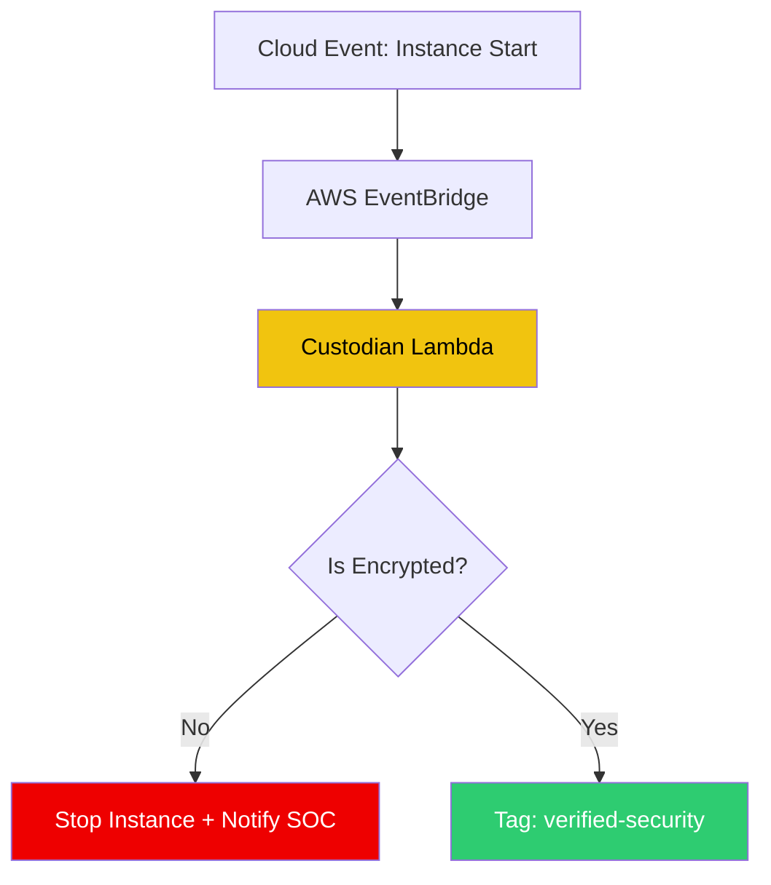

# ⚖️ Automated Compliance Auditing (Cloud Custodian)

> **"If a resource isn't compliant, fix it. If it can't be fixed, terminate it. Automatically."**

## 📚 Overview

Compliance shouldn't be a quarterly audit; it should be a real-time event. **Cloud Custodian** is a Rules Engine for cloud management that allows you to define policies in YAML to manage resources, enforce security, and optimize costs across AWS,Azure, and GCP.

## 🎯 Learning Objectives

- ✅ Master the **Custodian Policy Syntax** (Resources, Filters, Actions).
- ✅ Implement **Real-time Remediation** via Event-driven triggers (CloudWatch Events).
- ✅ Automate **EBS Snapshot cleanup** based on age/tags.
- ✅ Enforce **Tagging Compliance** (Auto-tagging missing creators).
- ✅ Build a **Compliance Dashboard** using Custodian Logs.

## 🗺️ Module Structure

1. **[🔴 01-Custodian-Policy-Language](readme.md)**
   - Writing your first policy: "Finding Orphaned Volumes".
   - Using the `custodian` CLI for dry-runs.
2. **[🔴 02-Real-time-Remediation](readme.md)**
   - Deploying policies as AWS Lambda functions.
   - Responding to `RunInstances` events to enforce encryption.

---

## 🏗️ Visual: Cloud Custodian Enforcement Loop



---

## 🛠️ YAML: S3 Encryption Enforcement Policy

```yaml
policies:
  - name: s3-encrypt-bucket-remediate
    resource: s3
    filters:
      - type: no-encryption
    actions:
      - type: set-encryption
        crypto: AES256
      - type: notify
        template: default
        priority_header: 1
        subject: "Non-compliant S3 Bucket Remediated"
        to: ["security-team@example.com"]
        transport:
          type: sqlite
```

## 📋 Professional Pattern: "Detect, Delay, Destroy"
When enforcing compliance on existing resources, don't terminate them immediately. Use a **Three-Stage Workflow**:
1. **Detect**: Tag the resource with `uncompliant-date`.
2. **Delay**: Send an email to the owner giving them 72 hours to fix.
3. **Destroy**: If the tag is still present after 72 hours, automatically terminate or disable the resource.

---
**Next Step**: Start with [Custodian Policy Language](readme.md) 🚀
