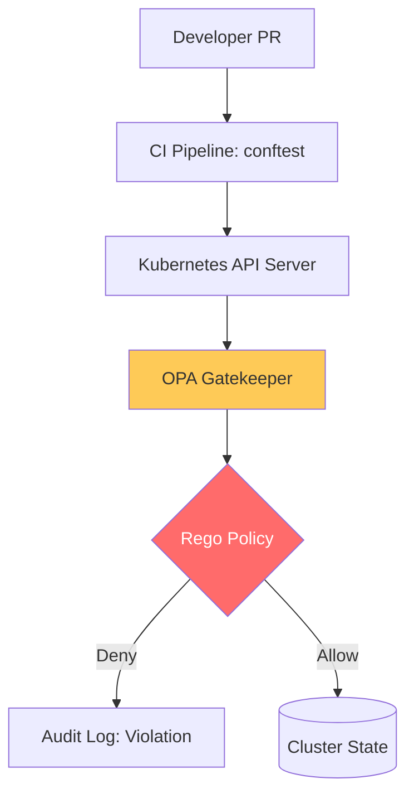

# Policy as Code \u0026 Compliance Auditing Reference

**Doc Version:** 1.0.0
**Role:** Compliance Officer / DevSecOps Engineer
**Scope:** OPA (Rego), Admission Control, and Automated Auditing

---

## 1. Compliance in the Cloud-Native Era

Traditional compliance (manual questionnaires and static audits) fails in dynamic environments. We replace manual checks with **Continuous Compliance**.

- **Goal**: Ensure the infrastructure is *always* compliant, not just during audit week.
- **Mechanism**: Encoding SOC2, HIPAA, or PCI-DSS requirements into machine-readable policies that are enforced at the API level.

---

## 2. Open Policy Agent (OPA) \u0026 Rego

OPA is a vendor-neutral policy engine that uses the **Rego** language to make decisions.

### Admission Control (Gatekeeper)
Gatekeeper is the Kubernetes-specific implementation of OPA.
1.  **ConstraintTemplates**: Define the Rego logic (e.g., "Check if image comes from a trusted registry").
2.  **Constraints**: Apply the logic to specific namespaces or resources (e.g., "Enforce trusted registry in 'Prod'").

---

## 3. The Compliance Lifecycle (Shift-Left Audit)

1.  **Static Check (Pre-Commit)**: Using `conftest` to check Terraform or Helm charts locally.
2.  **Admission Gate (Pre-Deploy)**: Using OPA Gatekeeper to reject non-compliant manifests at the K8s API server.
3.  **Runtime Monitoring (Continuous)**: Using **Compliance Operators** to scan the running cluster for drift against CIS Benchmarks.

---

## 4. Visualizing Policy Enforcement

---

## 5. Automated Auditing (The Technical Evidence)

Compliance requires PROOF.
- **Audit Logs**: Recording every API call and decision made by OPA.
- **Compliance Scans**: Generating a daily report of how every resource aligns with a framework (e.g., "98% compliant with NIST 800-53").
- **Evidence Collection**: Automating the collection of logs and configuration snapshots into an "Audit Repository" for external examiners.

---

## 6. Enterprise Governance Standards

- **Default Deny (Policy)**: New clusters must not allow any Pod creation until the OPA Gatekeeper baseline is applied.
- **Exceptions Governance**: Exceptions to security policies (e.g., "Allow this specific legacy pod to run as root") must be documented in Git with an expiration date and approved by a Security Architect.
- **Policy Tiering**: 
    - **Global**: Enforced on every cluster.
    - **Environment**: Enforced on Prod/Stage only.
    - **Project**: Team-specific rules.

> **Enterprise Pattern**: Implement **The Automated Compensating Control**. If a compliance scan finds an "S3 Bucket with public access," do not just alert—have a serverless function (Lambda) or an OPA mutation policy automatically flip the bucket back to private and alert the owner. This ensures your "Window of Risk" is reduced from hours/days to seconds.
