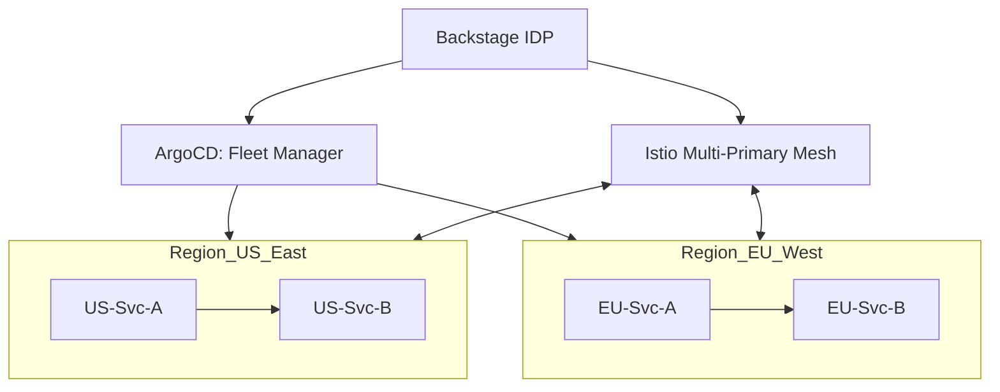

# 🏆 Capstone: Global Microservices Mesh (Service Mesh + GitOps + AIOps)

> **"The ultimate mastery of the cloud is the ability to manage complexity at global scale."**

## 🏗️ Project Overview

This capstone project integrates all the "Strategic Excellence" skills:
1.  **Service Mesh (Istio)**: For global traffic management and security.
2.  **GitOps (ArgoCD)**: To manage fleet deployments across multi-region clusters.
3.  **Platform Engineering (Backstage)**: As the single pane of glass for the entire stack.
4.  **AIOps**: For automated anomaly detection and self-healing.

## 🎯 Architecture

## 🛠️ Key Deliverables

1.  **Multi-Region Cluster Setup**: Using local Kind/K3s or Cloud EKS/GKE.
2.  **Cross-Cluster Service Discovery**: Services in US can call services in EU via Istio East-West gateways.
3.  **Global Canary Rollout**: Deploying a new version to 10% of users globally using a single GitOps command.
4.  **AI-Augmented Incident Response**: Integrating an LLM to analyze cross-region latency spikes and suggest routing changes.

## 🚀 Deployment Instructions

1.  **Bootstrap Infrastructure**: Run the Terraform scripts in `07-Boilerplates/3-Advanced/`.
2.  **Install the Mesh**: `istioctl install -f manifests/istio-multi-region.yaml`.
3.  **Connect GitOps**: `argocd cluster add context-us-east && argocd cluster add context-eu-west`.
4.  **Launch the IDP**: Access the Backstage dashboard to visualize the global topology.

---
**Seniority Note**: Successfully deploying and managing a multi-region service mesh is the hallmark of a **Principal / Staff DevOps Engineer**.
