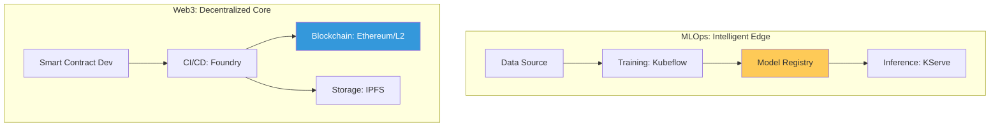

# Intelligent & Decentralized Systems Reference (MLOps & Web3)

**Doc Version:** 1.0.0
**Role:** Specialized Architect / Emerging Tech Lead
**Scope:** MLOps Lifecycles, Blockchain Infrastructure, and Decentralized DevOps

---

## 1. MLOps: The Intelligent Lifecycle

MLOps bridge the gap between Data Science and Operations, ensuring ML models are as reliable as traditional software.

### A. The Three Loops of MLOps
1.  **Data Loop**: Collecting, cleaning, and versioning data (DVC, Pachyderm).
2.  **Training Loop**: Reproducible experiments and model versioning (MLflow).
3.  **Deployment Loop**: Serving models and monitoring for drift (KServe, Seldon).

### B. Core Concepts: Model Drift vs. Data Drift
- **Data Drift**: The input data distribution changes (e.g., user behavior shifts).
- **Model Drift**: The model's predictive power decays over time.

---

## 2. Web3: The Decentralized Infrastructure

Web3 DevOps shifts from centralized servers to a distributed ledger and p2p storage.

### A. Node Infrastructure
- **Full Nodes**: Validating the entire chain locally.
- **Light Nodes**: Interacting with the chain without storing the full history.
- **RPC Providers**: Infura/Alchemy vs. Self-hosted clusters (High-availability).

### B. Decentralized Storage
Moving away from S3 to **IPFS** (InterPlanetary File System) or **Arweave** for immutable document and asset storage.

---

## 3. Visualizing the Specialized Stack

---

## 4. Security in Emerging Domains

- **MLOps**: Preventing "Model Poisoning" and ensuring data privacy (Differential Privacy).
- **Web3**: Smart Contract security audits and Private Key management (HSM/MPC).

---

## 5. Enterprise Governance Standards

- **Model Lineage**: Every prediction MUST be traceable back to the training dataset and code version.
- **Decentralized SLA**: Defining availability for dApps when the underlying chain is outside of your direct control.
- **Gas Optimization**: Automated CI/CD checks to ensure smart contract updates don't exceed budget.

> **Enterprise Pattern**: Implement **The Hybrid ML/Web3 Strategy**. Use MLOps to generate insights from data, but record the "Hash" of the model and its findings on a Blockchain. This provides an immutable audit trail of how decisions were made by the AI, critical for regulated industries like Finance and Healthcare.
