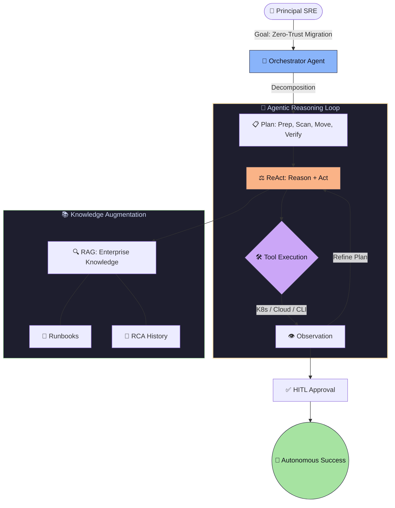

# 🦅 Advanced Prompt Engineering & Agentic AI for SRE

> **"In the era of autonomous infrastructure, the Senior Engineer doesn't just write scripts; they architect the 'brains' that manage the scripts."**

---

## 🏆 The Prompt Engineering Master Reference
Before diving into the modules, study the **[MASTER_PROMPT_ENGINEERING_REFERENCE.md](./MASTER_PROMPT_ENGINEERING_REFERENCE.md)**. This is your definitive guide for ReAct loops, RAG patterns, and security guardrails.

---

### 🏗️ Visual: The Agentic Reasoning Loop (Staff Pattern)

---

## 📂 Module Structure (The Architect Way)
We have reorganized this directory to support production-grade prompting workflows:
- **[/templates](./templates)**: Reusable reasoning and persona templates.
- **[/evals](./evals)**: Benchmarks and test cases for your prompts.
- **[/guardrails](./guardrails)**: Safety schemas and input validation logic.
- **[/docs](./docs)**: Deep-dive documentation on LLM-Ops.

---

## 🎓 Learning Objectives

- ✅ Architect **Agentic Workflows** using the **ReAct (Reason + Act)** pattern.
- ✅ Implement **Multi-Agent Orchestration** for security and compliance (Red-Team/Blue-Team).
- ✅ Build **Retrieval-Augmented Generation (RAG)** pipelines for SRE knowledge bases.
- ✅ Implement **LLM-Ops** for governed, cost-efficient enterprise AI usage.
- ✅ Design **Self-Healing Infrastructure** loops that remediate 80% of Tier-1 incidents.
- ✅ Master **System-Level Guardrails** to prevent autonomous failures.

---

## 🚀 The Staff-Level "Force Multiplier"

### 1. Autonomous RCA (Root Cause Analysis)
Traditional RCA takes hours of log-digging. Agentic systems can crawl logs, correlate them with recent Git commits, and present a ranked list of likely causes with a draft fix in minutes.

### 2. Multi-Agent Governance
Move beyond single-prompt logic. Use a **Reviewer-Actor** pattern where one agent generates a change and another "Adversarial" agent attempts to find vulnerabilities in it before a human ever sees the code.

---

## ❓ Staff-Level Interview Preparation

1. **Q: What is the primary advantage of ReAct (Reason+Act) over Chain-of-Thought (CoT)?**
   *A: CoT is a static internal process (thinking). ReAct allows the AI to step outside of its "brain" to use external tools (APIs, CLI) to get new information and update its plan based on real-world observations.*

2. **Q: How do you prevent 'Agentic Loops' from exhausting your cloud budget or causing a loop of destruction?**
   *A: 1) Strict Token/Step limits. 2) Semantic Guardrails (e.g., "Never run `rm` on nodes tagged 'prod'"). 3) Human-in-the-loop (HITL) checkpoints for any destructive action.*

---

## 🔗 Next Steps

Master the logic of the machine.

1. Review the **[Master Reference](./MASTER_PROMPT_ENGINEERING_REFERENCE.md)** 🏆
2. Proceed to: **[Part 1: Agentic Architecture](./part-01-agentic-orchestration/readme.md)** 🚀