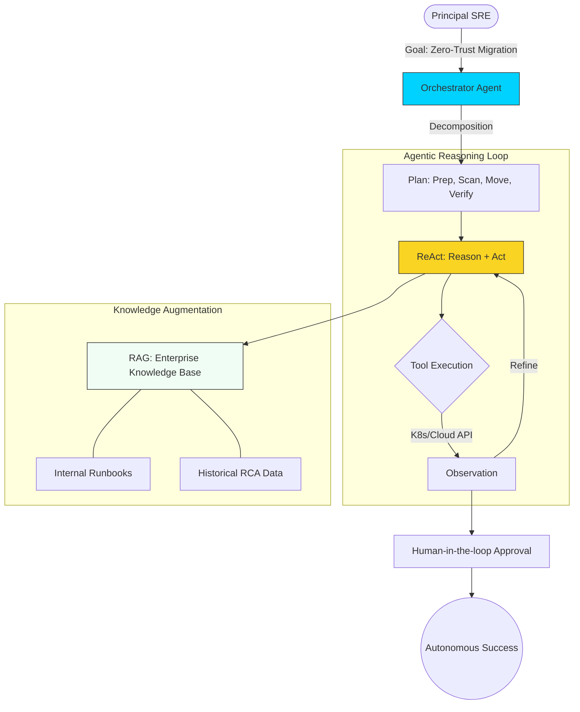

# 🦅 Advanced Prompt Engineering & Agentic AI for SRE

> **"In the era of autonomous infrastructure, the Senior Engineer doesn't just write scripts; they architect the 'brains' that manage the scripts."**

## 📚 Overview

At the **Advanced/Staff** level, Prompt Engineering evolves into **Agentic Systems Architecture**. You are no longer just asking an AI for a single function; you are building autonomous systems that can:
- **Reason** through complex outages using historical data (**RAG**).
- **Plan** multi-step infrastructure migrations using **Agentic Orchestration**.
- **Self-Heal** production environments by closing the loop between Observability and Remediation.

This module focuses on the intersection of **Generative AI** and **Autonomous Operations**.

---

## 🎓 Learning Objectives

By the end of this advanced track, you will:

- ✅ Architect **Agentic Workflows** using the **ReAct (Reason + Act)** pattern.
- ✅ Implement **Multi-Agent Orchestration** for security and compliance (Red-Team/Blue-Team).
- ✅ Build **Retrieval-Augmented Generation (RAG)** pipelines for SRE knowledge bases.
- ✅ Implement **LLM-Ops** for governed, cost-efficient enterprise AI usage.
- ✅ Design **Self-Healing Infrastructure** loops that remediate 80% of Tier-1 incidents.
- ✅ Master **System-Level Guardrails** to prevent autonomous failures.

---

## 🗺️ Curriculum Structure

| Part | Topic | Description |
| :--- | :--- | :--- |
| **[🔵 Part 1](./part-01-agentic-orchestration/)** | **Agentic Architecture** | Reasoning loops (ReAct/CoT), Multi-Agent frameworks (AutoGPT/CrewAI logic). |
| **[🟣 Part 2](./part-02-intelligent-platforms/)** | **Intelligent Platforms** | Building RAG for SRE, LLM-Ops, FinOps for AI, and Private LLMs. |
| **[🔴 Part 3](./part-03-autonomous-ops/)** | **Autonomous Operations** | Self-healing loops, AI-driven Incident response, and Production Guardrails. |
| **[📊 Part 4](./assessments/)** | **Mastery Assessments** | Staff-level architectural challenges and incident simulations. |

---

## 🚀 The Staff-Level "Force Multiplier"

### 1. Autonomous RCA (Root Cause Analysis)
Traditional RCA takes hours of log-digging. Agentic systems can crawl logs, correlate them with recent Git commits, and present a ranked list of likely causes with a draft fix in minutes.

### 2. Multi-Agent Governance
Move beyond single-prompt logic. Use a **Reviewer-Actor** pattern where one agent generates a change and another "Adversarial" agent attempts to find vulnerabilities in it before a human ever sees the code.

### 3. Knowledge Democratization (RAG)
Turn your internal PDF runbooks and Slack incident history into an active knowledge base that "primes" your AI prompts with your company's specific tribal knowledge.

---

## 🏆 Case Study: Project "Self-Healing EKS"

**The Problem**: A global financial platform suffered from intermittent "OOMKills" in their EKS clusters, causing micro-downtimes.
**The Agentic Solution**: A multi-agent loop was created. 
- **Agent A (Watcher)**: Monitors Prometheus alerts. 
- **Agent B (Diagnoser)**: Executes `kubectl top` and analyzes historical RAG data to see if this is a known leak.
- **Agent C (Fixer)**: Calculates new resource limits based on 30-day usage trends and submits a PR to the Terraform repo.
- **The Result**: 92% of OOM incidents were resolved autonomously without paging an engineer.

---

## ❓ Staff-Level Interview Preparation

1. **Q: What is the primary advantage of ReAct (Reason+Act) over Chain-of-Thought (CoT)?**
   *A: CoT is a static internal process (thinking). ReAct allows the AI to step outside of its "brain" to use external tools (APIs, CLI) to get new information and update its plan based on real-world observations.*

2. **Q: How do you prevent 'Agentic Loops' from exhausting your cloud budget or causing a loop of destruction?**
   *A: 1) Strict Token/Step limits. 2) Semantic Guardrails (e.g., "Never run `rm` on nodes tagged 'prod'"). 3) Human-in-the-loop (HITL) checkpoints for any destructive action.*

3. **Q: Why is RAG more effective than Fine-Tuning for SRE tasks?**
   *A: Fine-tuning is slow and dates the model. RAG provides real-time, up-to-date context from your latest logs and documentation, ensuring the AI is responding to the *current* state of the infrastructure.*

---

## 🔗 Next Steps

Master the logic of the machine.

Proceed to: **[Part 1: Agentic Architecture](./part-01-agentic-orchestration/readme.md)** 🚀

---
**Last Updated:** 2026-02-11  
**Version:** 5.0 (Staff/Principal Level)