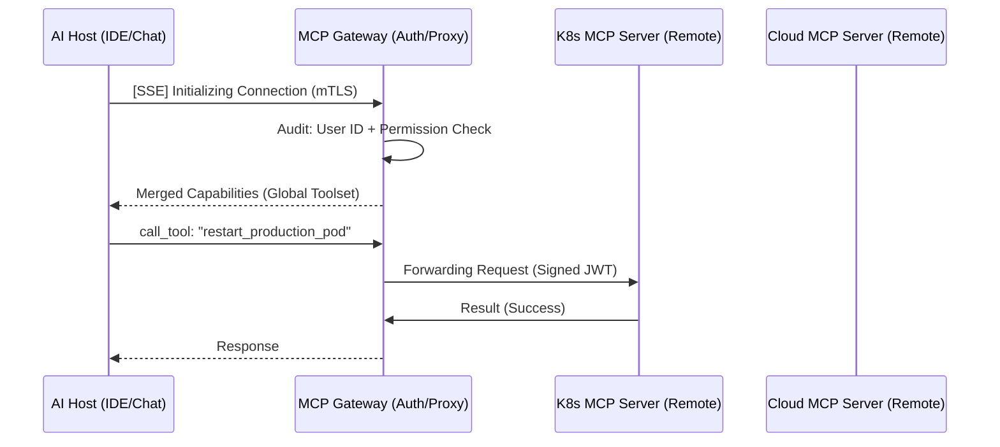

# 🏗️ MASTER_MCP_REFERENCE: The Staff Engineer's Guide to Enterprise MCP

> **"In the Intermediate phase, we built the nervous system. In the Advanced phase, we build the Global Backbone. This isn't about running a single script; it's about architecting a resilient, distributed, and secure AI-Ops platform."**

---

## 🏛️ 1. The Enterprise MCP Blueprint: Gateway & Federation

At scale, individual STDIO connections are insufficient. We shift to a **Gateway Architecture** where hosts connect to a central arbiter.

### The Federated Gateway Handshake


### Key Differences (Intermediate vs. Advanced)
| Feature | Intermediate | Advanced (Enterprise) |
| :--- | :--- | :--- |
| **Transport** | STDIO (Local Process) | **SSE / WebSockets** (Distributed) |
| **Discovery** | Static config files | **Dynamic Service Discovery** |
| **Security** | OS Permissions | **Zero-Trust (mTLS + OIDC)** |
| **Governance** | Local logs | **Centralized Audit Trails** |

---

## 🛠️ 2. Production SDK Implementation (Advanced Patterns)

### A. Custom SSE Transport (TypeScript)
For servers that live in different containers or clouds from the AI Host.

```typescript
import express from "express";
import { McpServer } from "@modelcontextprotocol/sdk/server/mcp.js";
import { SSEServerTransport } from "@modelcontextprotocol/sdk/server/sse.js";

const server = new McpServer({ name: "Enterprise-SRE-SSE", version: "2.0.0" });
const app = express();

let transport: SSEServerTransport;

app.get("/sse", async (req, res) => {
  transport = new SSEServerTransport("/messages", res);
  await server.connect(transport);
});

app.post("/messages", async (req, res) => {
  await transport.handlePostMessage(req, res);
});

app.listen(3000, () => console.log("SSE MCP Server listening on 3000"));
```

### B. High-Performance Tool Dispatching (Python)
Implementing request batching and async processing for telemetry.

```python
from mcp.server.fastmcp import FastMCP
import asyncio

mcp = FastMCP("Advanced-Telemetry")

@mcp.tool()
async def query_cluster_metrics(cluster_id: str):
    """Async fetching of metrics from multiple prometheus endpoints."""
    # Concurrent fetching pattern
    results = await asyncio.gather(
        fetch_prom(f"{cluster_id}-us-east"),
        fetch_prom(f"{cluster_id}-eu-west")
    )
    return format_results(results)
```

---

## 🛡️ 3. The Security Framework: Multi-Layer Sandboxing

**"Never trust the AI inputs. Never trust the underlying host. Sandbox both."**

### A. Firejail + Docker (Double-Isolation Pattern)
Run your MCP server inside a Docker container that is further restricted by a Firejail profile.

```bash
# Example Run Command
docker run --rm \
  --cap-drop ALL \
  --security-opt no-new-privileges \
  --read-only \
  -v ./logs:/app/logs:ro \
  mcp-server-image \
  firejail --profile=/app/mcp-strict.profile python server.py
```

### B. Input Parameter Hardening (Zod/Pydantic)
Use strict typing to prevent the AI from injecting shell metacharacters.

```typescript
server.tool("execute_sql", {
  query: z.string().regex(/^SELECT/i).describe("Only read-only SELECT queries allowed"),
  limit: z.number().max(100).default(10),
}, async ({ query, limit }) => { ... });
```

---

## 🚀 4. Advanced DevOps Use Cases

1.  **Cross-Cloud Resource Bridge**: An MCP server that bridges resources from AWS, GCP, and Azure into a single context window for "Cloud-Agnostic" SRE work.
2.  **Autonomous Incident Triage**: An agent that, via MCP, can read Kubernetes logs, query Datadog, check Terraform state, and write a summary to Slack automatically.
3.  **Governance as Code**: Tools that check if a proposed infrastructure change (via `terraform plan`) complies with corporate security policies before allowing an 'Apply'.

---

## 📂 5. Standardized Directory Structure

```text
/mcp-advanced-root
├── 📂 servers/              # Production-grade implementations
│   ├── 📂 gateway/          # Central Routing & Auth
│   ├── 📂 logs-engine/      # Scalable log processing
│   ├── 📂 cloud-bridge/     # Multi-cloud interface
├── 📂 deployments/          # K8s Manifests & Dockerfiles
│   ├── 📂 helm/             # MCP Server Helm Charts
│   └── docker-compose.yml   # Local HA Testing
├── 📂 config/               # Security policies & mTLS Certs
├── 📂 clients/              # Advanced Host configs (Zed, Cursor, Custom SDK)
└── MASTER_MCP_REFERENCE.md  # <--- You Are Here
```

---

## 🏁 Conclusion: The Path to Autonomous Ops
Staff Engineer, you aren't just building a tool. You are building the **Control Plane** for the next generation of infrastructure management. 

**Advanced Checklist**:
1. [ ] Implement the SSE Gateway with mTLS.
2. [ ] Define your custom Firejail security profile.
3. [ ] Deploy a federated server cluster to Kubernetes using Helm.
