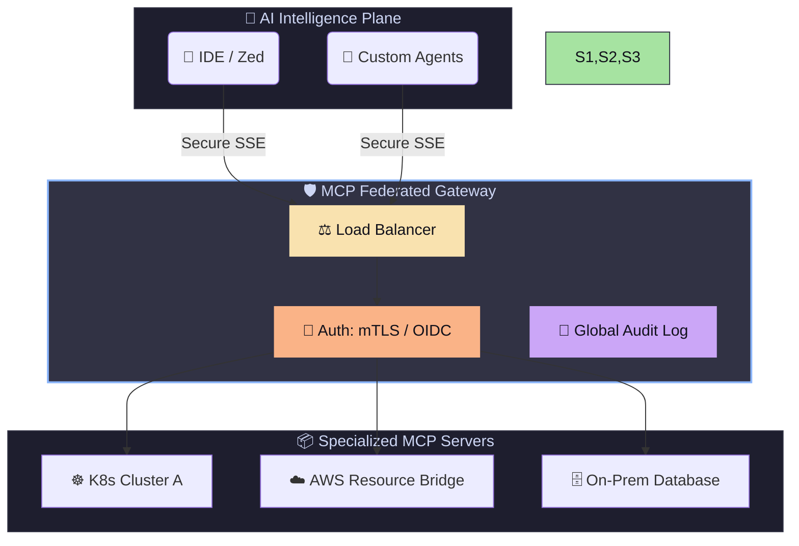

# 🔌 Advanced Model Context Protocol (MCP)

> **"Listen up, Staff Engineer. At this level, we don't just 'run' MCP. We architect global context backbones that unify fragmented infrastructure into a single, intelligent control plane."**

---

## 🏆 The Advanced Master Reference
Before proceeding, read the **[MASTER_MCP_REFERENCE.md](./MASTER_MCP_REFERENCE.md)**. It contains the blueprints for Enterprise Gateway patterns, mTLS security, and SSE (Server-Sent Events) transport implementations.

---

### 🏗️ Visual: The Federated AI Control Plane (Enterprise)

---

## 📂 Module Structure (Enterprise Standard)
This directory has been reorganized to support distributed development:

- **[/servers](./servers)**: Source code for high-performance SSE and Webhook servers.
- **[/deployments](./deployments)**: Helm charts and Docker Compose files for HA clusters.
- **[/clients](./clients)**: Advanced configurations for connecting proprietary agents.
- **[/config](./config)**: Security policies, mTLS profiles, and Zero-Trust schemas.

---

## 🎓 Learning Objectives (Staff Level)

1. **Architecting for Scale**: Transitioning from STDIO (local) to SSE (remote).
2. **Hardening**: Implementing "Double-Isolation" (Docker + Firejail).
3. **Federation**: Unifying multi-cloud tools into a single context window.
4. **Governance**: Building audit-ready AI-Ops platforms.

---

## 🚀 Lab: The 2 AM SRE Bot
**Challenge**: Deploy an SSE-based MCP server to a Kubernetes cluster that allows an AI, connected via a remote gateway, to perform read-only log analysis and suggest 'Safe' restart commands for approval.

1. Initialize the Gateway in `servers/gateway`.
2. Deploy the K8s Sidekick in `deployments/helm`.
3. Use the `npx @modelcontextprotocol/inspector` to verify the remote SSE connection.

---

## 🎤 Interview Prep (Staff/Principal)
- **Q**: How do you prevent 'Prompt Injection' in a tool that queries a database?
- **A**: *By using strict JSON Schema validation (Zod/Pydantic) and mapping natural language queries to predefined, parameterized SQL templates rather than raw execution.*

- **Q**: Why use SSE over STDIO in an enterprise environment?
- **A**: *SSE allows the AI and the Tools to live on different network segments, facilitating mTLS auth, centralized logging, and high availability.*

