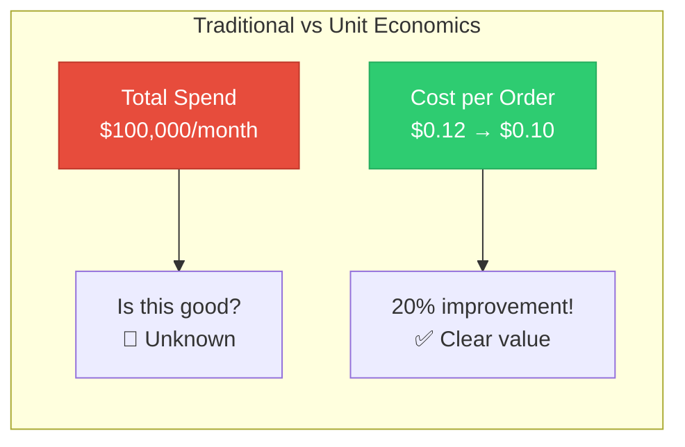
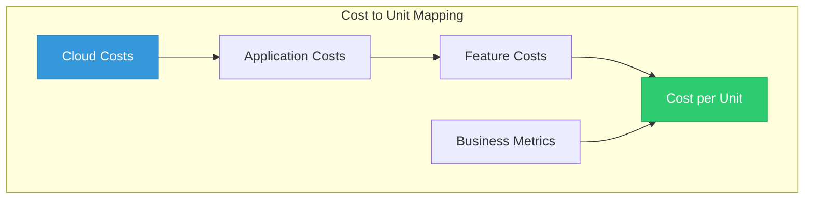
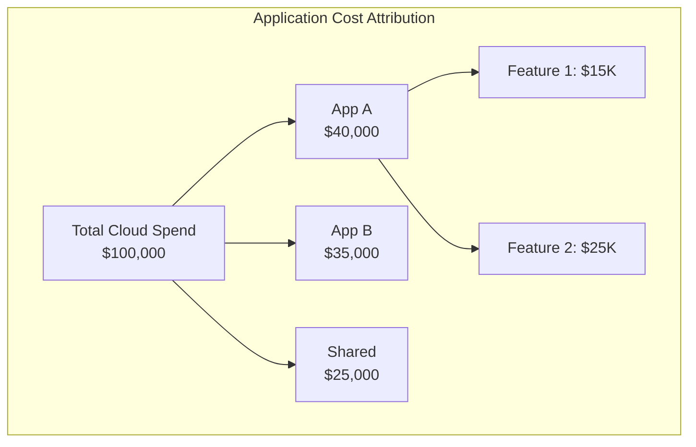
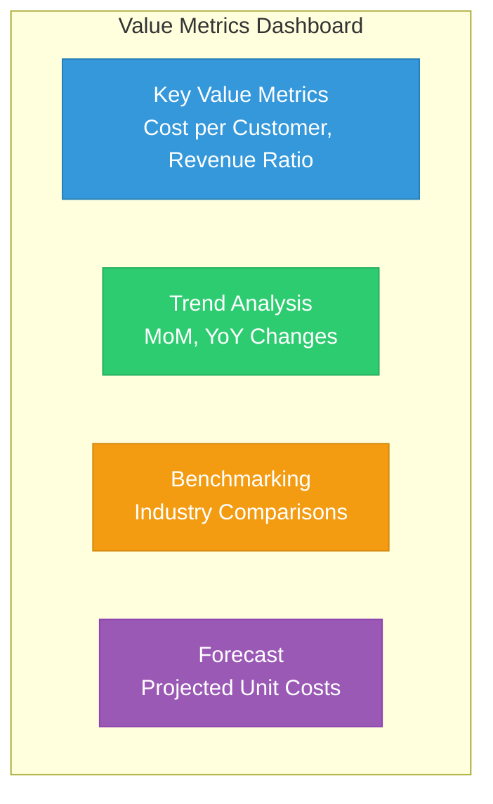
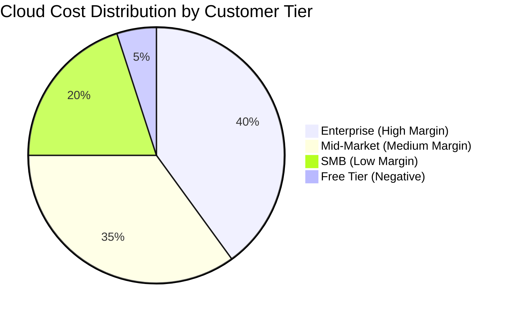
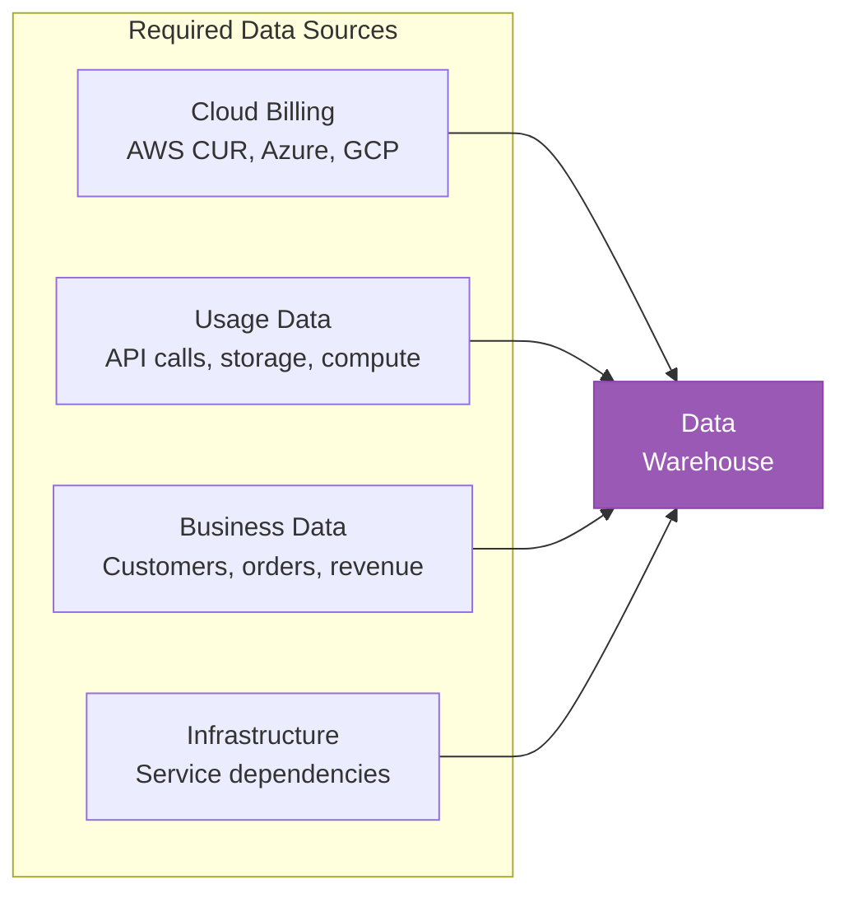

# Lesson 03: Unit Economics & Value Metrics

## Learning Objectives

By the end of this lesson, you will:
- Define and calculate unit economics for cloud
- Connect cloud costs to business value
- Implement cost per customer/transaction
- Build value-based reporting

---

## Why Unit Economics Matters

Traditional cost reporting shows **total spend**, but unit economics shows **efficiency**.



### The Shift in Perspective

| Traditional View | Unit Economics View |
|------------------|---------------------|
| "We spent $1M on cloud" | "Cost per transaction dropped 15%" |
| "Costs grew 20%" | "Revenue grew 30%, cost per $ revenue decreased" |
| "Storage costs are too high" | "Cost per GB served is industry-leading" |

---

## Key Unit Metrics

### Business Metrics

| Metric | Formula | Example |
|--------|---------|---------|
| **Cost per Customer** | Total Cloud Cost / Active Customers | $5.20/customer/month |
| **Cost per Transaction** | Compute Cost / Transactions | $0.002/transaction |
| **Cost per Revenue $** | Cloud Cost / Revenue | $0.08 per $1 revenue |
| **Cost per Feature** | Feature Infrastructure / Usage | $0.10/feature use |

### Technical Metrics

| Metric | Formula | Example |
|--------|---------|---------|
| **Cost per Request** | API Infra Cost / API Calls | $0.00001/request |
| **Cost per GB Stored** | Storage Cost / Data Volume | $0.023/GB/month |
| **Cost per GB Transferred** | Transfer Cost / Data Volume | $0.09/GB |
| **Cost per Compute Hour** | Compute Cost / Compute Hours | $0.10/hour |

---

## Calculating Unit Costs

### Step 1: Define the Business Unit

Choose metrics that matter to your business:

| Business Type | Relevant Units |
|---------------|----------------|
| **E-commerce** | Orders, customers, GMV |
| **SaaS** | Users, API calls, features used |
| **Media** | Views, streams, subscribers |
| **Gaming** | Players, sessions, DAU/MAU |
| **Fintech** | Transactions, accounts |

### Step 2: Map Costs to Units



### Step 3: Calculate and Track

```sql
-- Calculate cost per customer by month
WITH monthly_costs AS (
    SELECT 
        DATE_TRUNC('month', billing_date) as month,
        SUM(cost_usd) as total_cost
    FROM normalized_costs
    WHERE service_category IN ('compute', 'database', 'storage')
    GROUP BY 1
),
monthly_customers AS (
    SELECT 
        DATE_TRUNC('month', activity_date) as month,
        COUNT(DISTINCT customer_id) as active_customers
    FROM customer_activity
    GROUP BY 1
)
SELECT 
    c.month,
    c.total_cost,
    cu.active_customers,
    c.total_cost / cu.active_customers as cost_per_customer
FROM monthly_costs c
JOIN monthly_customers cu ON c.month = cu.month
ORDER BY c.month;
```

---

## Cost Attribution Models

### Application-Based Attribution



### Customer-Based Attribution

```sql
-- Attribute costs to customers based on usage
SELECT 
    c.customer_id,
    c.customer_tier,
    SUM(u.api_calls) as total_api_calls,
    SUM(u.storage_gb) as total_storage,
    -- Allocate costs proportionally
    SUM(u.api_calls) * (SELECT compute_cost_per_call FROM unit_costs) 
        + SUM(u.storage_gb) * (SELECT storage_cost_per_gb FROM unit_costs) 
        as attributed_cost
FROM customers c
JOIN usage_data u ON c.customer_id = u.customer_id
GROUP BY c.customer_id, c.customer_tier;
```

### Activity-Based Costing (ABC)

| Activity | Cost Driver | Unit Cost |
|----------|-------------|-----------|
| **User Registration** | New users | $0.50/registration |
| **Order Processing** | Orders | $0.15/order |
| **Data Storage** | GB stored | $0.03/GB |
| **API Calls** | Requests | $0.0001/request |
| **Support** | Tickets | $5.00/ticket |

---

## Value Metrics Dashboard

### Executive Dashboard Components



### Sample Metrics Report

| Metric | Current | Previous | Change | Target |
|--------|---------|----------|--------|--------|
| **Cost per Customer** | $4.80 | $5.20 | ↓ 8% | $4.50 |
| **Cost per Transaction** | $0.0018 | $0.0020 | ↓ 10% | $0.0015 |
| **Cost per $1 Revenue** | $0.072 | $0.080 | ↓ 10% | $0.065 |
| **Infrastructure Efficiency** | 92% | 88% | ↑ 4% | 95% |

---

## Customer Profitability Analysis

### Gross Margin by Customer Segment



### Profitability Calculation

```sql
SELECT 
    customer_tier,
    COUNT(*) as customer_count,
    SUM(monthly_revenue) as total_revenue,
    SUM(attributed_cloud_cost) as total_cost,
    SUM(monthly_revenue) - SUM(attributed_cloud_cost) as gross_profit,
    (SUM(monthly_revenue) - SUM(attributed_cloud_cost)) / SUM(monthly_revenue) * 100 as gross_margin_pct
FROM customer_profitability
GROUP BY customer_tier
ORDER BY gross_margin_pct DESC;
```

**Sample Output:**

| Tier | Customers | Revenue | Cost | Profit | Margin |
|------|-----------|---------|------|--------|--------|
| Enterprise | 50 | $500,000 | $100,000 | $400,000 | 80% |
| Mid-Market | 500 | $250,000 | $75,000 | $175,000 | 70% |
| SMB | 5,000 | $100,000 | $60,000 | $40,000 | 40% |
| Free | 50,000 | $0 | $15,000 | -$15,000 | N/A |

---

## Building a Unit Economics Program

### Implementation Roadmap

| Phase | Duration | Activities |
|-------|----------|------------|
| **1. Foundation** | Month 1-2 | Define units, map costs, build data pipeline |
| **2. Attribution** | Month 2-3 | Implement cost attribution logic |
| **3. Reporting** | Month 3-4 | Build dashboards, automate reports |
| **4. Action** | Month 4+ | Use insights for optimization |

### Data Requirements



---

## Benchmarking

### Industry Benchmarks

| Metric | Good | Average | Poor |
|--------|------|---------|------|
| **Cost per Revenue $** | <5% | 5-10% | >10% |
| **Infrastructure utilization** | >70% | 50-70% | <50% |
| **Cloud waste** | <10% | 10-25% | >25% |
| **RI/SP coverage** | >70% | 40-70% | <40% |

### Creating Internal Benchmarks

| Team/App | Cost per User | vs. Average | Status |
|----------|---------------|-------------|--------|
| App A | $2.50 | -25% | ✅ Efficient |
| App B | $3.50 | +5% | ➡️ Average |
| App C | $5.00 | +50% | ⚠️ Review |
| App D | $8.00 | +140% | ❌ Optimize |

---

## Hands-On Challenge

### Challenge 1: Define Your Unit Metrics

1. List your key business transactions
2. Define 3-5 unit cost metrics
3. Identify data sources for each

### Challenge 2: Calculate Current Unit Costs

Using your data:
1. Pull last month's cloud costs
2. Pull corresponding business metrics
3. Calculate unit costs

### Challenge 3: Build a Value Dashboard

Design a dashboard showing:
1. Key unit metrics with trends
2. Customer profitability analysis
3. Benchmarking view

---

## Key Takeaways

- ✅ Unit economics connects cloud costs to business value
- ✅ Cost per customer/transaction reveals true efficiency
- ✅ Customer profitability analysis guides pricing decisions
- ✅ Benchmarking enables meaningful comparisons
- ✅ Trend analysis shows improvement over time

---

## Next Lesson

Continue to **[Lesson 04: Building FinOps Culture](../04-finops-culture/readme.md)** to learn how to embed FinOps practices across your organization.
