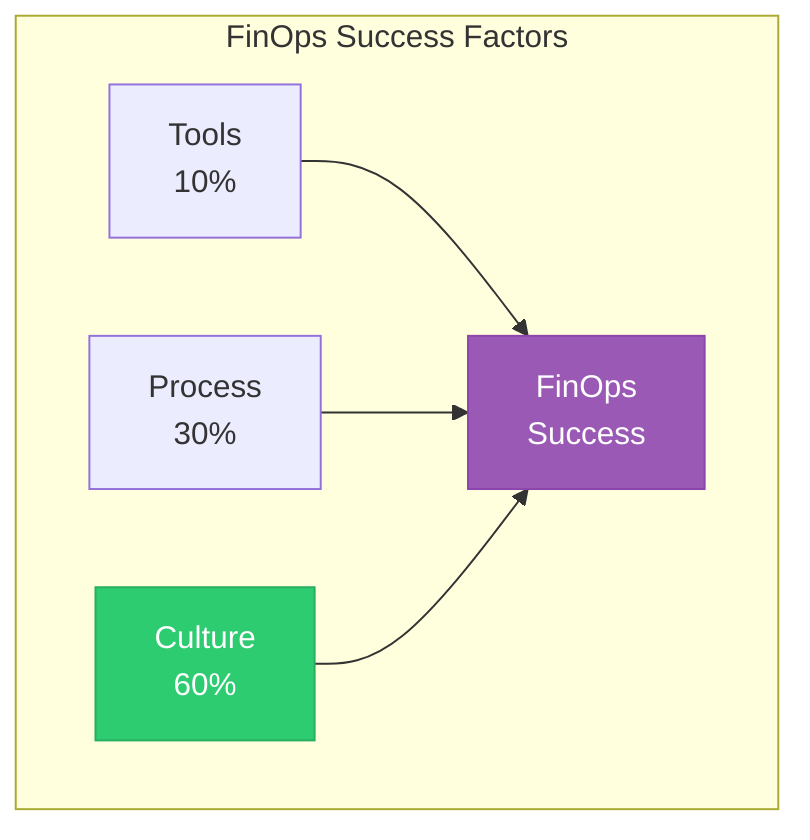
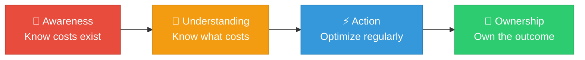
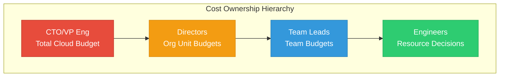
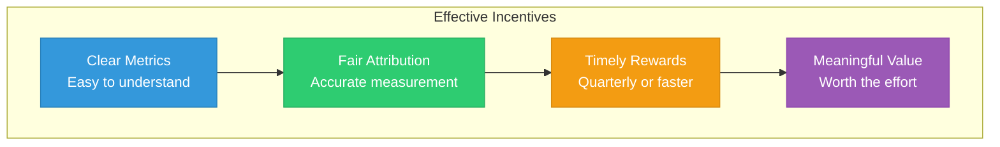
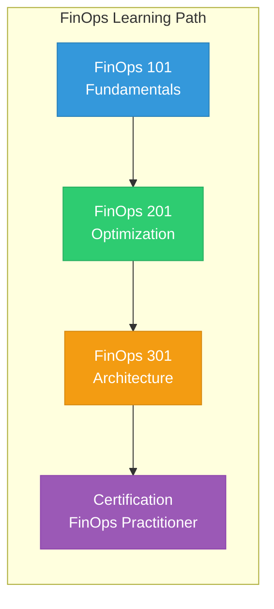
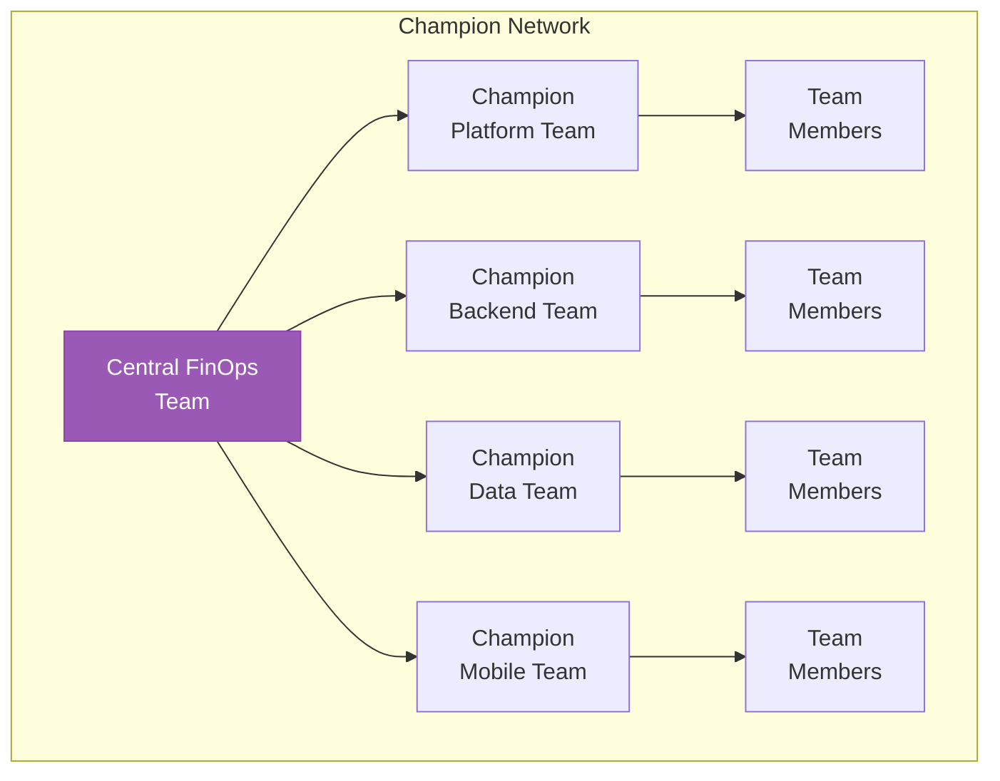

# Lesson 04: Building FinOps Culture

## Learning Objectives

By the end of this lesson, you will:
- Build a FinOps-aware organization
- Create effective incentive structures
- Implement education and enablement programs
- Drive sustainable behavioral change

---

## Culture is the Foundation

Tools and processes alone don't create FinOps success. **Culture** is what makes it sustainable.



---

## The FinOps Cultural Shift

### From Traditional to FinOps Culture

| Traditional | FinOps Culture |
|-------------|----------------|
| "IT owns cloud costs" | "Everyone owns their costs" |
| "Cost is someone else's problem" | "Cost is a shared responsibility" |
| "We don't know what we spend" | "We have real-time visibility" |
| "Optimize when there's a problem" | "Continuous optimization" |
| "Speed vs. cost trade-off" | "Speed AND cost efficiency" |

### Cultural Maturity Progression



---

## Building Awareness

### Cost Visibility Initiatives

| Initiative | Description | Impact |
|------------|-------------|--------|
| **Weekly cost emails** | Team spending summaries | Regular awareness |
| **Slack cost bot** | Real-time cost notifications | Immediate visibility |
| **Dashboard TVs** | Cost dashboards on office screens | Constant reminder |
| **Monthly reviews** | Team-level cost review meetings | Accountability |

### Sample Weekly Cost Email

```markdown
## 📊 Your Team's Cloud Costs - Week of Jan 15

### Summary
- **This week**: $12,450 (↓ 5% vs last week)
- **Month to date**: $45,200 (85% of $53,000 budget)
- **Forecast**: On track ✅

### Top Spending Services
<b>1. EC2: $5,200</b>
<details>
<summary>Show Answer</summary>
Answer: 42%
</details>

<b>2. RDS: $3,100</b>
<details>
<summary>Show Answer</summary>
Answer: 25%
</details>

<b>3. S3: $1,800</b>
<details>
<summary>Show Answer</summary>
Answer: 14%
</details>


### Optimization Opportunities
- 🔴 3 unused EBS volumes ($120/month)
- 🟡 2 oversized EC2 instances ($340/month)

[View Full Dashboard →]
```

---

## Creating Accountability

### Cost Ownership Model



### RACI for Cost Decisions

| Decision | Engineer | Team Lead | Director | FinOps | Finance |
|----------|----------|-----------|----------|--------|---------|
| Spin up new resources | R | A | I | C | I |
| Right-sizing | R | A | I | C | I |
| Budget setting | C | R | A | C | A |
| RI/SP purchase | C | C | R | A | A |
| Cost reporting | I | I | I | R | A |

---

## Incentive Structures

### Positive Incentives

| Incentive | Description | Implementation |
|-----------|-------------|----------------|
| **Savings sharing** | Teams keep % of savings | Quarterly bonus pool |
| **Recognition** | Public acknowledgment | Monthly awards |
| **Budget rollover** | Unused budget carries forward | Annual budget cycle |
| **Innovation fund** | Savings fund new projects | Reinvestment program |

### Incentive Design Principles



### Example: Savings Sharing Program

```yaml
Savings Sharing Program:

Eligibility:
    - Teams with >$10K monthly cloud spend
    - Implemented approved optimization

Calculation:
    - Baseline: Previous 3-month average
    - Savings: Baseline - Current spend
    - Team share: 20% of savings

Payout:
    - Frequency: Quarterly
    - Form: Team budget for tools/training

Example:
    - Previous average: $50,000/month
    - New average: $40,000/month
    - Monthly savings: $10,000
    - Quarterly savings: $30,000
    - Team reward: $6,000 (20%)
```

---

## Education and Enablement

### FinOps Training Program

| Level | Audience | Content | Duration |
|-------|----------|---------|----------|
| **101** | All engineers | Cloud billing basics, tagging | 2 hours |
| **201** | Team leads | Optimization techniques, budgeting | 4 hours |
| **301** | Architects | Cost-efficient architecture | 8 hours |
| **Certification** | FinOps champions | FinOps Foundation certification | 40 hours |

### Training Curriculum



### Just-in-Time Learning

| Moment | Learning Opportunity |
|--------|----------------------|
| **Resource creation** | Pop-up with cost estimate |
| **PR review** | Cost impact comment |
| **Budget alert** | Link to optimization guide |
| **Onboarding** | FinOps fundamentals module |

---

## Communication Strategy

### Audience-Specific Messaging

| Audience | Key Message | Channel | Frequency |
|----------|-------------|---------|-----------|
| **Executives** | Cloud ROI, strategic investment | Monthly deck | Monthly |
| **Directors** | Budget status, team performance | Email + meeting | Bi-weekly |
| **Team Leads** | Team costs, optimization opportunities | Dashboard + Slack | Weekly |
| **Engineers** | Resource costs, best practices | IDE + PR comments | Real-time |

### Communication Calendar

| Week | Activity | Audience |
|------|----------|----------|
| Week 1 | Monthly cost review | Leadership |
| Week 2 | Team optimization sessions | Engineers |
| Week 3 | FinOps office hours | Anyone |
| Week 4 | Newsletter + recognition | Organization |

---

## FinOps Champions Program

### Champion Role

| Responsibility | Activities |
|----------------|------------|
| **Advocate** | Promote FinOps practices in team |
| **Educate** | Answer team questions, share knowledge |
| **Report** | Provide feedback to central FinOps |
| **Lead** | Drive optimization initiatives |

### Champion Network



### Champion Benefits

- 🎓 Advanced training and certifications
- 🏆 Recognition in company communications
- 💰 Access to savings sharing bonus
- 🚀 Career development opportunity

---

## Measuring Cultural Change

### Culture Metrics

| Metric | Target | Measurement |
|--------|--------|-------------|
| **Training completion** | 100% | LMS tracking |
| **Dashboard adoption** | >80% weekly active | Tool analytics |
| **Optimization proposals** | 5+ per team/quarter | Ticket tracking |
| **Budget accuracy** | ±5% | Actual vs. budget |
| **Employee sentiment** | 4+/5 | Survey scores |

### Survey Questions

<b>1. "I understand how my work impacts cloud costs"</b>
<details>
<summary>Show Answer</summary>
Answer: 1-5
</details>

<b>2. "I have access to the cost information I need"</b>
<details>
<summary>Show Answer</summary>
Answer: 1-5
</details>

<b>3. "My team actively considers cost in decisions"</b>
<details>
<summary>Show Answer</summary>
Answer: 1-5
</details>

<b>4. "I feel empowered to suggest optimizations"</b>
<details>
<summary>Show Answer</summary>
Answer: 1-5
</details>

<b>5. "FinOps practices are valued in my organization"</b>
<details>
<summary>Show Answer</summary>
Answer: 1-5
</details>


---

## Common Anti-Patterns

| Anti-Pattern | Problem | Solution |
|--------------|---------|----------|
| **Blame culture** | Teams hide costs | Focus on improvement |
| **Central control** | No ownership | Distribute responsibility |
| **All-or-nothing** | Overwhelmed teams | Gradual adoption |
| **No feedback loop** | Efforts feel pointless | Show impact |
| **Inconsistent messaging** | Confusion | Align communications |

---

## Hands-On Challenge

### Challenge 1: Cultural Assessment

Survey your organization:
1. Distribute the 5 survey questions above
2. Calculate average scores
3. Identify gaps

### Challenge 2: Design an Incentive Program

Create a savings sharing proposal:
1. Define eligibility criteria
2. Set calculation methodology
3. Determine payout structure

### Challenge 3: Champion Program Launch

Plan a champion program:
<b>1. Identify potential champions</b>
<details>
<summary>Show Answer</summary>
Answer: 1 per team
</details>

2. Define roles and responsibilities
3. Create training plan

---

## Key Takeaways

- ✅ Culture is the biggest factor in FinOps success (60%)
- ✅ Visibility creates awareness; accountability drives action
- ✅ Positive incentives outperform punishment
- ✅ Education must be ongoing and role-specific
- ✅ Champions extend FinOps reach across the organization

---

## Next Lesson

Continue to **[Lesson 05: Enterprise Governance](../05-enterprise-governance/readme.md)** to learn how to implement policies and controls at scale.