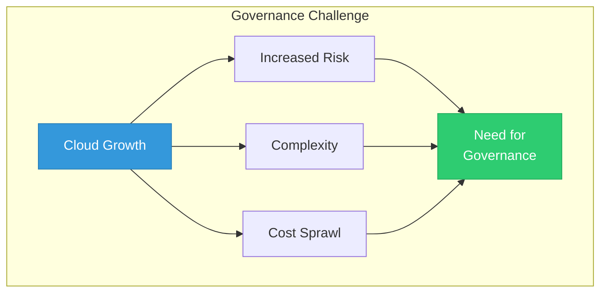
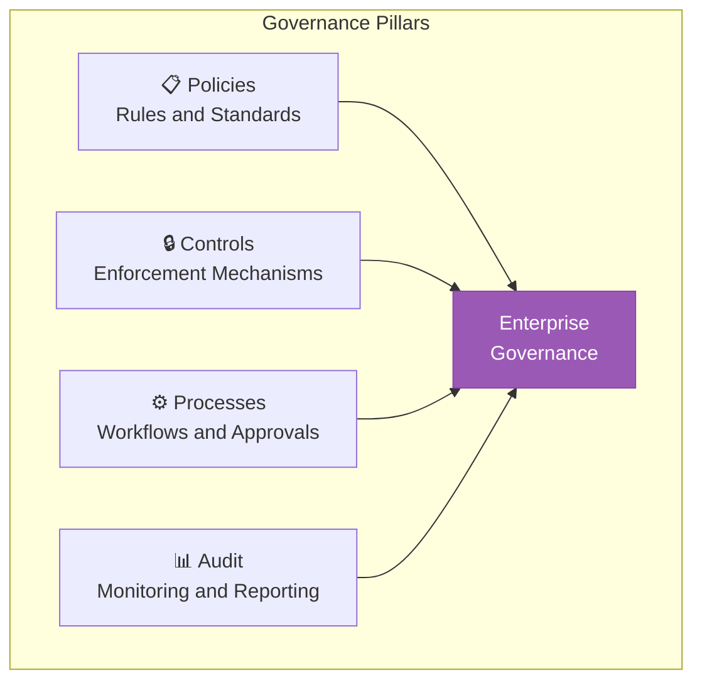
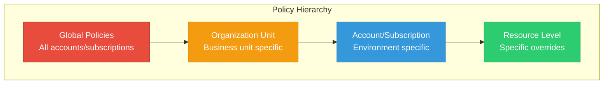
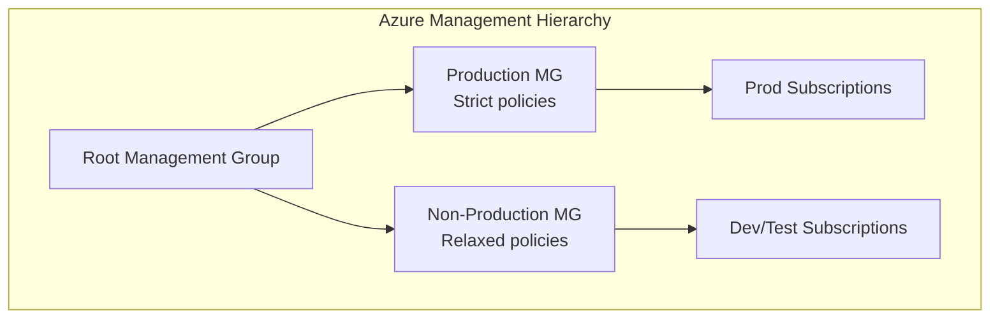
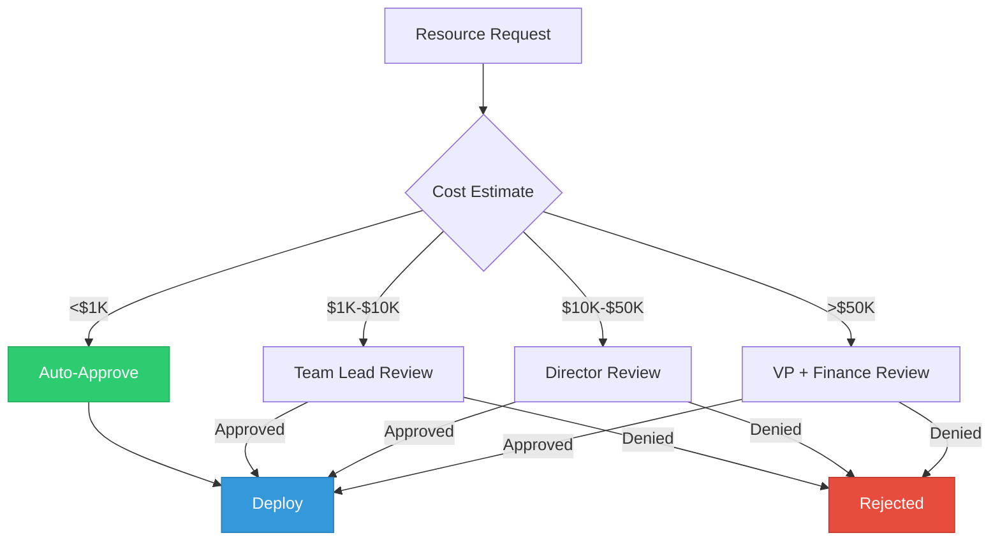
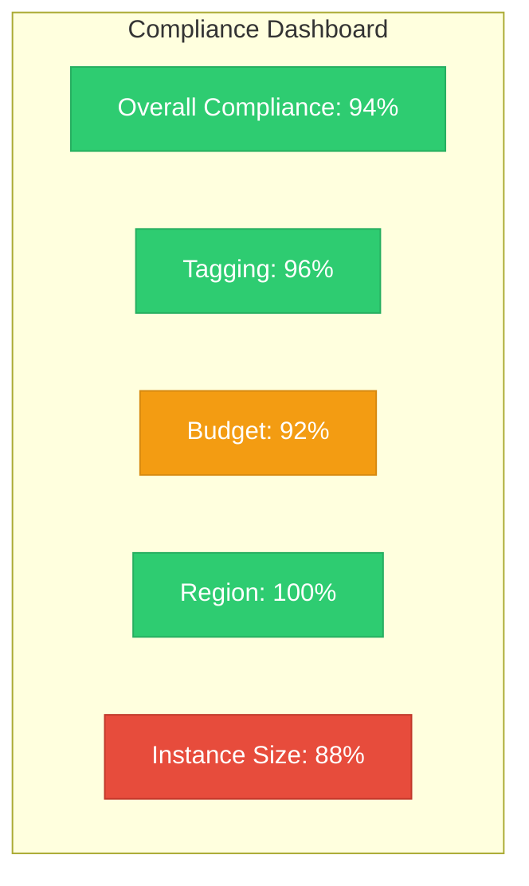
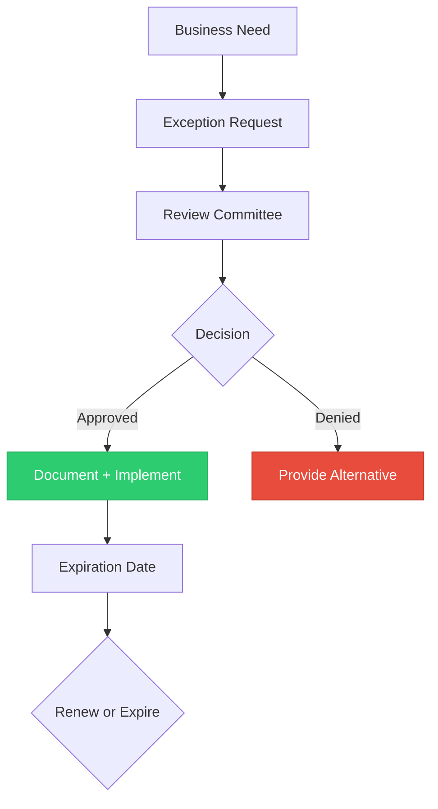
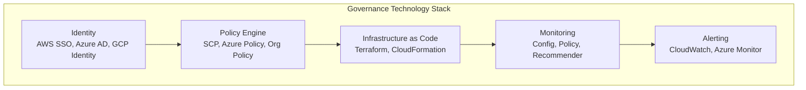
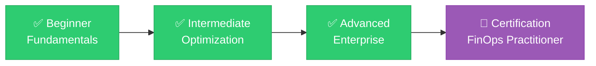

# Lesson 05: Enterprise Governance

## Learning Objectives

By the end of this lesson, you will:
- Implement enterprise-scale cost governance
- Design policy frameworks for cloud spending
- Automate governance enforcement
- Build compliance and audit capabilities

---

## The Governance Challenge

As organizations scale cloud usage, governance becomes critical:



### Without Governance

| Problem | Impact |
|---------|--------|
| Uncontrolled spending | Budget overruns |
| Inconsistent tagging | Poor visibility |
| Shadow IT | Security risks |
| No approval process | Waste accumulation |
| Audit failures | Compliance issues |

---

## Governance Framework

### The Four Pillars



### Governance Maturity

| Level | Description | Characteristics |
|-------|-------------|-----------------|
| **Ad-hoc** | No formal governance | Reactive, inconsistent |
| **Defined** | Documented policies | Standards exist |
| **Managed** | Enforced policies | Automated controls |
| **Optimized** | Continuous improvement | Self-healing |

---

## Policy Framework

### Policy Categories

| Category | Purpose | Examples |
|----------|---------|----------|
| **Resource** | Control what can be created | Instance types, regions |
| **Cost** | Control spending | Budgets, approval limits |
| **Tagging** | Ensure visibility | Required tags, values |
| **Access** | Control who can act | IAM, RBAC |
| **Lifecycle** | Manage resource lifespan | Expiration, cleanup |

### Policy Hierarchy



---

## AWS Governance Implementation

### Service Control Policies (SCP)

```json
{
  "Version": "2012-10-17",
  "Statement": [
    {
      "Sid": "DenyExpensiveInstanceTypes",
      "Effect": "Deny",
      "Action": "ec2:RunInstances",
      "Resource": "arn:aws:ec2:*:*:instance/*",
      "Condition": {
        "ForAnyValue:StringLike": {
          "ec2:InstanceType": [
            "*.metal",
            "*.24xlarge",
            "*.16xlarge",
            "*.12xlarge"
          ]
        }
      }
    },
    {
      "Sid": "DenyNonApprovedRegions",
      "Effect": "Deny",
      "NotAction": [
        "iam:*",
        "organizations:*",
        "support:*"
      ],
      "Resource": "*",
      "Condition": {
        "StringNotEquals": {
          "aws:RequestedRegion": [
            "us-east-1",
            "us-west-2",
            "eu-west-1"
          ]
        }
      }
    }
  ]
}
```

### AWS Config Rules

```yaml
# config-rules.yaml
Resources:
  RequiredTagsRule:
    Type: AWS::Config::ConfigRule
    Properties:
      ConfigRuleName: required-tags
      Description: Checks for required tags
      Scope:
        ComplianceResourceTypes:
          - AWS::EC2::Instance
          - AWS::RDS::DBInstance
          - AWS::S3::Bucket
      Source:
        Owner: AWS
        SourceIdentifier: REQUIRED_TAGS
      InputParameters:
        tag1Key: Environment
        tag2Key: Owner
        tag3Key: CostCenter
```

---

## Azure Governance Implementation

### Azure Policy

```json
{
  "mode": "All",
  "policyRule": {
    "if": {
      "allOf": [
        {
          "field": "type",
          "equals": "Microsoft.Compute/virtualMachines"
        },
        {
          "not": {
            "field": "Microsoft.Compute/virtualMachines/sku.name",
            "in": "[parameters('allowedSkus')]"
          }
        }
      ]
    },
    "then": {
      "effect": "deny"
    }
  },
  "parameters": {
    "allowedSkus": {
      "type": "Array",
      "metadata": {
        "description": "Allowed VM sizes"
      },
      "defaultValue": [
        "Standard_D2s_v3",
        "Standard_D4s_v3",
        "Standard_D8s_v3"
      ]
    }
  }
}
```

### Azure Management Groups



---

## GCP Governance Implementation

### Organization Policies

```yaml
# Restrict allowed locations
constraint: constraints/gcp.resourceLocations
listPolicy:
  allowedValues:
    - us-central1
    - us-east1
    - europe-west1
```

### VPC Service Controls

```yaml
# Restrict data exfiltration
accessLevel:
  name: corp-network-only
  basic:
    conditions:
      - ipSubnetworks:
          - 10.0.0.0/8
        members:
          - user:*@company.com
```

---

## Automated Governance

### Policy as Code

```python
# Cloud Custodian Policy
policies:
  - name: ec2-tag-compliance
    resource: ec2
    filters:
      - "tag:Environment": absent
    actions:
      - type: notify
        template: missing-tag-notification.html
        to:
          - resource-owner
          - finops@company.com
        transport:
          type: ses
          
  - name: ec2-stop-after-hours
    resource: ec2
    filters:
      - type: value
        key: "tag:Environment"
        value: development
      - type: offhour
        offhour: 20
        default_tz: America/New_York
    actions:
      - stop
```

### Terraform Sentinel Policies

```hcl
# Sentinel policy for cost control
import "tfplan/v2" as tfplan

# Get all EC2 instances
ec2_instances = filter tfplan.resource_changes as _, rc {
    rc.type is "aws_instance" and
    rc.mode is "managed"
}

# Check for approved instance types
approved_types = [
    "t3.micro", "t3.small", "t3.medium",
    "m5.large", "m5.xlarge"
]

main = rule {
    all ec2_instances as _, instance {
        instance.change.after.instance_type in approved_types
    }
}
```

---

## Approval Workflows

### Spending Approval Matrix

| Amount | Approval Required | Response Time |
|--------|-------------------|---------------|
| <$1,000/month | Auto-approved | Immediate |
| $1,000-$10,000 | Team lead | 1 business day |
| $10,000-$50,000 | Director | 2 business days |
| >$50,000 | VP + Finance | 5 business days |

### Approval Workflow Diagram



---

## Compliance and Audit

### Audit Trail Requirements

| Element | Requirement | Retention |
|---------|-------------|-----------|
| **Who** | User identity | 7 years |
| **What** | Action taken | 7 years |
| **When** | Timestamp | 7 years |
| **Where** | Resource, region | 7 years |
| **Approval** | Authorization record | 7 years |

### Compliance Dashboard



### Audit Reports

| Report | Frequency | Audience |
|--------|-----------|----------|
| **Compliance summary** | Weekly | FinOps team |
| **Exception report** | Daily | Resource owners |
| **Spending audit** | Monthly | Finance |
| **Policy changes** | As needed | Security/Compliance |

---

## Exception Management

### Exception Process



### Exception Request Template

```yaml
Exception Request:
  Requestor: jane.doe@company.com
  Date: 2024-01-15
  
  Policy: No instances larger than m5.xlarge
  
  Request:
    Resource: m5.4xlarge for data-processing
    Justification: Memory requirements for batch job
    Duration: 6 months
    Cost Impact: +$500/month
    
  Alternatives Considered:
    - Vertical scaling: Insufficient memory
    - Multiple smaller instances: Increased complexity
    
  Approval:
    - Status: Approved
    - Approver: cto@company.com
    - Conditions: Monthly review, sunset date 2024-07-15
```

---

## Governance Tools

### Enterprise Platforms

| Tool | Capabilities | Best For |
|------|--------------|----------|
| **AWS Control Tower** | Account factory, guardrails | AWS-only enterprise |
| **Azure Blueprints** | Subscription templates, policies | Azure enterprise |
| **GCP Org Policy** | Constraints, hierarchy | GCP enterprise |
| **Terraform Cloud** | Policy as code, workflows | Multi-cloud IaC |
| **Cloud Custodian** | Policy engine, automation | Multi-cloud policies |

### Governance Stack



---

## Hands-On Challenge

### Challenge 1: Policy Design

Create a governance policy for:
<b>1. Required tags</b>
<details>
<summary>Show Answer</summary>
Answer: 5 minimum
</details>

2. Approved instance types
3. Approved regions
4. Budget limits by environment

### Challenge 2: Approval Workflow

Design an approval workflow:
1. Define spending thresholds
2. Assign approvers per level
3. Document SLAs

### Challenge 3: Compliance Dashboard

Build a compliance report showing:
1. Overall compliance percentage
2. Top violations
3. Trend over time

---

## Key Takeaways

- ✅ Governance is essential for enterprise-scale FinOps
- ✅ Policies should be preventive, not just detective
- ✅ Automate enforcement with policy as code
- ✅ Balance control with agility through approval workflows
- ✅ Maintain audit trails for compliance

---

## Congratulations! 🎉

You've completed the **Advanced FinOps** curriculum!

### Your FinOps Journey



### Next Steps

1. 📜 **Get Certified**: Pursue FinOps Foundation certification
2. 🤝 **Join Community**: FinOps Foundation Slack
3. 📚 **Keep Learning**: Cloud FinOps book
4. 🚀 **Take Action**: Apply what you've learned!
