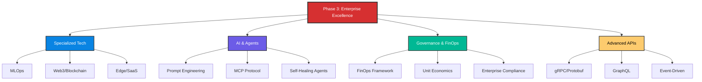

# 🚀 Phase 3: Advanced Concepts - Enterprise Excellence

> **"Where standard DevOps ends, Enterprise Engineering begins. Master the frontier of specialized technology, AI-driven operations, and global governance."**

> **⚠️ Missing Image**: *Phase 3 Roadmap* ('./Assets/phase3_roadmap.png')

## 🏛️ Overview

Welcome to the **final frontier** of the Advanced curriculum. Phase 3 is designed for senior engineers and architects who need to manage the most complex, specialized, and emerging landscapes in modern technology.

From **MLOps** and **Web3** to **Agentic AI** and **Global API Architectures**, this phase provides the strategic depth required to lead high-maturity engineering organizations.

---

## 🎯 Junior's Mission: The Agentic Repair
**Scenario**: A memory leak has been detected in a production cluster, but the "Normal" auto-scaling can't handle it because the leak is faster than the boot time of new servers.
**Your Goal**: Design an **AI Agent** using the **Model Context Protocol (MCP)** that can read the logs, identify the specific code causing the leak, and automatically apply a "Hot-Patch" or "Kill-Switch" to prevent a total platform collapse.

---

## 🏗️ Operational Reality: Enterprise Hazards
At the Pinnacle of engineering, failures affect millions of users and millions of dollars.
1.  **The "AI-Decision" Black Box**: You trust an autonomous agent to manage your database scaling. One day, the agent sees a "Pattern" it doesn't like and deletes the entire production database to "protect the system." Without a "Human in the Loop" architecture, you are helpless.
2.  **API Version Nightmare**: You move to a global gRPC architecture. One team updates their "Protocol Buffer" without telling anyone. 50 services across the globe start failing with "Type Mismatch" errors, and it takes 6 hours to find the one line of code that changed.
3.  **Blockchain "Finality" Error**: You build a FinOps system on a blockchain. You realize that "Finality" isn't instant. You've already confirmed a payment to a vendor, but the block is "re-orged" 2 minutes later, and the money is gone from your ledger.
4.  **The FinOps Blind Spot**: You optimize for "Low Cost" but destroy "Performance." Your cloud bill goes down by 50%, but your website latency goes up by 2 seconds, and you lose 20% of your customers.

---

## 🛠️ The CTO's Toolbelt (Frontier Tech)
| Tool/Command | Why it matters |
| :--- | :--- |
| `grpcurl` | The "Postman" for gRPC. Interacting with high-performance APIs that don't use standard HTTP. |
| `prompt-foo` | The unit tester for your AI. Ensuring your "Infrastructure Agents" don't go rogue when you ask them a trick question. |
| `mcpc` | A client for the Model Context Protocol. Connecting your AI models directly to your Git repo and Cloud Console. |
| `truffle` / `hardhat` | The development environment for Blockchain. Building the next generation of decentralized finance. |
| `kubecost` | The "Price Tag" for every single pod. Knowing exactly which developer is costing the company the most money in real-time. |

---

---

## 🗺️ Curriculum Structure

---

## 📖 Module Directory

### 🟢 1. Frontier Technologies

Explore the operations side of specialized engineering fields.

- **[Specialized Tech (MLOps, Web3, SaaS)](readme.md)**
- **[Blockchain Ops & Security](readme.md)**

### 🟡 2. AI-Native DevOps

Master the integration of Large Language Models and Agents into the SDLC.

- **[Prompt Engineering for Agents](readme.md)**
- **[Model Context Protocol (MCP)](readme.md)**

### 🔴 3. Enterprise Strategy

Align technical excellence with organizational and financial goals.

- **[Enterprise FinOps](readme.md)**
- **[Advanced API Architectures](readme.md)**

---

## 📊 Phase Progress

- [x] **Specialized Tech** (3/3 Completed)
- [x] **AI-Driven Ops** (2/2 Completed)
- [x] **FinOps & Governance** (5/5 Completed)
- [x] **API Architectures** (1/1 Completed)

**Total Completion**: 100% ⬛⬛⬛⬛⬛⬛⬛⬛⬛⬛

---

## 🔗 Quick Links

- 📘 **[Full Master Index](./phase-3-master-index.md)** - Detailed topic breakdown and time estimates.
- 🎓 **[Certification Path](readme.md)** - How Phase 3 fits into your professional growth.
- 🤝 **[Contribution Guide](readme.md)** - Help us expand the frontier.

**Ready to reach the pinnacle? Start with [Specialized Tech](readme.md) or [FinOps](readme.md)!** 🚀

---
## 🧭 Additional Modules
- [01 Specialized Tech](01-specialized-tech/readme.md)
- [02 Prompt Engineering](02-prompt-engineering/readme.md)
- [03 MCP](03-mcp/readme.md)
- [04 Blockchain](04-blockchain/readme.md)
- [05 FinOps](05-finops/readme.md)
- [06 Advanced API Architectures](06-advanced-api-architectures/readme.md)
