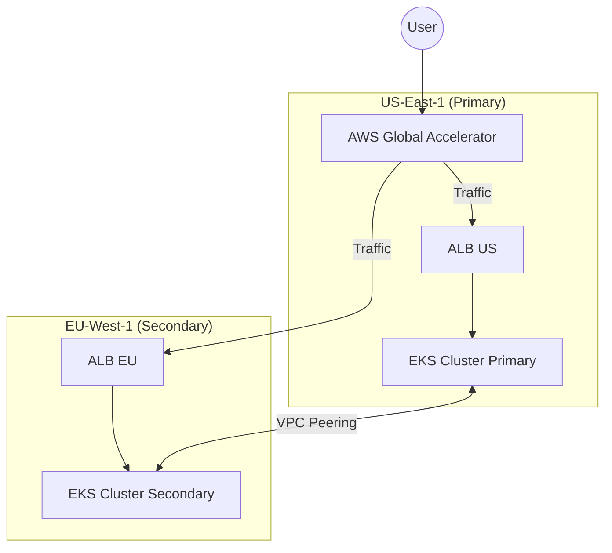

# 🏗️ Global Capstone Infrastructure (Terraform)

This directory contains the Infrastructure as Code (IaC) for the **Active-Active Global Platform**.

## 🌍 Architecture Overview



## 🛠️ Components

| Component | Module | Description |
|:---|:---|:---|
| **VPC Mesh** | `modules/vpc` | Creates non-overlapping VPCs (`10.1.0.0/16`, `10.2.0.0/16`) and establishes a **Cross-Region Peering Connection**. |
| **EKS Clusters** | `modules/eks` | Deploys two EKS 1.29 clusters with **Karpenter** (Autoscaler) and **AWS Load Balancer Controller** IAM Roles. |
| **Global Accelerator** | `environments/prod` | Creates the static Anycast IP entry point for the application. |

## 🚀 Deployment Guide

### Prerequisites
1.  **AWS Credentials**: Export `AWS_ACCESS_KEY_ID` and `AWS_SECRET_ACCESS_KEY` with Administrator permissions.
2.  **Terraform**: Version `1.5+`.

### Step 1: Initialize
```bash
cd environments/prod
terraform init
```

### Step 2: Review Plan
```bash
terraform plan -out=tfplan
```
*Check that it creates `vpc_primary`, `vpc_secondary`, and the `peering_connection`.*

### Step 3: Apply
```bash
terraform apply tfplan
```
*Note: This will take ~20 minutes to provision EKS Control Planes.*

### Step 4: Configure Kubectl
```bash
# US Cluster
aws eks update-kubeconfig --region us-east-1 --name global-platform-primary --alias us-primary

# EU Cluster
aws eks update-kubeconfig --region eu-west-1 --name global-platform-secondary --alias eu-secondary
```

## ⚠️ The "Chicken and Egg" Problem (Ingress)
Terraform creates the **Global Accelerator**, but it cannot add the Application Load Balancers (ALB) to the Endpoint Groups because **the ALBs do not exist yet**.

The ALBs are created by the **Kubernetes Ingress Controller** (which runs *inside* the cluster).

**Solution**:
1.  Apply Terraform (creates EKS + empty Global Accelerator).
2.  Deploy the App (K8s creates ALBs).
3.  Update Terraform (add ALB ARNs to Global Accelerator) OR use `aws globalaccelerator` CLI to patch it.
