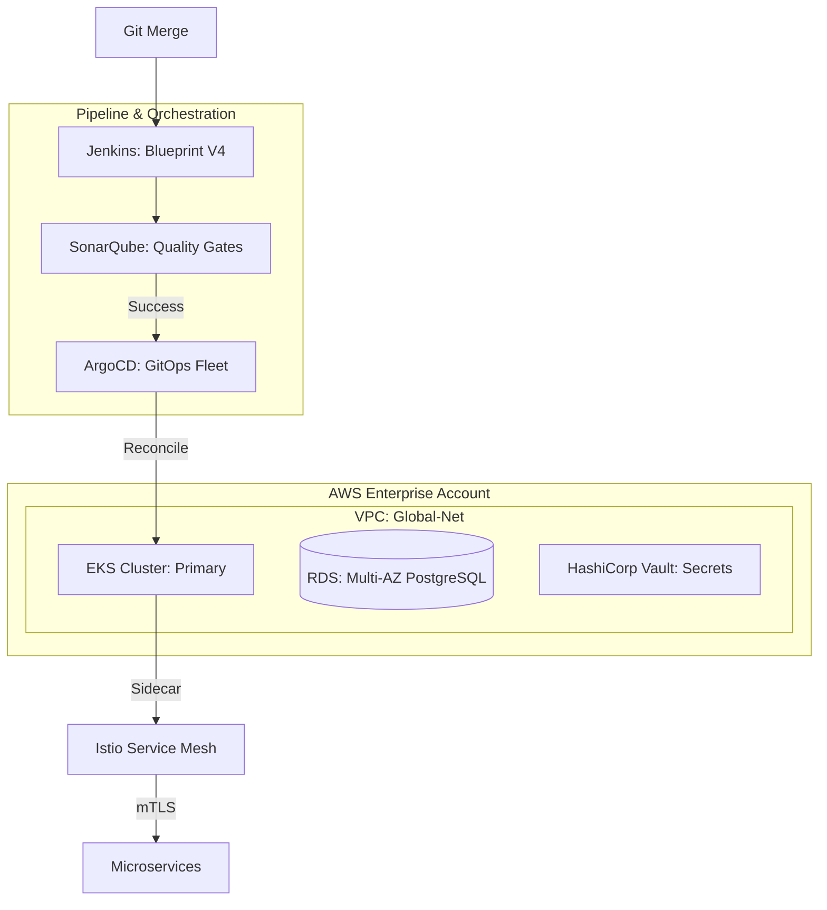

# 🏗️ Showcase: Global Microservices Mesh Deployment

This project is a high-fidelity demonstration of the **Full DevOps Lifecycle**. It combines every tier of this repository into a single, production-ready architectural pattern.

---

## 🏛️ Architectural Overview

This showcase deploys a **Spring-PetClinic** microservices application across a globally distributed infrastructure.



---

## 🛠️ The Professional Tech Stack

- **Provisioning**: Terraform (VPC, EKS, RDS).
- **Configuration**: Ansible (Security Hardening, Vault Setup).
- **Delivery**: [Jenkins Enterprise Blueprint](../../../02-Intermediate/02-Phase-2/02-Delivery-and-Governance/01-CI-CD-Pipelines/02-Part-2-The-Engine/Jenkins/blueprints/blueprint-enterprise-k8s-full.groovy).
- **Security**:
  - **Istio**: Zero-Trust mTLS.
  - **Trivy**: Container vulnerability scanning.
  - **Vault**: CSI Secret Provider.
- **Observability**: Prometheus, Grafana, and Kiali (Service Mapping).

---

## 🚀 Key Learning Objectives

1. **Shift-Left Governance**: Policy-as-Code (OPA) integrated into the Terraform plan before execution.
2. **Automated Quality Gates**: Blocking the release if SonarQube code coverage is < 80% or Trivy finds CRITICAL vulnerabilities.
3. **GitOps Discipline**: Re-syncing the cluster automatically if a human makes manual changes via `kubectl`.
4. **Network Resilience**: Implementing Circuit Breakers to prevent cascading failures between services.

---

## 📁 Project Structure

- **[infra/](./infra/)**: Terraform modules for AWS EKS provisioning.
- **[pipeline/](README.md)**: The customized `Jenkinsfile` based on our Enterprise Blueprint.
- **[gitops/](./gitops/)**: ArgoCD ApplicationSet manifests for automated delivery.

---

## 📋 Implementation Roadmap

- [x] **Phase 1**: Base Networking (VPC, Subnets, NAT Gateway).
- [x] **Phase 2**: EKS Control Plane & Worker Node provisioning via Terraform.
- [x] **Phase 3**: Istio Control Plane & Gateway installation via Helm.
- [x] **Phase 4**: CI/CD integration with [Jenkinsfile](./Jenkinsfile) and security scans.
- [x] **Phase 5**: [GitOps](./gitops/) reconciliation and automated drift detection.

---

## 🚀 Quick Start Deployment

### Option 1: Automated Deployment (Recommended)

#### For Windows (PowerShell)

```powershell
cd C:\Users\Ganil\Documents\Devops\8-Porjects-Showcase\Global-Microservices-Mesh
.\deploy.ps1
```

#### For Linux/Mac (Bash)

```bash
cd /path/to/Devops/8-Porjects-Showcase/Global-Microservices-Mesh
chmod +x deploy.sh
./deploy.sh
```

### Option 2: Manual Deployment

Follow the comprehensive step-by-step guide:

#### [Complete Deployment Guide](./DEPLOYMENT_GUIDE.md)

### Prerequisites

Before deploying, ensure you have:

- AWS CLI configured with valid credentials
- Terraform (v1.0+)
- kubectl (v1.24+)
- Helm (v3.x+)
- Docker (for local testing)

---

### Deployment Philosophy

*"Building at this level isn't about running commands; it's about architecting systems that sustain themselves."*
