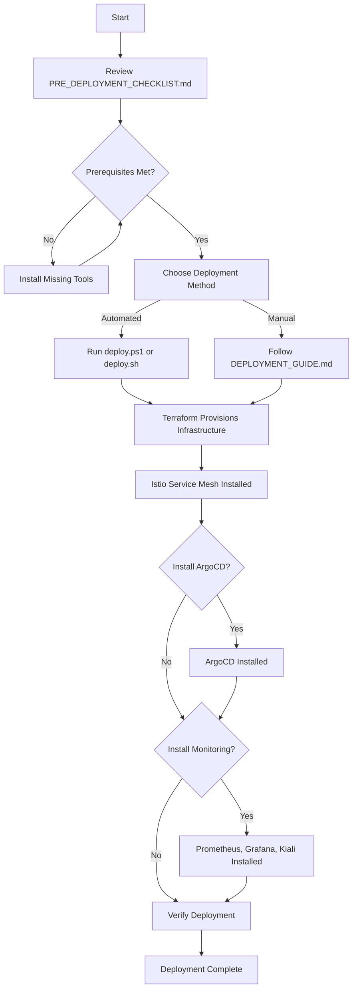

# 🎯 Global Microservices Mesh - Deployment Resources Summary

## 📚 Documentation Created

This document summarizes all the deployment resources created for the Global Microservices Mesh project.

---

## 📁 Files Created

### 1. **DEPLOYMENT_GUIDE.md**

Comprehensive step-by-step deployment guide covering:

- Prerequisites verification
- 5 deployment phases:
  1. Infrastructure Provisioning (Terraform)
  2. Service Mesh Verification (Istio)
  3. ArgoCD Setup (GitOps)
  4. CI/CD Pipeline Setup (Jenkins)
  5. Security & Observability (Monitoring)
- Verification and testing procedures
- Troubleshooting common issues
- Cleanup instructions
- Success criteria

**Location**: `C:\Users\Ganil\Documents\Devops\8-Porjects-Showcase\Global-Microservices-Mesh\DEPLOYMENT_GUIDE.md`

---

### 2. **deploy.sh**

Automated Bash deployment script for Linux/Mac users featuring:

- Automated prerequisite checking
- Infrastructure deployment with Terraform
- kubectl configuration
- Istio verification
- Optional ArgoCD installation
- Optional monitoring stack installation
- Color-coded output for easy reading
- Interactive prompts for user decisions

**Location**: `C:\Users\Ganil\Documents\Devops\8-Porjects-Showcase\Global-Microservices-Mesh\deploy.sh`

**Usage**:

```bash
cd /path/to/Global-Microservices-Mesh
chmod +x deploy.sh
./deploy.sh
```

---

### 3. **deploy.ps1**

Automated PowerShell deployment script for Windows users featuring:

- Automated prerequisite checking
- Infrastructure deployment with Terraform
- kubectl configuration
- Istio verification
- Optional ArgoCD installation
- Optional monitoring stack installation
- Color-coded PowerShell output
- Interactive prompts for user decisions
- Command-line parameters support

**Location**: `C:\Users\Ganil\Documents\Devops\8-Porjects-Showcase\Global-Microservices-Mesh\deploy.ps1`

**Usage**:

```powershell
cd C:\Users\Ganil\Documents\Devops\8-Porjects-Showcase\Global-Microservices-Mesh
.\deploy.ps1
```

**Advanced Usage**:

```powershell
# Skip ArgoCD installation
.\deploy.ps1 -SkipArgoCD

# Skip monitoring installation
.\deploy.ps1 -SkipMonitoring

# Custom AWS region
.\deploy.ps1 -AwsRegion "us-west-2"

# Combine parameters
.\deploy.ps1 -AwsRegion "eu-west-1" -SkipMonitoring
```

---

### 4. **PRE_DEPLOYMENT_CHECKLIST.md**

Comprehensive checklist covering:

- Prerequisites verification (tools, AWS config)
- Repository setup
- Infrastructure planning
- Security considerations
- Monitoring & observability decisions
- CI/CD setup requirements
- Network planning
- Documentation review
- Deployment decision points
- Testing plan
- Support & escalation contacts
- Cleanup plan
- Success criteria

**Location**: `C:\Users\Ganil\Documents\Devops\8-Porjects-Showcase\Global-Microservices-Mesh\PRE_DEPLOYMENT_CHECKLIST.md`

---

### 5. **README.md** (Updated)

Enhanced main README with:

- Quick start deployment instructions
- Links to all deployment resources
- Prerequisites list
- Both automated and manual deployment options

**Location**: `C:\Users\Ganil\Documents\Devops\8-Porjects-Showcase\Global-Microservices-Mesh\README.md`

---

## 🚀 Quick Start Guide

### For First-Time Deployment

1. **Review the Pre-Deployment Checklist**
   ```powershell
   # Open and review
   code PRE_DEPLOYMENT_CHECKLIST.md
   ```

2. **Read the Deployment Guide**
   ```powershell
   # Open and read
   code DEPLOYMENT_GUIDE.md
   ```

3. **Verify Prerequisites**
   ```powershell
   # Check tool versions
   terraform version
   kubectl version --client
   helm version
   aws --version
   
   # Verify AWS credentials
   aws sts get-caller-identity
   ```

4. **Run Automated Deployment**
   ```powershell
   # Windows
   .\deploy.ps1
   
   # Or for manual deployment, follow DEPLOYMENT_GUIDE.md
   ```

---

## 📊 Deployment Flow



---

## 🎯 What Gets Deployed

### Infrastructure (Terraform)

- **VPC**: Custom VPC with public and private subnets
- **EKS Cluster**: Managed Kubernetes cluster
- **Worker Nodes**: Auto-scaling group of EC2 instances
- **NAT Gateway**: For private subnet internet access
- **Security Groups**: Network security rules

### Service Mesh (Istio)

- **Istio Base**: Core Istio CRDs
- **Istiod**: Istio control plane
- **Istio Ingress Gateway**: Entry point for external traffic
- **Istio Namespaces**: istio-system, istio-ingress

### GitOps (Optional - ArgoCD)

- **ArgoCD Server**: GitOps controller
- **ArgoCD Application**: Auto-sync configuration
- **ArgoCD UI**: Web interface for deployment management

### Monitoring (Optional)

- **Prometheus**: Metrics collection
- **Grafana**: Visualization dashboards
- **Kiali**: Service mesh observability
- **Alert Manager**: Alert management

---

## 📋 Estimated Deployment Time

| Phase | Duration | Notes |
|-------|----------|-------|
| Prerequisites Check | 5 min | Verify tools and credentials |
| Terraform Init & Plan | 3 min | Initialize and plan infrastructure |
| Terraform Apply | 15-20 min | Create VPC, EKS, and Istio |
| kubectl Configuration | 1 min | Update kubeconfig |
| Istio Verification | 2 min | Verify service mesh |
| ArgoCD Installation | 5 min | Optional |
| Monitoring Installation | 5-10 min | Optional |
| **Total** | **30-45 min** | Full deployment with all options |

---

## 💰 Estimated AWS Costs

### Monthly Cost Breakdown (us-east-1)

| Resource | Quantity | Unit Cost | Monthly Cost |
|----------|----------|-----------|--------------|
| EKS Cluster | 1 | $0.10/hour | ~$73 |
| t3.medium Instances | 2-4 | $0.0416/hour | ~$60-$120 |
| NAT Gateway | 1 | $0.045/hour | ~$33 |
| Data Transfer | Variable | $0.09/GB | ~$10-$50 |
| EBS Volumes | 2-4 (20GB each) | $0.10/GB-month | ~$4-$8 |
| **Total** | - | - | **~$180-$284/month** |

> **Note**: Costs vary based on usage, region, and configuration. Always use the AWS Pricing Calculator for accurate estimates.

---

## 🛡️ Security Features

- **Network Isolation**: Private subnets for worker nodes
- **Service Mesh mTLS**: Encrypted service-to-service communication
- **Security Scanning**: Trivy for container vulnerabilities
- **IaC Scanning**: Checkov for Terraform security
- **IAM Roles**: Least privilege access for EKS
- **Security Groups**: Restrictive network rules

---

## 🔗 Related Resources

### Internal Documentation

- [Terraform Modules](readme.md)
- [Jenkins Blueprints](readme.md)
- [Service Mesh Guide](readme.md)

### External Documentation

- [Terraform AWS Provider](https://registry.terraform.io/providers/hashicorp/aws/latest/docs)
- [EKS Documentation](https://docs.aws.amazon.com/eks/)
- [Istio Documentation](https://istio.io/latest/docs/)
- [ArgoCD Documentation](https://argo-cd.readthedocs.io/)
- [Helm Documentation](https://helm.sh/docs/)

---

## 🆘 Getting Help

### Troubleshooting

1. Check the **Troubleshooting** section in `DEPLOYMENT_GUIDE.md`
2. Review AWS CloudWatch logs for EKS cluster issues
3. Check Terraform state: `terraform show`
4. Verify kubectl connectivity: `kubectl get nodes`

### Common Issues

| Issue | Solution |
|-------|----------|
| Terraform apply fails | Check AWS quotas and IAM permissions |
| kubectl can't connect | Run `aws eks update-kubeconfig` |
| Istio pods not starting | Check node resources and events |
| ArgoCD sync fails | Verify Git repository access |

---

## ✅ Success Criteria

Your deployment is successful when:

- ✅ `kubectl get nodes` shows 2+ nodes in Ready state
- ✅ `kubectl get pods -n istio-system` shows all pods Running
- ✅ `kubectl get svc -n istio-ingress` shows external LoadBalancer IP
- ✅ ArgoCD UI is accessible (if installed)
- ✅ Grafana dashboards are accessible (if installed)
- ✅ No critical security vulnerabilities detected

---

## 🎓 Learning Outcomes

By completing this deployment, you will have:

1. ✅ Deployed production-grade infrastructure with Terraform
2. ✅ Configured a managed Kubernetes cluster (EKS)
3. ✅ Implemented a service mesh with Istio
4. ✅ Set up GitOps with ArgoCD
5. ✅ Configured monitoring and observability
6. ✅ Implemented security best practices
7. ✅ Automated infrastructure deployment

---

## 📅 Next Steps After Deployment

1. **Deploy Sample Application**
   - Deploy Spring PetClinic microservices
   - Configure Istio virtual services
   - Test service mesh features

2. **Configure Advanced Features**
   - Enable strict mTLS
   - Implement circuit breakers
   - Configure rate limiting
   - Set up fault injection

3. **Set Up CI/CD**
   - Configure Jenkins pipeline
   - Integrate with Git repository
   - Set up automated deployments

4. **Enhance Monitoring**
   - Create custom Grafana dashboards
   - Configure alerts
   - Set up distributed tracing

5. **Implement Security**
   - Configure Vault for secrets
   - Implement OPA policies
   - Set up security scanning

---

## 🧹 Cleanup

When you're done testing:

```powershell
# Navigate to infrastructure directory
cd infra

# Destroy all resources
terraform destroy

# Confirm with: yes
```

**Important**: This will delete all AWS resources created by Terraform.

---

**Ready to Deploy?** Start with the [Pre-Deployment Checklist](./pre-deployment-checklist.md)!

---

**Created**: 2026-01-24  
**Last Updated**: 2026-01-24  
**Version**: 1.0
