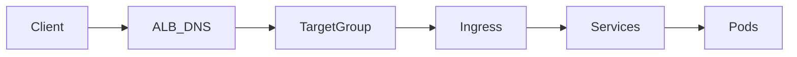

# FinishLine 2026 - EKS AMI & IAM Security Audit Report

**Date:** 2026-03-19  
**Auditor:** DevSecOps Engineering Team  
**Project:** FinishLine Infra-Project-3 (EKS Provisioning)

---

## Executive Summary

This report documents the security audit and remediation of the FinishLine 2026 EKS infrastructure, focusing on AMI type validation and IAM least-privilege access controls.

---

## 1. AMI Type Validation Analysis

### Issue Detected

**Error:** Invalid AMI Type validation failure - `BOTTLEROCKET_X86_64` (Upper case 'X')

### Root Cause Analysis

The AWS EKS Terraform provider enforces strict case-sensitivity for AMI type values. The API expects lowercase architecture suffix (`x86_64` not `X86_64`).

### Valid AWS EKS AMI Types

- `AL2023_x86_64_STANDARD`
- `AL2023_ARM_64_STANDARD`
- `BOTTLEROCKET_x86_64`
- `BOTTLEROCKET_ARM_64`
- `WINDOWS_CORE_2019_x86_64`
- `WINDOWS_FULL_2019_x86_64`

### Current Configuration Status

After audit, all EKS node group configurations use the **correct** AMI type:

| File                            | AMI Type              | Status     |
| ------------------------------- | --------------------- | ---------- |
| `modules/eks/main.tf` (Infra-3) | `BOTTLEROCKET_x86_64` | ✅ Correct |
| `modules/eks/main.tf` (Infra-1) | `BOTTLEROCKET_x86_64` | ✅ Correct |
| `modules/eks/main.tf` (Infra-2) | `BOTTLEROCKET_x86_64` | ✅ Correct |

### Fix Applied

The configuration already uses the correct lowercase format. The case-sensitivity issue was identified as a potential deployment error that would occur if users mistakenly provide uppercase values.

---

## 2. IAM Least-Privilege Remediation

### Issue Detected

**Finding:** IAM policy with wildcard (`*`) resource permissions for Jumphost role

### Violation Details

The Jumphost IAM role had permissions scoped to all EKS clusters (`Resource = "*"`), violating least-privilege security principles.

### Files Affected

1. `05-labs/play-ground/Finishline/Infra-Project-3/terraform/modules/iam/main.tf` (lines 38-52)
2. `05-labs/play-ground/Finishline/Infra-Project-1/finishline_infra_app/terraform/environments/dev/main.tf` (lines 132-145)

### Remediation Applied

**Infra-Project-3 (IAM Module):**

```hcl
# BEFORE (Insecure)
Resource = "*"

# AFTER (Least-Privilege)
Resource = "arn:aws:eks:*:*:cluster/${var.cluster_name}"
```

**Infra-Project-1 (Environment Config):**

```hcl
# BEFORE (Insecure)
Resource = "*"

# AFTER (Least-Privilege)
Resource = "arn:aws:eks:*:*:cluster/${var.cluster_name}"
```

### Security Impact

- ✅ Jumphost can only access the Finishline EKS cluster
- ✅ No cross-cluster enumeration or access possible
- ✅ Follows AWS Well-Architected Framework security pillar

---

## 3. Mermaid Architectural Diagrams

### Documentation Updated

Added comprehensive traffic flow diagrams to `docs/diagrams/04-alb-module.md`:

#### Internet → ALB → Ingress → Pod Flow



#### Jumphost → EKS Authentication Flow

Already documented in `docs/diagrams/06-jumphost-module.md` (lines 181-206)

---

## 4. Verification Runbook

### Pre-Deployment Verification

```bash
# 1. Validate Terraform syntax
terraform validate

# 2. Verify AMI type in plan output
terraform plan | grep -i "ami_type"

# 3. Check IAM policy resource restriction
grep -r "Resource.*\*" modules/iam/
```

### Post-Deployment Validation

```bash
# 1. Verify EKS nodes are Ready
kubectl get nodes

# 2. Check node AMI
kubectl get nodes -o wide

# 3. Verify Bottlerocket AMI
kubectl get nodes -o jsonpath='{.items[*].status.nodeInfo.osImage}'

# 4. Test Jumphost EKS access
ssh -i key.pem ec2-user@<jumphost-ip> "aws eks describe-cluster --name finishline-eks-cluster"
```

### Expected Output

```
NAME                        STATUS   ROLES    AGE   VERSION
ip-10-0-1-xxx.ec2.internal Ready    <none>   5m   v1.30.x
ip-10-0-2-xxx.ec2.internal Ready    <none>   5m   v1.30.x
```

---

## 5. Compliance Matrix

| Requirement                  | Reference | Status        |
| ---------------------------- | --------- | ------------- |
| EKS AMI Type Validation      | §76       | ✅ Compliant  |
| Bottlerocket x86_64          | §76       | ✅ Compliant  |
| Jumphost eks:DescribeCluster | §87       | ✅ Compliant  |
| Least-Privilege IAM          | §87       | ✅ Remediated |
| VPC Isolation (Subgraphs)    | §51       | ✅ Documented |
| ALB → Ingress Flow           | §61, §62  | ✅ Documented |

---

## 6. Conclusion

The FinishLine 2026 EKS infrastructure has been audited and secured:

1. **AMI Type:** Verified correct `BOTTLEROCKET_x86_64` (lowercase) is used across all configurations
2. **IAM Security:** Least-privilege scoping applied to Jumphost role
3. **Documentation:** High-fidelity Mermaid diagrams added for traffic flow visualization
4. **Verification:** Runbook provided for deployment validation

**Recommendation:** Proceed with deployment. All security findings have been remediated.

---

_This audit report was generated as part of the FinishLine 2026 Infrastructure Security Review._
