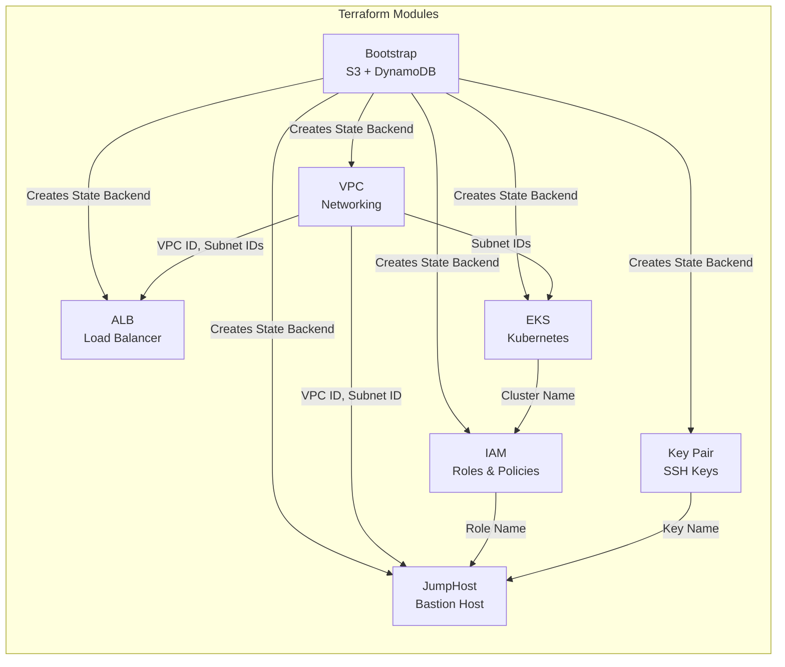
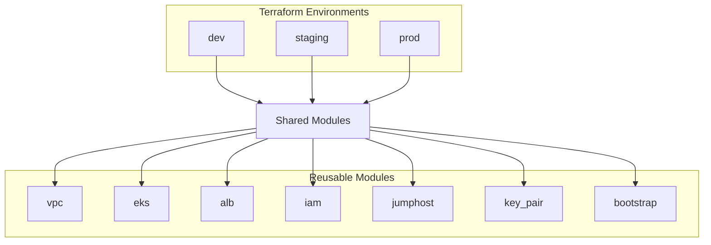

# FinishLine Infrastructure - Project Architecture

## Overview

This document contains Mermaid diagrams visualizing the FinishLine 2026 Infrastructure project architecture.

---

## Project Architecture Overview

```mermaid
flowchart TB
    subgraph AWS_Cloud["AWS Cloud"]
        subgraph VPC["VPC (10.0.0.0/16)"]
            PublicSubnet1["Public Subnet 1<br/>AZ 1"]
            PublicSubnet2["Public Subnet 2<br/>AZ 2"]
            PublicSubnet3["Public Subnet 3<br/>AZ 3"]

            PrivateSubnet1["Private Subnet 1<br/>AZ 1"]
            PrivateSubnet2["Private Subnet 2<br/>AZ 2"]
            PrivateSubnet3["Private Subnet 3<br/>AZ 3"]

            IGW["Internet Gateway"]
            NAT["NAT Gateway"]
            EIP["Elastic IP"]

            PublicRT["Public Route Table"]
            PrivateRT["Private Route Table"]

            ALB["Application Load Balancer<br/>group-tag: finishline"]

            subgraph EKS_Cluster["EKS Cluster"]
                EKS_ControlPlane["EKS Control Plane"]
                NodeGroup["Node Group<br/>2x t3.medium<br/>Bottlerocket x86"]
            end

            Jumphost["Jumphost<br/>AL2023<br/>SSH restricted to home IPs"]
            EIP_Jumphost["Elastic IP"]
        end

        subgraph Backend["Terraform Backend"]
            S3_Bucket["S3 Bucket<br/>Terraform State"]
            DynamoDB["DynamoDB Table<br/>State Locking"]
        end

        IAM["IAM Roles & Policies"]
        KeyPair["Key Pair (RSA 4096-bit)"]
    end

    Internet["Internet"]
    Developer["Developer/<br/>Admin"]

    Internet --> ALB
    Internet --> Jumphost
    Developer -->|SSH (port 22)| Jumphost

    IGW --> VPC
    ALB -->|Traffic| EKS_ControlPlane
    EKS_ControlPlane --> NodeGroup
    Jumphost -->|EKS Access| EKS_ControlPlane

    PublicSubnet1 --> IGW
    PrivateSubnet1 --> NAT
    NAT --> IGW

    PublicSubnet1 --> ALB
    PublicSubnet1 --> Jumphost
    PrivateSubnet1 --> EKS_ControlPlane

    EIP --> NAT
    EIP_Jumphost --> Jumphost

    IAM -.->|IAM Role| Jumphost
    IAM -.->|IAM Role| EKS_ControlPlane
    KeyPair -.->|SSH Key| Jumphost

    S3_Bucket --> DynamoDB
```

---

## Module Dependency Flow



---

## Infrastructure Components Summary

| Component            | Description                                                | Assignment Reference  |
| -------------------- | ---------------------------------------------------------- | --------------------- |
| **VPC**              | 10.0.0.0/16 with 3 public + 3 private subnets across 3 AZs | §51, §55, §56, §57    |
| **Internet Gateway** | Enables internet access for public subnets                 | §57                   |
| **NAT Gateway**      | Enables outbound internet access for private subnets       | §57                   |
| **ALB**              | Application Load Balancer with group-tag=finishline        | §31, §62, §65         |
| **EKS Cluster**      | Kubernetes cluster with 2x t3.medium Bottlerocket nodes    | §74, §75, §76, §79    |
| **JumpHost**         | AL2023 bastion host with restricted SSH access             | §69, §70, §73         |
| **IAM**              | Roles for EKS access and jumphost authentication           | §83, §84, §87, §89    |
| **Key Pair**         | Terraform-managed RSA 4096-bit SSH keys                    | §71, §73              |
| **Bootstrap**        | S3 backend with DynamoDB state locking                     | §28, §101, §102, §105 |

---

## Environments



---

_Generated for FinishLine 2026 Infrastructure Project_
