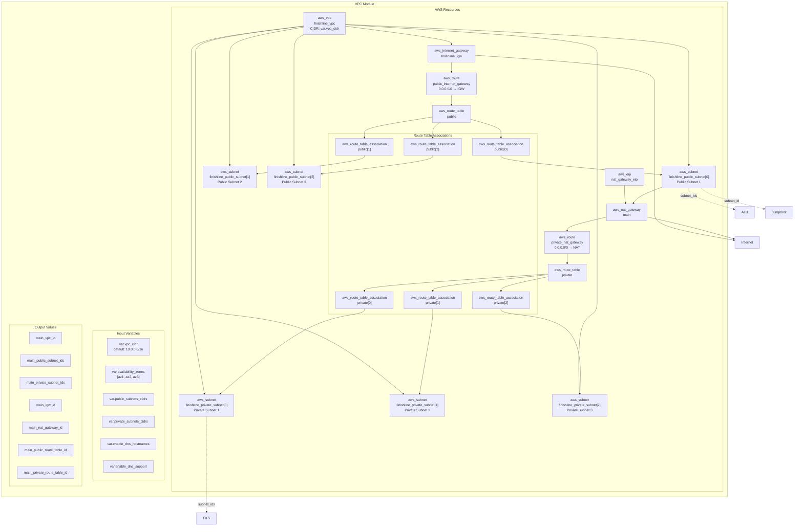
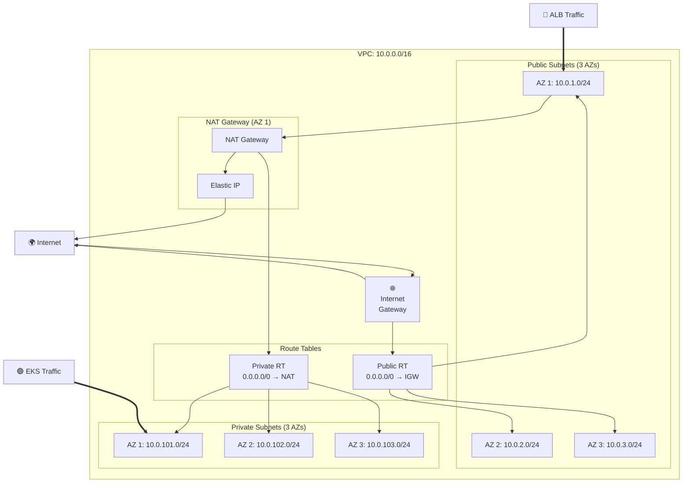

# VPC Module Diagram

## Module: terraform/modules/vpc

---

## VPC Architecture Diagram

---

## Key Features

| Feature              | Implementation                                  | Reference |
| -------------------- | ----------------------------------------------- | --------- |
| **VPC CIDR**         | Configurable via `var.vpc_cidr`                 | §51       |
| **3 AZs**            | Subnets distributed across 3 availability zones | §55       |
| **Public Subnets**   | Map public IP on launch enabled                 | §56       |
| **Private Subnets**  | Isolated from direct internet access            | §56       |
| **Internet Gateway** | Provides internet access for public subnets     | §57       |
| **NAT Gateway**      | Enables outbound internet for private subnets   | §57       |
| **Route Tables**     | Separate public and private routing             | §57       |

---

_Generated from: terraform/modules/vpc/main.tf_
