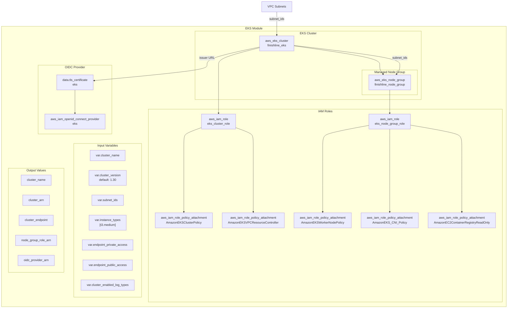
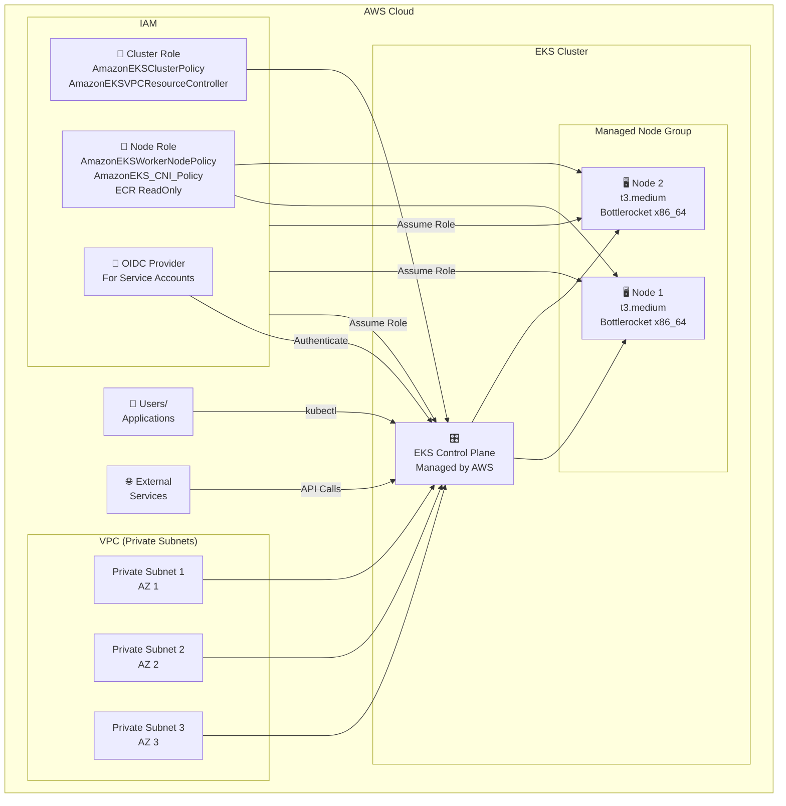
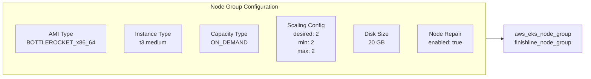
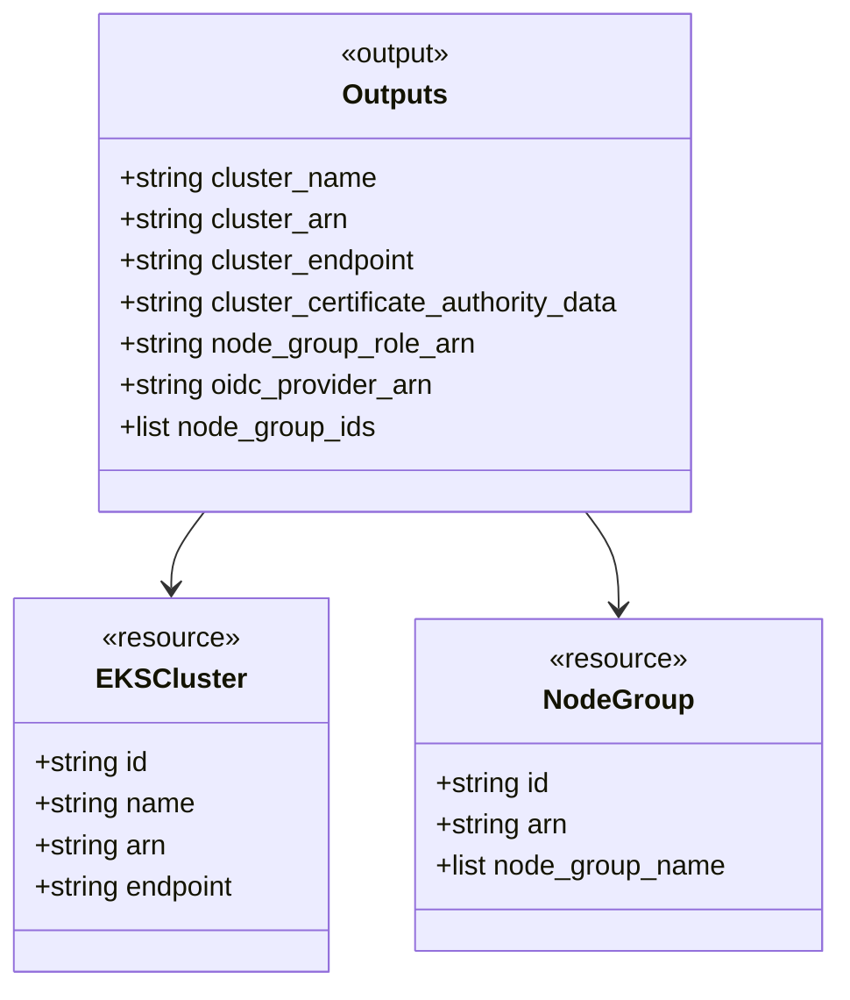

# EKS Module Diagram

## Module: terraform/modules/eks

---

## EKS Cluster Architecture

---

## Node Group Configuration

---

## Key Features

| Feature             | Implementation                  | Reference |
| ------------------- | ------------------------------- | --------- |
| **Cluster Version** | Kubernetes 1.30 (configurable)  | §74       |
| **Node Count**      | Exactly 2 nodes (fixed size)    | §79       |
| **Instance Type**   | t3.medium                       | §75       |
| **AMI Type**        | Bottlerocket x86_64             | §76       |
| **Capacity Type**   | On-Demand                       | §79       |
| **IAM Roles**       | Cluster role + Node group role  | §76       |
| **OIDC Provider**   | Enabled for service account IAM | §76       |

---

## Outputs Reference

---

_Generated from: terraform/modules/eks/main.tf_
