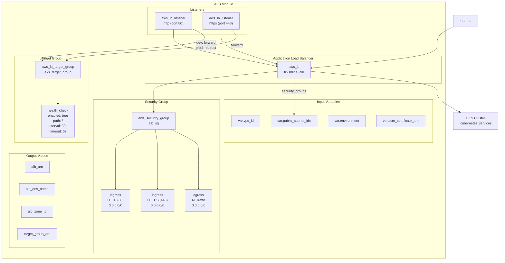
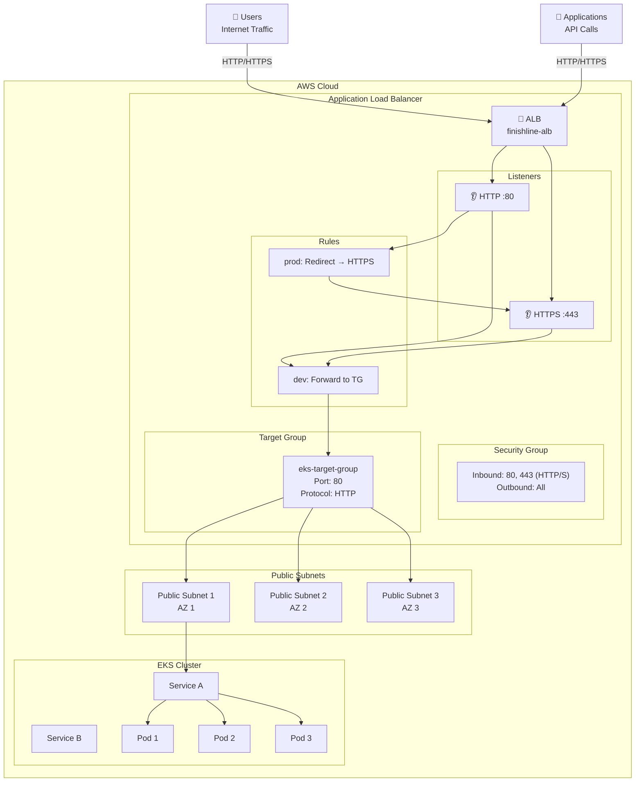
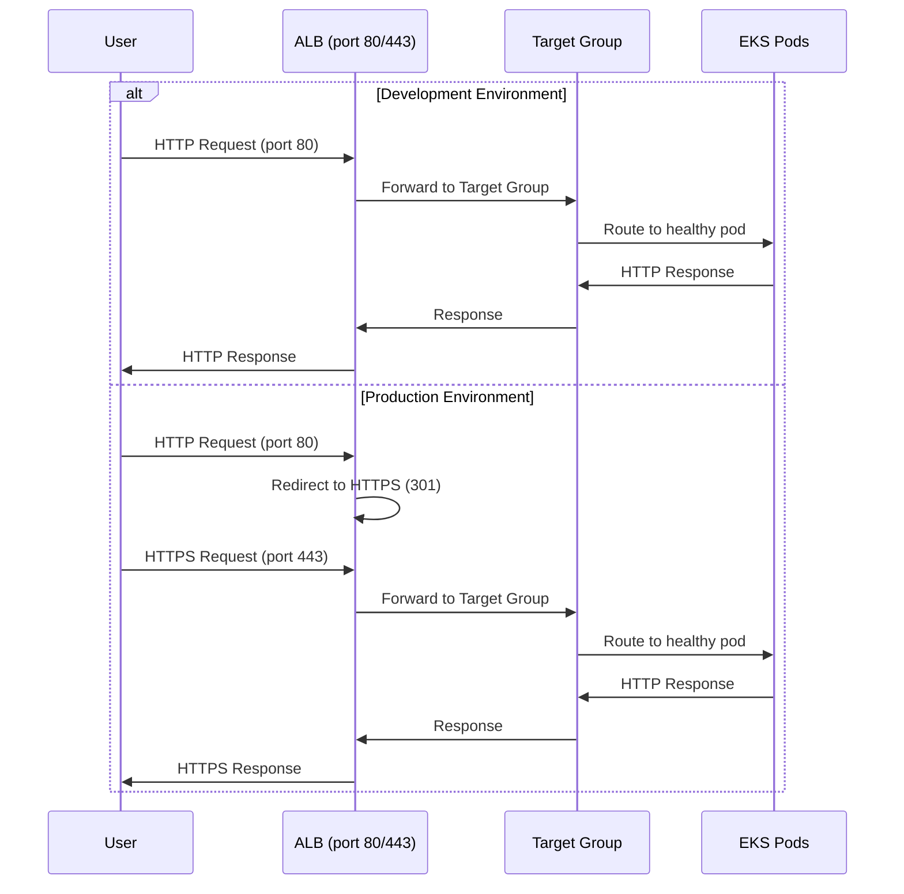
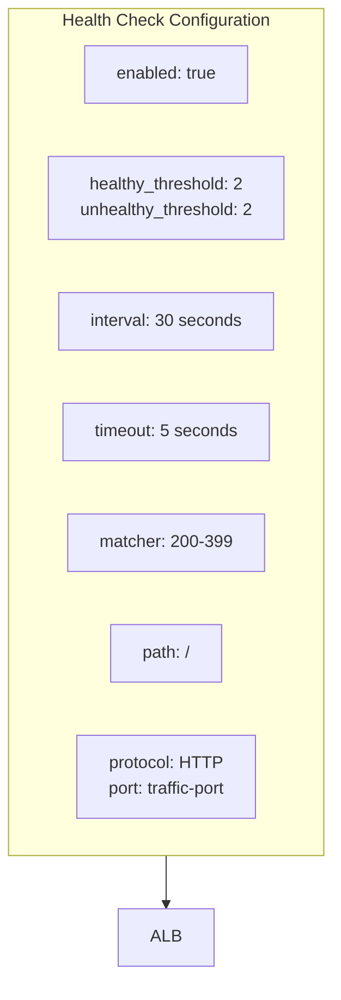

# ALB Module Diagram

## Module: terraform/modules/alb



---

## ALB Architecture



---

## Traffic Flow



---

## Ingress to Pod Traffic Flow (Assignment §61, §62)

```mermaid
flowchart LR
    subgraph Internet_Zone["🌐 Internet Zone"]
        Client["👤 Client<br/>Browser/App"]
    end

    subgraph VPC_Public["📦 VPC - Public Subnets (AZ 1,2,3)"]
        subgraph ALB_Zone["🔷 Shared ALB (group-tag: finishline)"]
            ALB_DNS["finishline-alb-*.elb.amazonaws.com"]
            Listener80["👂 :80"]
            Listener443["👂 :443"]
            TargetGroup["🎯 Target Group<br/>port: 80"]
        end
    end

    subgraph VPC_Private["📦 VPC - Private Subnets (AZ 1,2,3)"]
        subgraph EKS_Cluster["☸️ EKS Cluster"]
            subgraph Ingress_Zone["🎫 Kubernetes Ingress
            (group: finishline)"]
                Ingress["aws-load-balancer-controller
                Ingress resource"]
                IngressRule["Host: *.finishline.com
                Path: /api → svc:api"]
            end

            subgraph Services["🔌 Kubernetes Services"]
                APIService["svc:api
                ClusterIP: 10.x.x.x"]
                WebService["svc:web
                ClusterIP: 10.x.x.x"]
            end

            subgraph Pods["🖥️ Pods"]
                APIPod["api-pod
                :8080"]
                WebPod["web-pod
                :8080"]
            end
        end
    end

    Client --HTTP/HTTPS--> ALB_DNS
    ALB_DNS --> Listener80
    ALB_DNS --> Listener443
    Listener80 --> TargetGroup
    Listener443 --> TargetGroup
    TargetGroup -->|Route to pod| Ingress
    Ingress --> IngressRule
    IngressRule --> APIService
    IngressRule --> WebService
    APIService --> APIPod
    WebService --> WebPod
```



---

## Key Features

| Feature                | Implementation                              | Reference |
| ---------------------- | ------------------------------------------- | --------- |
| **Load Balancer Type** | Application Load Balancer (layer 7)         | §31       |
| **Group Tag**          | `group-tag = "finishline"` for IngressGroup | §62, §65  |
| **Internet-facing**    | `internal = false`                          | §62       |
| **HTTP Listener**      | Port 80, redirects to HTTPS in prod         | §62       |
| **HTTPS Listener**     | Port 443 with ACM certificate (optional)    | §62       |
| **Target Group**       | HTTP port 80, health check on /             | §62       |
| **Security Groups**    | Allow HTTP/HTTPS from 0.0.0.0/0             | §31       |

---

## Listener Configuration

```mermaid
flowchart LR
    subgraph HTTP_Port80["HTTP Listener (80)"]
        if Dev["Environment?"]
        forward["Forward to<br/>Target Group"]
        redirect["Redirect to<br/>HTTPS :443"]
    end

    subgraph HTTPS_Port443["HTTPS Listener (443)"]
        forward_https["Forward to<br/>Target Group"]
    end

    if Dev -->|dev| forward
    if Dev -->|staging/prod| redirect
    redirect --> HTTPS_Port443
    HTTPS_Port443 --> forward_https
```

---

## Health Check Configuration



---

_Generated from: terraform/modules/alb/main.tf_
