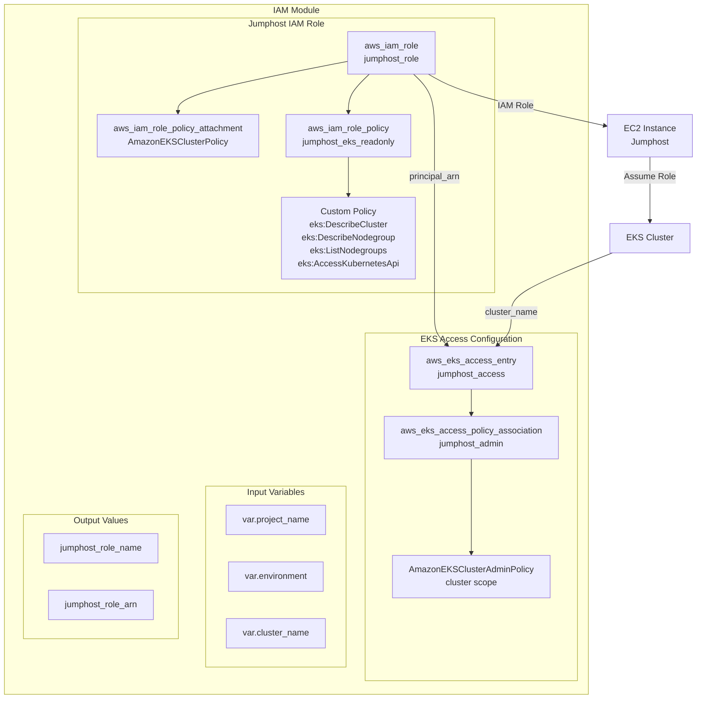
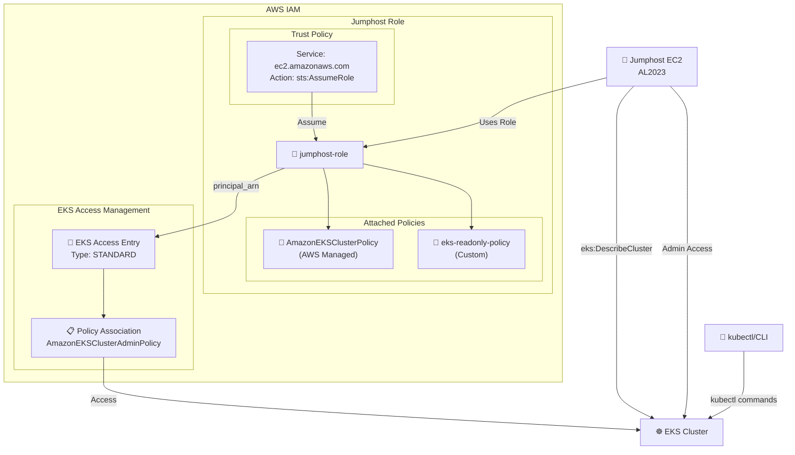
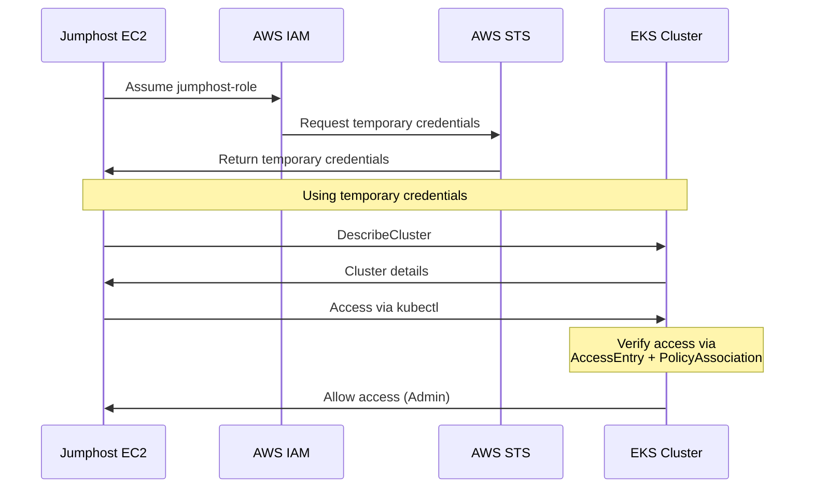
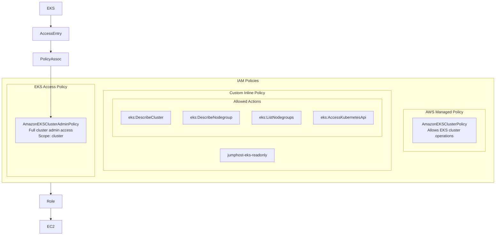
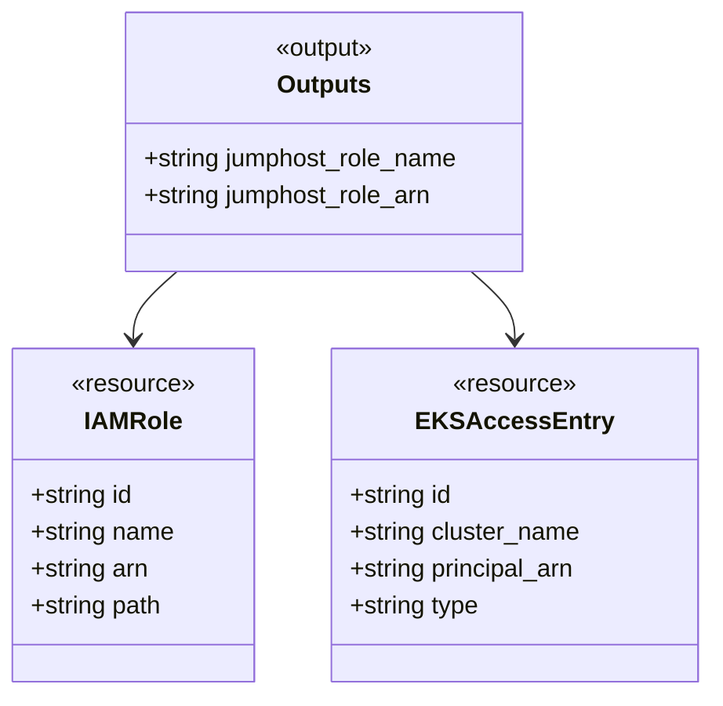

# IAM Module Diagram

## Module: terraform/modules/iam

---

## IAM Role & Policy Architecture

---

## EKS Access Entry Flow

---

## Key Features

| Feature              | Implementation                              | Reference |
| -------------------- | ------------------------------------------- | --------- |
| **Jumphost Role**    | EC2 instance role for bastion access        | §83       |
| **EKS Policy**       | AmazonEKSClusterPolicy attached             | §84       |
| **Read-only Policy** | Custom policy for describe actions          | §84       |
| **EKS Access Entry** | STANDARD type access entry                  | §87       |
| **Admin Policy**     | AmazonEKSClusterAdminPolicy (cluster scope) | §89       |
| **Least Privilege**  | Describe access + admin via EKS IAM         | §84, §89  |

---

## Policy Details

---

## Outputs Reference

---

_Generated from: terraform/modules/iam/main.tf_
