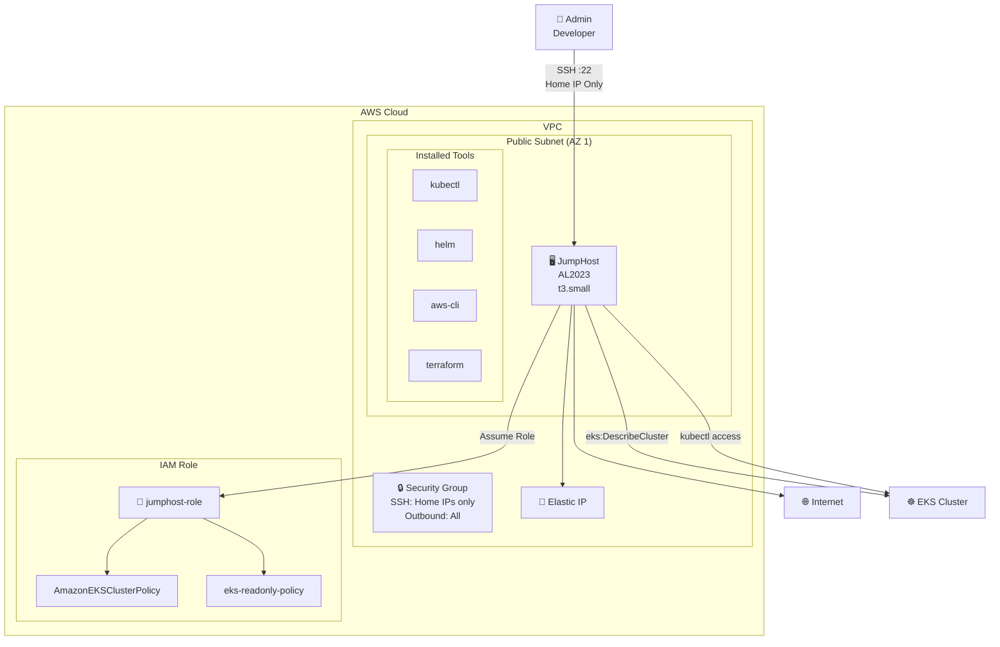
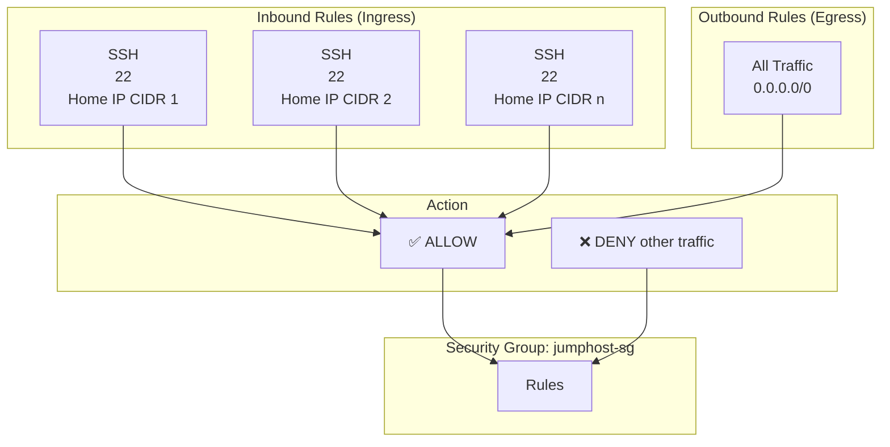
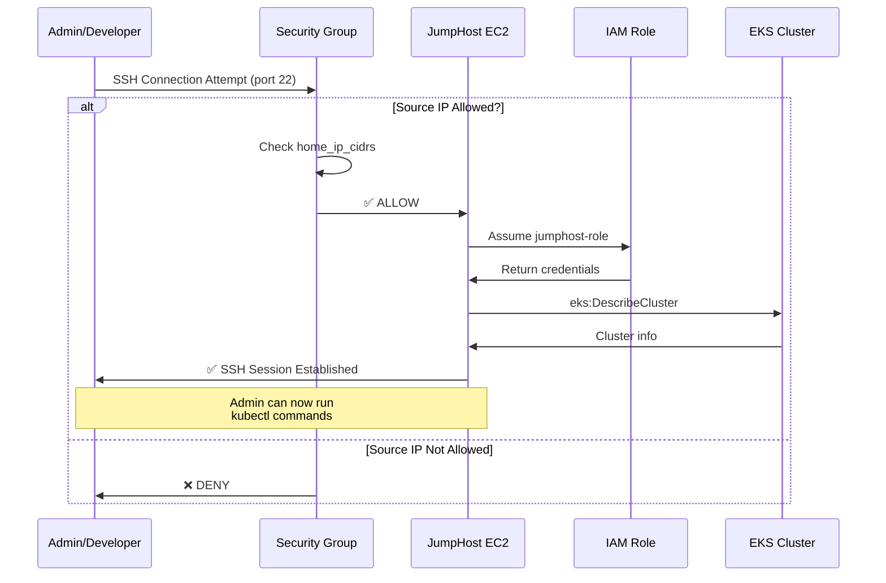
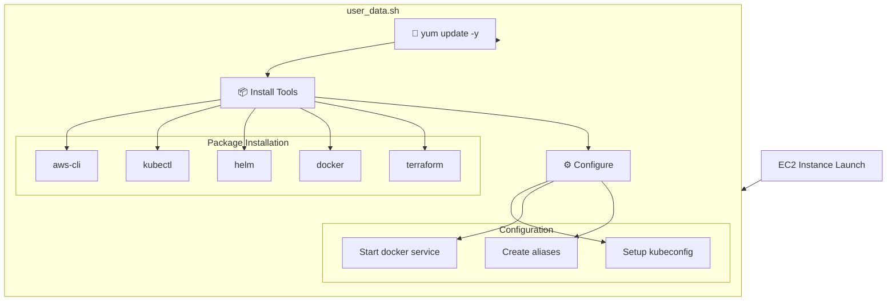
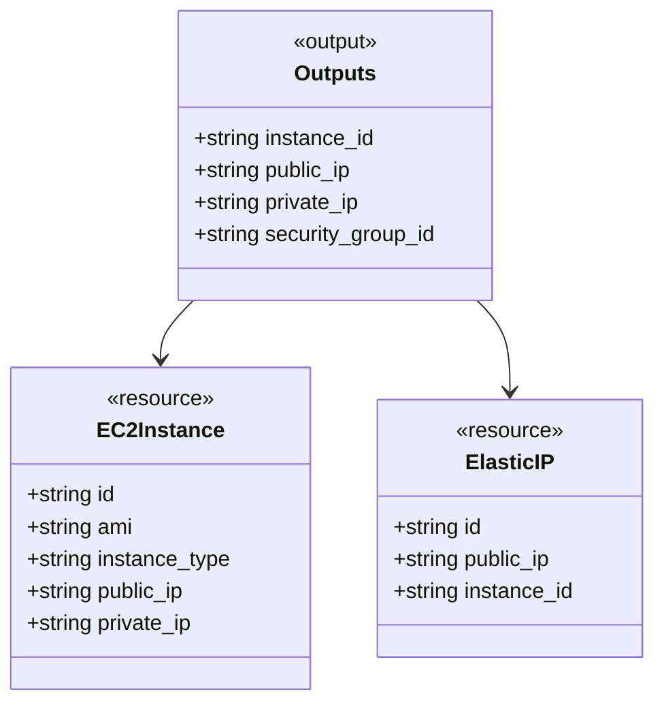

# JumpHost Module Diagram

## Module: terraform/modules/jumphost

```mermaid
flowchart TB
    subgraph JumpHost_Module["JumpHost Module"]

        subgraph SecurityGroup["Security Group"]
            SG["aws_security_group<br/>jumphost_sg"]

            subgraph IngressRules["Ingress Rules (Dynamic)"]
                SSH1["ingress<br/>SSH (22)<br/>var.home_ip_cidrs[0]"]
                SSH2["ingress<br/>SSH (22)<br/>var.home_ip_cidrs[1]"]
                SSH3["ingress<br/>SSH (22)<br/>var.home_ip_cidrs[n]"]
            end

            EgressRule["egress<br/>All Traffic<br/>0.0.0.0/0"]
        end

        subgraph EC2Instance["EC2 Instance"]
            Instance["aws_instance<br/>jumphost"]

            AMI["data.aws_ami<br/>al2023<br/>Amazon Linux 2023"]

            UserData["user_data<br/>Tool installation<br/>kubectl, helm, awscli"]

            RootBlock["root_block_device<br/>volume_size: 20GB<br/>volume_type: gp3<br/>encrypted: true"]
        end

        subgraph InstanceProfile["IAM Instance Profile"]
            Profile["aws_iam_instance_profile<br/>jumphost_profile"]
            Role["var.jumphost_role_name<br/>(from IAM module)"]
        end

        subgraph ElasticIP["Elastic IP"]
            EIP["aws_eip<br/>jumphost_eip"]
        end

        subgraph Inputs["Input Variables"]
            vpc_id["var.vpc_id"]
            subnet_id["var.subnet_id"]
            home_ip_cidrs["var.home_ip_cidrs"]
            instance_type["var.instance_type<br/>default: t3.small"]
            key_pair_name["var.key_pair_name"]
            jumphost_role_name["var.jumphost_role_name"]
        end

        subgraph Outputs["Output Values"]
            instance_id["instance_id"]
            public_ip["public_ip"]
            private_ip["private_ip"]
            security_group_id["security_group_id"]
        end
    end

    Developer["Developer<br/>Admin"]
    Internet["Internet"]
    EKS["EKS Cluster"]

    SG --> SSH1
    SG --> SSH2
    SG --> SSH3
    SG --> EgressRule

    Instance --> AMI
    Instance --> UserData
    Instance --> RootBlock
    Instance --> SG
    Instance --> Profile
    Instance --> EIP
    Instance --> key_pair_name

    Profile --> Role

    Developer -->|SSH (restricted)| Instance
    Instance -->|EKS Access| EKS
    EIP --> Internet
```

---

## JumpHost Architecture



---

## Security Group Rules



---

## Key Features

| Feature               | Implementation                      | Reference |
| --------------------- | ----------------------------------- | --------- |
| **AMI**               | Amazon Linux 2023 (AL2023)          | §69       |
| **SSH Restriction**   | Only from `var.home_ip_cidrs`       | §70       |
| **Tool Installation** | kubectl, helm, awscli, terraform    | §73       |
| **IAM Profile**       | Instance profile with jumphost role | §83       |
| **Key Pair**          | SSH key for authentication          | §71       |
| **EIP**               | Static public IP address            | §69       |
| **Security**          | SSH restricted to home IP ranges    | §70       |

---

## SSH Access Flow



---

## User Data Script



---

## Outputs Reference



---

_Generated from: terraform/modules/jumphost/main.tf_
