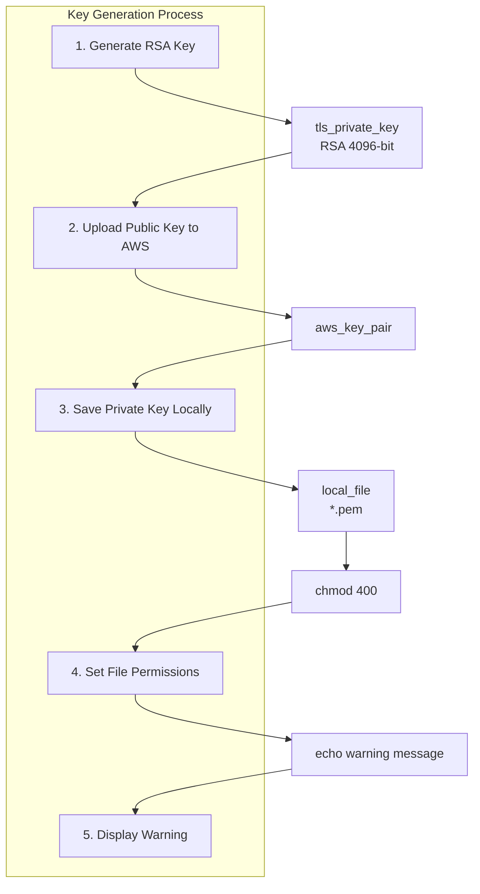
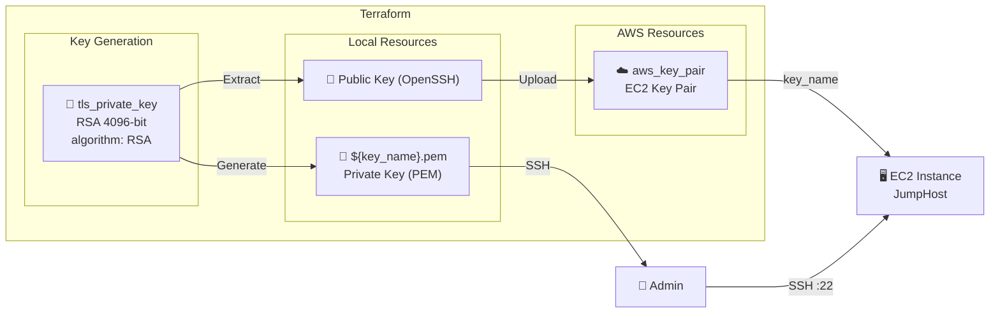
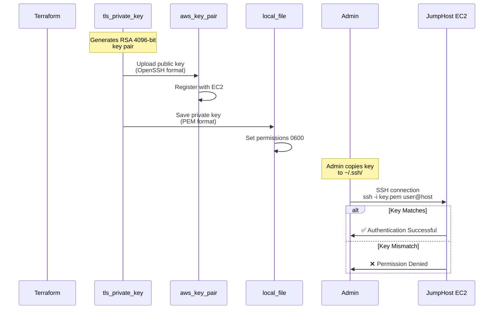
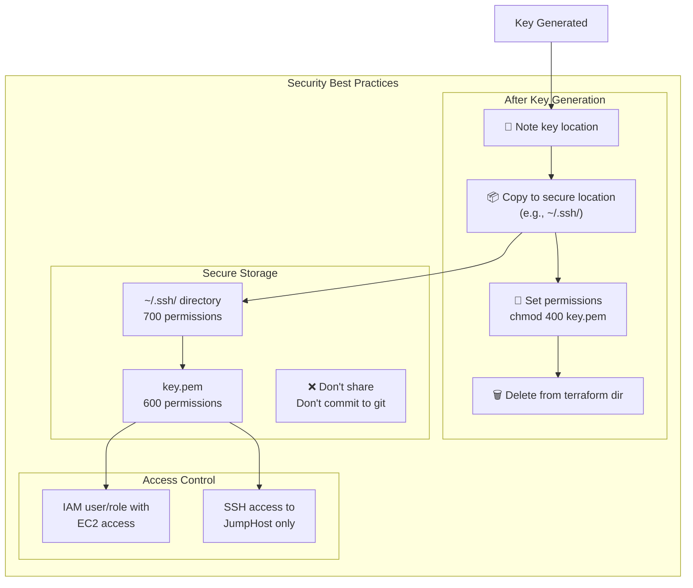
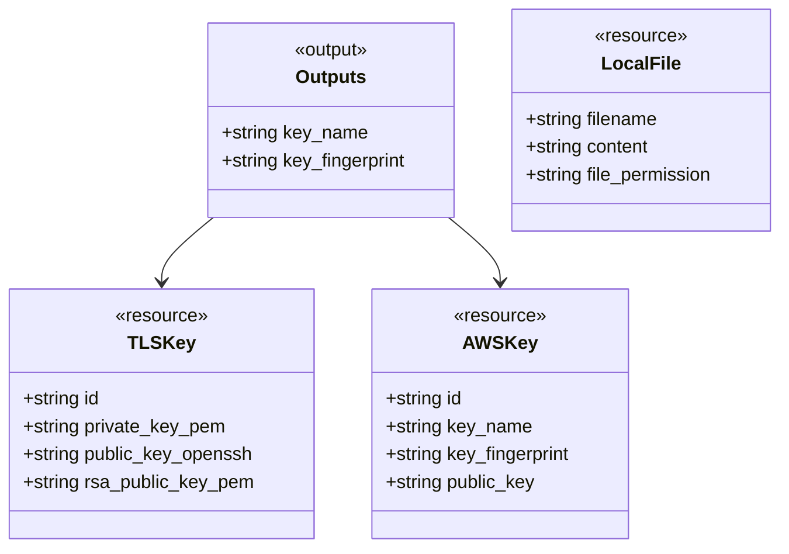

# Key Pair Module Diagram

## Module: terraform/modules/key_pair

```mermaid
flowchart TB
    subgraph KeyPair_Module["Key Pair Module"]

        subgraph TLS_Key["TLS Private Key"]
            TLSKey["tls_private_key<br/>rsa_4096"]

            Algorithm["algorithm: RSA<br/>rsa_bits: 4096"]
        end

        subgraph AWS_Key["AWS Key Pair"]
            AWSKey["aws_key_pair<br/>finishline_key"]

            PublicKey["public_key<br/>OpenSSH format"]
        end

        subgraph Local_Key["Local Private Key"]
            LocalFile["local_file<br/>private_key"]

            FilePath["filename: ${path.module}/${key_name}.pem"]
            Permissions["file_permission: 0600"]
        end

        subgraph Warning["Null Resource Warning"]
            Warning["null_resource<br/>key_warning"]
            WarningMsg["Display key location<br/>and security reminders"]
        end

        subgraph Inputs["Input Variables"]
            key_name["var.key_name"]
            project_name["var.project_name"]
            environment["var.environment"]
        end

        subgraph Outputs["Output Values"]
            key_name_out["key_name"]
            key_fingerprint["key_fingerprint"]
        end
    end

    EC2["EC2 Instance<br/>JumpHost"]

    TLSKey -->|public_key_openssh| AWSKey
    TLSKey -->|private_key_pem| LocalFile
    TLSKey --> Warning

    AWSKey -->|key_name| EC2
    LocalFile -->|SSH Access| EC2
```

---

## Key Pair Generation Flow



---

## Key Pair Architecture



---

## Key Features

| Feature                | Implementation                     | Reference |
| ---------------------- | ---------------------------------- | --------- |
| **Key Type**           | RSA 4096-bit                       | §71       |
| **Private Key Format** | PEM (local file)                   | §71       |
| **Public Key Format**  | OpenSSH (AWS)                      | §71       |
| **File Permissions**   | 0600 (owner read/write only)       | §71       |
| **Terraform Managed**  | Generated and managed by Terraform | §71       |
| **Key Name**           | Configurable via `var.key_name`    | §71       |

---

## SSH Key Usage Flow



---

## Security Considerations



---

## Outputs Reference



---

_Generated from: terraform/modules/key_pair/main.tf_
