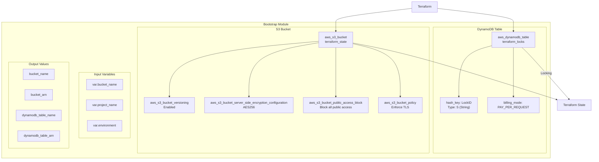
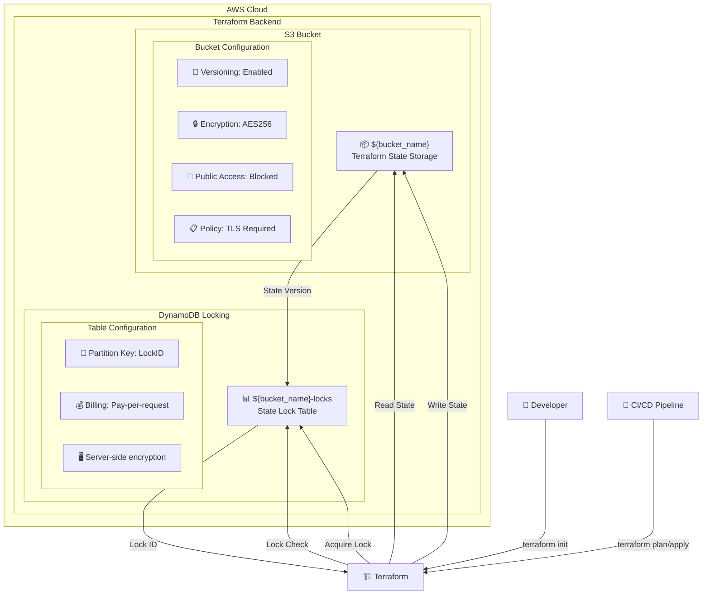
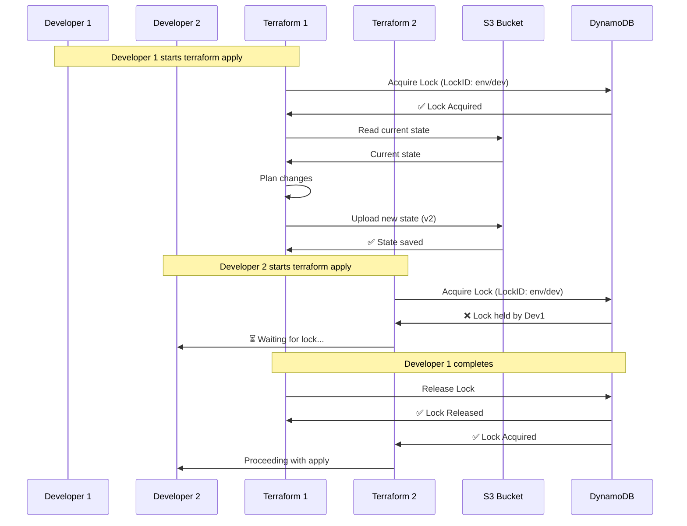
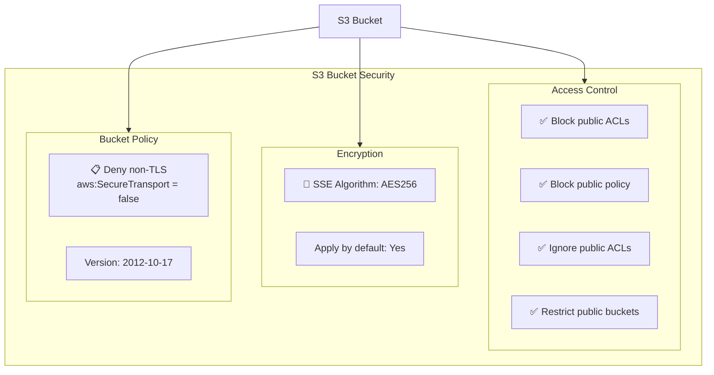
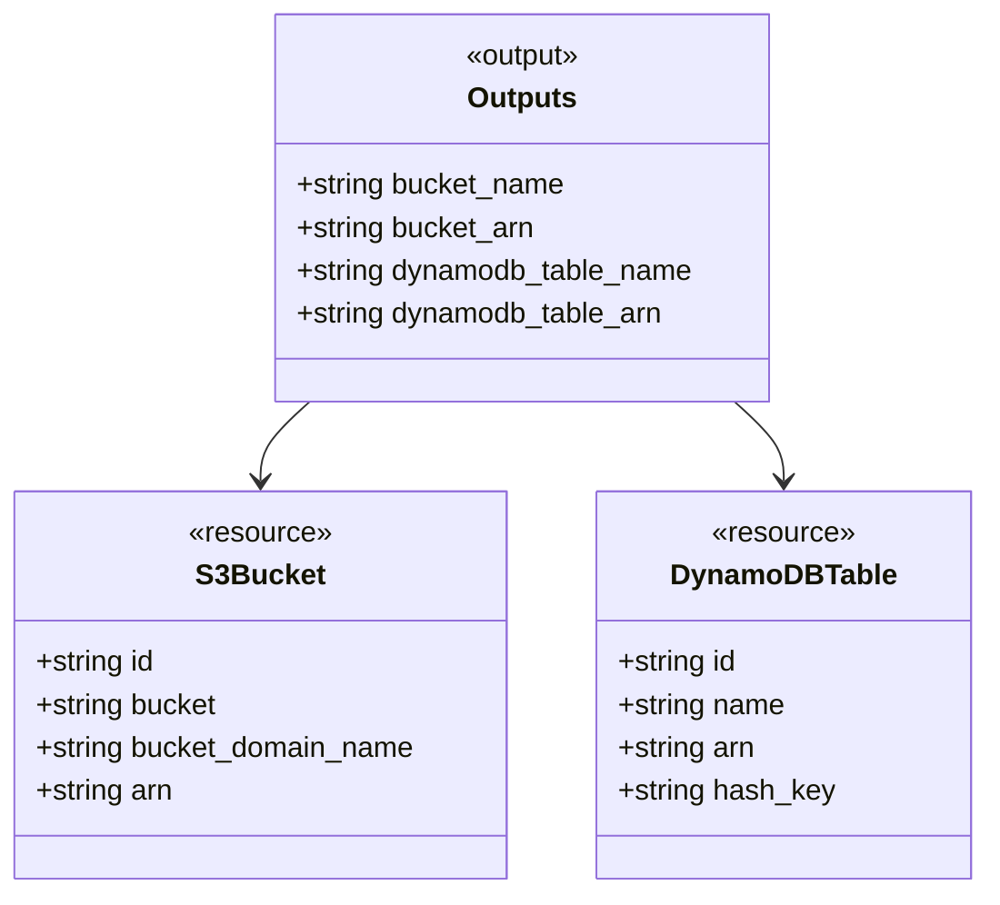

# Bootstrap Module Diagram

## Module: terraform/modules/bootstrap



---

## Terraform Backend Architecture



---

## State Locking Flow



---

## Key Features

| Feature             | Implementation                           | Reference |
| ------------------- | ---------------------------------------- | --------- |
| **S3 Backend**      | Terraform state storage in S3            | §101      |
| **State Locking**   | DynamoDB for concurrent operation safety | §102      |
| **Versioning**      | S3 versioning enabled                    | §28       |
| **Encryption**      | S3 server-side encryption (AES256)       | §101      |
| **Public Access**   | Block all public access                  | §102      |
| **TLS Policy**      | Deny non-TLS requests                    | §105      |
| **Pay-per-request** | DynamoDB on-demand billing               | §102      |

---

## S3 Bucket Security Configuration



---

## DynamoDB Table Schema

```mermaid
erDiagram
    TERRAFORM_LOCKS {
        string LockID PK "Environment path"
        string Info "Lock metadata"
        string Who "Who holds the lock"
        string Version "Terraform version"
        string Created "Lock timestamp"
    }

    TERRAFORM_LOCKS ||--|| LockMechanism : "represents"

    class LockMechanism {
        string purpose "Prevents concurrent tf runs"
        string scope "Per workspace"
    }
```

---

## Terraform Backend Configuration

```mermaid
flowchart LR
    subgraph BackendConfig["backend.tf Configuration"]
        BackendType["backend \"s3\""]

        Bucket["bucket = \"${bucket_name}\""]
        Key["key = \"terraform.tfstate\""]
        Region["region = \"${var.region}\""]
        DynamoLock["dynamodb_endpoint = \"${dynamodb_table}\""]
        Encrypt["encrypt = true"]
    end

    BackendConfig --> Terraform
    Terraform --> S3
    Terraform --> DynamoDB
```

---

## Outputs Reference



---

_Generated from: terraform/modules/bootstrap/main.tf_
